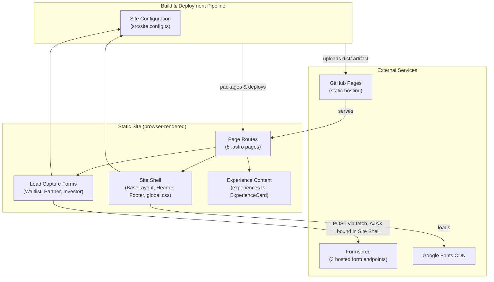

# Architecture — guestguideIQ

## Architecture Analysis

### System Overview

GuestGuideIQ's current system is a **statically generated marketing website**
built with Astro. There is no server runtime, no database, and no first-party
backend service — every page is pre-rendered HTML at build time and served as
static files from GitHub Pages. The only "dynamic" behavior at runtime is
client-side JavaScript in the browser: three lead-capture forms submit
directly from the visitor's browser to Formspree, a third-party hosted
form-backend service.

This intent's purpose is to specify a **new backend** behind this site, so this
architecture document deliberately documents the static baseline in enough
detail that the new backend's design can reason about exactly what it is
replacing, fronting, or leaving untouched.

### Architectural Style

**Static site (Jamstack), no backend of its own.** Evidence:

- No server framework (Express/FastAPI/etc.), no serverless function
  directory, no `api/` routes — Astro is configured with no server adapter
  (`astro.config.mjs` has no `output: 'server'` or `adapter`), so the default
  `output: 'static'` applies.
- No database, ORM, or persistence layer anywhere in the repo.
- The build pipeline (`astro build`) produces a fully static `./dist` that
  GitHub Pages serves as-is (`.github/workflows/deploy.yml`).
- The one piece of runtime behavior — form submission — is delegated entirely
  to a third-party SaaS (Formspree) via client-side `fetch()`, not to any code
  this repo owns or runs.

There is exactly one deployable unit (the static site itself); "component" in
this document means a logical source-code grouping, not a deployable service —
consistent with the six components enumerated in `component-inventory.md`.

### Component Relationships



### Data Flow

There is no server-side data flow in the current system. Data moves in exactly
two directions, both entirely client-side or build-time:

1. **Build-time (content → static HTML)**: `src/data/experiences.ts` and page
   frontmatter are read by Astro at `astro build` time and compiled into
   static HTML under `./dist`; `site.config.ts` values (site URL, contact
   email, form endpoints, analytics IDs) are inlined into the built pages at
   the same time. No runtime configuration loading exists — every value is
   baked into the static output.
2. **Runtime (browser → Formspree)**: a visitor fills in a form; the inline
   script in `BaseLayout.astro` intercepts the `submit` event, serializes the
   form as `FormData`, and `POST`s it directly to the matching Formspree URL
   from `site.config.ts`. Formspree's own backend is the only place any
   traveler/partner/investor data is ever persisted today — this repo neither
   stores nor sees the data again after the `fetch()` call resolves.

### Interaction Diagrams

The following sequence diagram is the one meaningful business transaction the
current system implements end-to-end: a visitor submitting any of the three
lead-capture forms. All three forms (Waitlist, Partner, Investor) share the
identical mechanism — they differ only in which Formspree endpoint and field
set is used — so one diagram, parameterized by form, covers all three.

```mermaid
sequenceDiagram
    actor Visitor
    participant Page as Page Route<br/>(e.g. contact.astro)
    participant Form as Lead Capture Form<br/>(Waitlist/Partner/Investor)
    participant Shell as Site Shell<br/>(bindAjaxForms in BaseLayout)
    participant Cfg as Site Configuration<br/>(site.config.ts FORMS.*)
    participant Formspree as Formspree<br/>(third-party form backend)

    Visitor->>Page: Load page
    Page->>Form: Render form (data-ajax-form, action=FORMS.x)
    Form->>Cfg: action URL resolved at build time
    Visitor->>Form: Fill required fields, click Submit
    Form->>Form: HTML5 client validation (required, type=email)
    alt validation fails
        Form-->>Visitor: Browser blocks submit, shows native error
    else validation passes
        Form->>Shell: submit event captured (data-ajax-form)
        Shell->>Shell: preventDefault(); build FormData
        Shell->>Formspree: POST form.action<br/>Accept: application/json
        alt Formspree 2xx (response.ok)
            Formspree-->>Shell: 200/201 JSON
            Shell->>Visitor: navigate to form.dataset.successUrl<br/>(default /thank-you/)
        else Formspree error / network failure
            Formspree-->>Shell: non-2xx or fetch rejects
            Shell->>Shell: un-hide [data-form-error]
            Shell->>Form: re-enable submit button
            Shell-->>Visitor: error message shown, form remains filled
        end
    end
```

**Text fallback** (in case the diagram above fails to render): Visitor loads a
page containing a lead-capture form → fills required fields → browser runs
HTML5 validation → on pass, `BaseLayout.astro`'s `bindAjaxForms()` intercepts
the submit, prevents the native page navigation, and POSTs the form as
`FormData` (with `Accept: application/json`) to the Formspree URL configured
for that form in `site.config.ts` → on `response.ok`, the browser is navigated
to `/thank-you/` (or the form's configured success URL); on failure, an error
element is un-hidden and the submit button re-enabled, with no data retained
or retried by this codebase.

### Key Design Decisions

- **Static-first, zero backend**: the team chose to launch the marketing
  presence with no backend investment at all, delegating lead capture to a
  SaaS form provider (Formspree). This is a sound low-cost choice for a
  pre-launch validation site and is the direct reason this intent now exists
  — the moment product requirements exceed "collect an email and forward it,"
  a first-party backend becomes necessary.
- **Single source of environment config** (`site.config.ts`): every
  environment-specific value (URL, email, form endpoints, analytics IDs) is
  centralized in one file rather than scattered across pages/components. This
  is a well-factored seam: a new backend's base URL/API client config can be
  added here without touching page or component markup.
- **AJAX-with-fallback form submission**: forms are progressively enhanced —
  they work with plain HTML `action`/`_next` redirect (no-JS fallback) and are
  upgraded to AJAX (stay-on-page, custom success/error handling) when
  JavaScript runs. A new backend that replaces Formspree should preserve this
  dual-path behavior or explicitly decide to drop the no-JS fallback.
- **No server-side validation anywhere**: validation is 100% client-side
  (HTML5) plus whatever Formspree enforces on its side. A new backend inherits
  a green field here — nothing existing to port forward except the field
  names/types documented in `api-documentation.md`.

### Improvement Opportunities

- **No first-party API surface exists to secure, rate-limit, or validate** —
  by design today, but the explicit gap this intent's backend must close.
- **No conversion telemetry**: analytics IDs are `null`; a new backend that
  owns form submission is a natural place to also emit
  submission/conversion events, closing the gap flagged in the developer scan.
- **No automated build/test gate on pull requests** — `deploy.yml` only runs
  on push to `main`; introducing a backend service is a good trigger to also
  add a PR-triggered CI workflow (build + future backend tests) rather than
  discovering breakage only after merge.
- **Single point of third-party dependency**: all lead data currently lives
  only in Formspree's system. A new backend should make an explicit decision
  about whether it owns storage going forward or continues to relay to a
  third party, rather than leaving this implicit.
