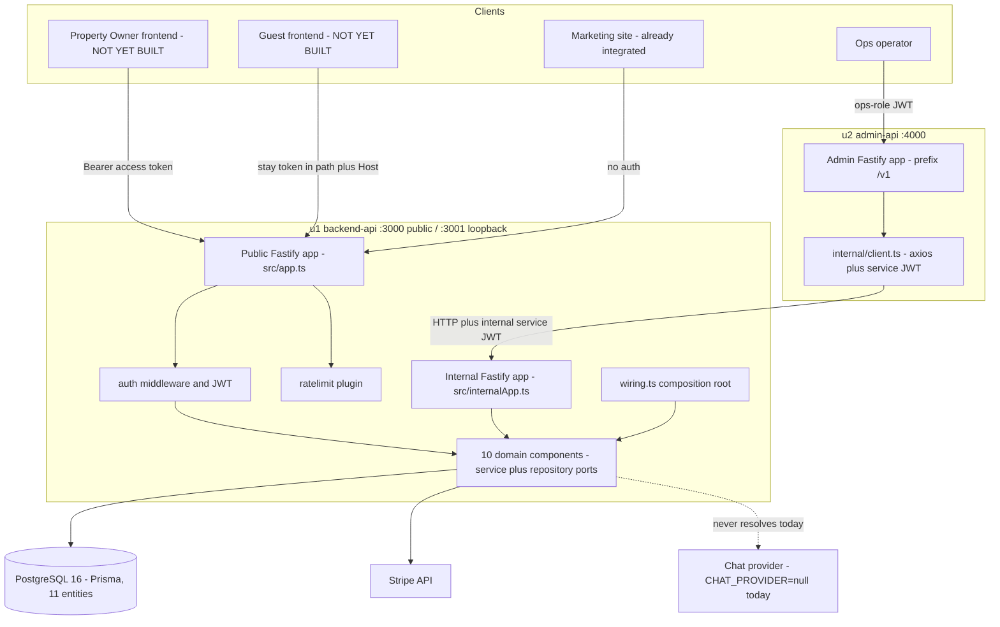
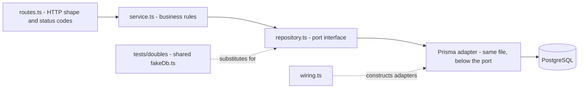
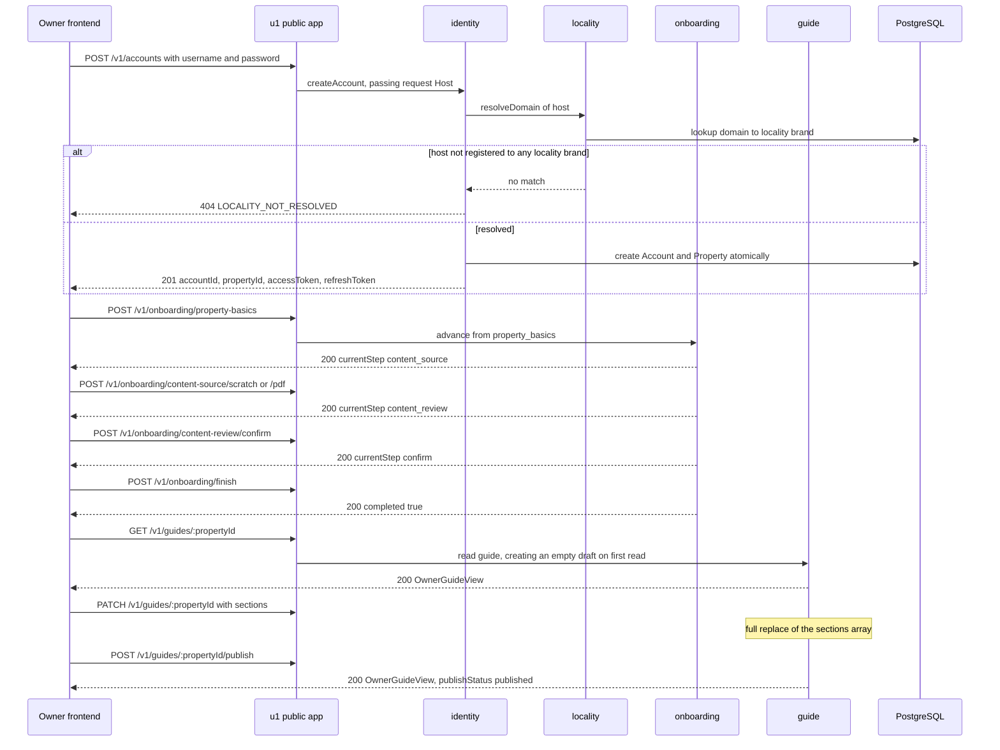
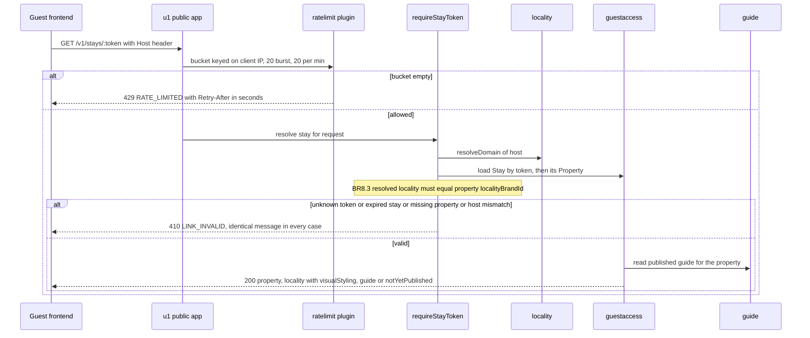
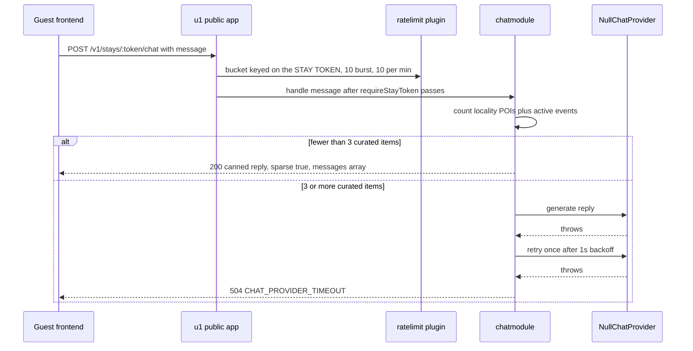
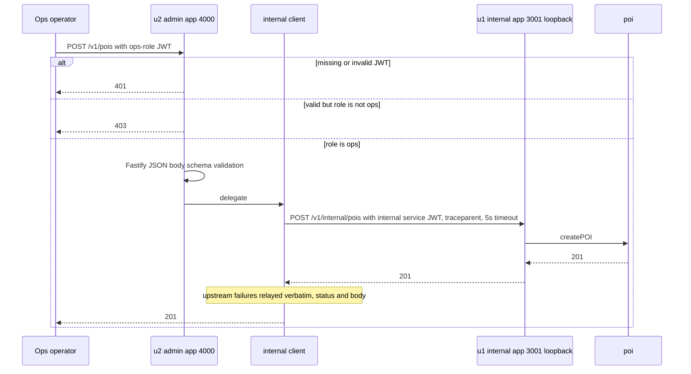

# Architecture — `guestguideiq-app`

**Derived from**: the developer full-repo scan of 2026-09-07, re-run over current HEAD (branch `main`, HEAD `76d190d`; the earlier pass ran at `40c8aed`, and `git diff 40c8aed..HEAD` touches only `infra/lib/backend-api-stack.ts`). Component responsibilities are in `component-inventory.md`; wire-level contracts are in `api-documentation.md`. Nothing is repeated across those files — this document covers structure, topology, and transaction flow only.

---

## System Overview

Two independently deployed TypeScript/Fastify HTTP services over one shared PostgreSQL database, plus two separate AWS CDK apps.

- **u1 `backend-api`** (repo root) owns the data and hosts **all ten domain components**. It runs **two Fastify instances in one process**: a public listener on `PORT` (default 3000, bound `0.0.0.0`) and an internal listener on `INTERNAL_PORT` (default 3001, bound **`127.0.0.1` only**, never `EXPOSE`d in the Dockerfile and never in an ALB target group).
- **u2 `admin-api`** (`admin-api/`) owns **no data**. Every route is an ops-role-gated delegation into u1's internal API over HTTP. It shares no code, no types, and no npm linkage with u1 — the only coupling is the runtime URL `BACKEND_API_INTERNAL_URL`.

## Architectural Style

**Modular monolith with a satellite ops service**, implemented as **ports and adapters (hexagonal)**.

Evidence:
- Every u1 domain module is the identical triad `repository.ts` (narrow port interface + Prisma adapter) → `service.ts` (business logic, depends only on the port) → `routes.ts` (HTTP). Applied consistently across all ten modules with no observed violation.
- `src/wiring.ts` is the **sole composition root**; it is the only place Prisma adapters are constructed. No circular imports observed.
- u1 is a monolith by deployment (one container, one process, two listeners), not by structure — the module boundaries are clean enough that extraction would be mechanical.
- u2 is a genuine separate service: separate `package.json`, `tsconfig.json`, `node_modules/`, `Dockerfile`, and CDK app.

## Component Topology



*Text fallback*: four client kinds reach the system. Owner, Guest, and marketing traffic hit u1's public Fastify app on port 3000, passing through auth middleware and the rate-limit plugin into the ten domain components, which talk to PostgreSQL via Prisma, to Stripe, and (nominally) to a chat provider that is never resolved. Ops traffic hits u2's admin app on port 4000, which holds no data and forwards every call over HTTP with an internal service JWT to u1's internal Fastify app bound to loopback on port 3001.

## Layering Inside a u1 Domain Component



*Text fallback*: HTTP route handlers call a service; the service depends only on a narrow repository port interface; the Prisma adapter implements that port in the same file; `wiring.ts` constructs the adapters; in tests an in-memory double backed by a shared `fakeDb.ts` is substituted for the port.

## Data Architecture

- One PostgreSQL 16 database, 11 entities, Prisma as ORM and migration tool. A single applied migration, `20260906234912_init`. `prisma/schema.prisma` is the authoritative shape.
- All persistence flows through repository ports; no service imports `PrismaClient` directly.
- **Two stores are deliberately in-memory and per-process**: `InMemoryRefreshTokenStore` and `InMemoryRateLimitStore`. Production runs `desiredCount: 2` ECS tasks autoscaling to 6, so refresh-token revocation is **not shared across tasks** (a rotated token replayed against the other task is accepted) and each rate-limit bucket is effectively multiplied by the task count. Both files carry comments acknowledging a Redis upgrade path; neither is wired. This bounds any frontend silent-re-auth strategy — see `code-quality-assessment.md` TD-12.

## Deployment Topology

- **Packaging**: multi-stage Dockerfile, `node:20-slim` base, non-root container user, `runtime` and `migrate` targets.
- **u1 CDK app** (`infra/`): three environment-parameterized stacks (`dev`, `staging`, `production`) — VPC, ECS Fargate behind an ALB, RDS PostgreSQL 16 in private subnets, Secrets Manager, a CloudWatch log group, and a one-off migration task definition.
- **u2 CDK app** (`admin-api/infra/`): its own ECS Fargate service with a WAF IP allowlist. It reads the shared VPC/cluster ids from SSM parameters **that u1's stack does not publish**, so it is **not deployable today**.
- Observability: OpenTelemetry SDK, opt-in via `OTEL_ENABLED`; pino structured logging with redaction of `password`, `passwordHash`, `authorization`, `token`, `stayToken`. W3C `traceparent` is propagated u2 → u1 but **never surfaced to the client**.

---

## Interaction Diagrams

Five business transactions, each traced across the components that implement it.

### T1 — Property Owner signup through first published guide



*Text fallback*: signup resolves the tenant from the request `Host` header before creating anything, returning `404 LOCALITY_NOT_RESOLVED` if the host is not registered to a locality brand. The owner then walks a strictly ordered four-step onboarding state machine, reads the guide (which is lazily created as an empty draft), replaces its sections wholesale with a PATCH, and publishes it.

### T2 — Guest opens a stay link



*Text fallback*: the guest read is rate-limited by client IP, then authenticated by the opaque path token combined with a `Host`-header locality check. All four distinct failure modes collapse to one indistinguishable `410 LINK_INVALID`. On success the response carries the property, the locality branding blob, and either the published guide sections or a `notYetPublished` marker.

### T3 — Guest itinerary chat, as it actually behaves today



*Text fallback*: chat is rate-limited per stay token rather than per IP. With `CHAT_PROVIDER=null` in every environment, the provider always throws, so the only 200 path is the sparse-content fallback for localities with fewer than three curated items; every other request returns `504` after one retry. The transcript is returned only as a side effect of this POST — there is no history endpoint.

### T4 — Ops creates a POI through the admin service



*Text fallback*: the admin service authorises on an ops-role claim, validates the body against a Fastify JSON schema (u1's public routes have none), then forwards over HTTP with a short-lived internal service JWT and a W3C traceparent. Non-idempotent writes are never retried; idempotent reads retry once on 502/503/504 or a network error. Upstream errors are relayed verbatim.

### T5 — Access-token refresh with rotation

```mermaid
sequenceDiagram
  participant FE as Owner frontend
  participant API as u1 public app
  participant ID as identity
  participant RS as InMemoryRefreshTokenStore per process

  FE->>API: POST /v1/auth/refresh with refreshToken
  API->>ID: verify signature, expiry, and jti not revoked
  ID->>RS: check jti
  alt invalid, expired, or already revoked on THIS task
    ID-->>FE: 401 UNAUTHORIZED
  else accepted
    ID->>RS: revoke presented jti
    ID-->>FE: 200 new accessToken and refreshToken
  end
  Note over RS: store is per process; with 2 to 6 ECS tasks a rotated token replayed against another task is accepted
```

*Text fallback*: refresh tokens rotate on use — each refresh revokes the presented `jti` and issues a new pair. Because the revocation store is per-process and production runs two to six tasks, single-use semantics are not reliably enforced; a frontend must not depend on them.

---

## Cross-Cutting Constraints a Frontend Must Design Around

Recorded once here, referenced elsewhere rather than restated.

1. **Host-header tenancy is blocking for a browser frontend.** `POST /v1/accounts` and `requireStayToken` both resolve the locality brand from the request's own `Host` / `X-Forwarded-Host` header. A browser calling a shared origin such as `https://api.guestguideiq.com` sends that one host, which would have to be registered as a domain of **every** locality brand — forbidden by BR9.2 with a `409 CONFLICT`. A per-locality frontend origin calling a shared API origin therefore **cannot resolve its tenant today**. The viable resolutions are architectural, not incidental: a same-origin reverse proxy per locality domain, an explicit tenant header such as `X-Locality-Domain`, or a tenant parameter in the path or body. This must be decided before contract design.
2. **No supply side for guest links.** The entire Guest experience hangs off `GET /v1/stays/:token`, yet **no HTTP endpoint in either service creates a `Stay`**. `createStayService` / `StayService.createStay` exist in `src/guestaccess/service.ts` (lines 62-77) and are referenced by nothing — not `wiring.ts`, not any `routes.ts`, not `internal/routes.ts`, not admin-api. Stays exist only in tests, seeded directly into the fake DB by `tests/factories/stayFactory.ts`. An owner-authenticated `POST /v1/stays` returning the token/link is a **prerequisite backend change**, not a frontend one.
3. **CORS is merged, but its allowlist excludes the frontend and `credentials` is off.** The CORS work reached `main` in `b9c7c6e` (PR #15) and was re-verified file by file at `76d190d`, so no part of it depends on an unmerged branch any more. What it actually permits is narrower than "CORS works": production's `allowedOrigins` is **exactly `['https://guestguideiq.com']`** — the marketing site, hardcoded in `infra/bin/backend-api.ts`'s `domainConfig.production`, with no API subdomain, no frontend origin, no staging origin, no `localhost`, and no wildcard; `dev` and `staging` have no `domainConfig` entry at all, so `origin: false` refuses every cross-origin browser call there. **Every frontend origin this intent introduces must be added to `domainConfig` and redeployed — a backend change the frontend cannot make for itself**, sequenced before the first browser call from a new origin can succeed. Separately, **`credentials` is NOT enabled**: the `app.register(cors, …)` options object in `src/app.ts` carries only `origin`, so `Access-Control-Allow-Credentials` is never emitted and cross-origin cookies are neither sent nor accepted. **Cookie or session auth is therefore unavailable cross-origin** — bearer tokens in the `Authorization` header are the only viable scheme, pushing storage of a 15-minute access token and a 7-day rotating refresh token onto the frontend, and making the XSS-exposure trade-off of that storage an explicit frontend design decision. No `methods` / `allowedHeaders` / `exposedHeaders` / `maxAge` overrides are configured, so no non-simple response header can be read cross-origin. Coverage is three tests in `tests/unit/cors.test.ts`, all against `GET /health`; nothing asserts `Access-Control-Allow-Credentials` and there is no preflight `OPTIONS` test.

   > **Constraints 1 and 3 share a solution and must be decided together, before contract design.** A same-origin reverse proxy per locality domain — the leading candidate fix for the Host-header tenancy blocker in constraint 1 — would also make CORS moot entirely and restore the cookie-auth option. Deciding them separately risks locking in bearer-token storage, and accepting its XSS exposure, for a reason a proxy would have eliminated.
4. **Chat is non-functional and has no history.** See T3. `CHAT_PROVIDER=null` in `.env.example` and in the CDK task definition; there is no chat-history GET, so a guest reloading the page loses the transcript unless the frontend caches it locally.
5. **Read endpoints a frontend will assume exist are missing**: no `GET /v1/subscriptions`, no current-user/profile endpoint, no logout or token-revocation endpoint, no chat-history GET. `GET /v1/pois` and `GET /v1/events` accept no query parameters and return the whole locality list unpaginated.

## Key Design Decisions Worth Preserving

- **Two listeners, one process** — the internal API is unreachable from outside the task by construction (loopback bind, no `EXPOSE`, no target group; NFR3.11) rather than by policy.
- **Uniform failure for guest links** — collapsing four failure modes into one `410` is a deliberate information-leak defence, not sloppiness.
- **One error envelope across all three contracts** — `{ error: { code, message, details? } }`, consistently applied.
- **A single composition root** — `wiring.ts` is the only place infrastructure is bound to ports, which is why the test-double strategy works at all.

## Improvement Opportunities

- Move refresh-token revocation and rate-limit buckets to Redis before scaling beyond one task, or accept and document the weakened semantics.
- Add Fastify JSON request schemas to u1's public routes (u2 already has them) so malformed bodies yield `400` rather than `500`, and so a machine-readable contract becomes derivable.
- Surface the OTel trace id in the error envelope as a correlation id.
- Publish the SSM parameters u2's stack consumes, or fold u2's infrastructure into u1's app.
- Replace the hand-rolled `path.startsWith(...)` matching in the app-level rate-limit `preHandler` with route-level registration; the string matching is brittle against future route additions and has no test coverage.
