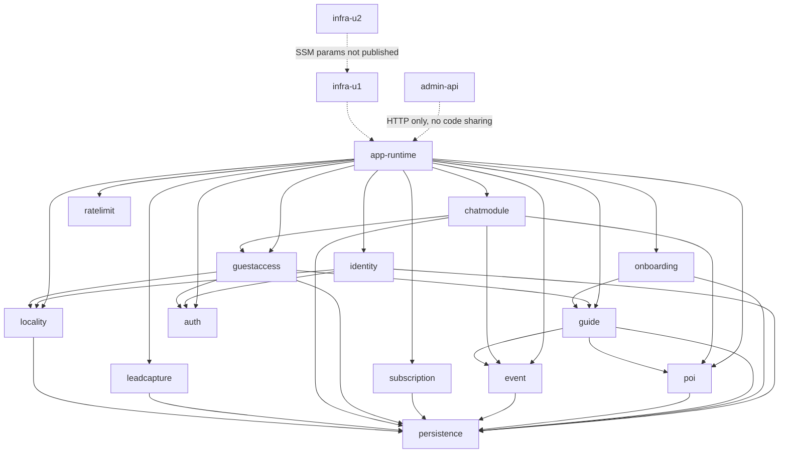

# Component Inventory — `guestguideiq-app`

**Derived from**: the developer full-repo scan of 2026-09-07. Every `routes.ts` and `service.ts` was read line by line; repository **port interfaces and record types** were read; repository **Prisma adapter bodies** were skimmed at query-shape granularity only (see `reverse-engineering-timestamp.md` for the exact split).

Headings below are the canonical component names used by the scope block in `reverse-engineering-timestamp.md`. Endpoint contracts belong to `api-documentation.md` and are not repeated here.

---

## Domain components (u1 `backend-api`)

All ten follow the identical triad `repository.ts` → `service.ts` → `routes.ts`, wired only in `src/wiring.ts`.

### identity

**Responsibility**: Account lifecycle and all Property Owner authentication — signup (atomically creating the Account and its single Property), login, password-reset request and confirm, access/refresh token issuance and rotation.
**Depends on**: `locality` (to resolve the tenant from the request `Host` at signup), `auth` (JWT signing/verification, refresh-token store), `bcryptjs`, its own Prisma adapter.
**Depended on by**: every authenticated route, indirectly via `auth`.
**Notes**: `requestPasswordReset` returns a `{ resetToken }` that `routes.ts` discards — there is no delivery mechanism, so reset confirm is dead in practice.

### onboarding

**Responsibility**: The four-step property-setup state machine (`property_basics` → `content_source` → `content_review` → `confirm`), including seeding guide content either from scratch or from caller-supplied pre-extracted PDF sections.
**Depends on**: `guide` (to seed sections), its own Prisma adapter.
**Depended on by**: nothing — it is a leaf entry point.
**Notes**: Enforces strict ordering with `409 CONFLICT`. Performs no PDF parsing of its own.

### guide

**Responsibility**: The Property Guide aggregate — sections, draft/published status, and favourites over locality-curated POIs and Events. Lazily creates an empty draft on first read.
**Depends on**: `poi` and `event` (to validate that a favourite belongs to the property's own locality), `guide/propertyLookup.ts`, its own Prisma adapter.
**Depended on by**: `onboarding` (seeding), `guestaccess` (published read).
**Notes**: Section updates are a full replace of the array, not a merge.

### poi

**Responsibility**: Curated Points of Interest for a locality brand — the owner-facing list read and the internal/ops create.
**Depends on**: its own Prisma adapter.
**Depended on by**: `guide` (favourite validation), `chatmodule` (curated-item count for the sparse fallback), `internal` and `admin-api` (create).

### event

**Responsibility**: Curated local Events — the owner-facing list read (active only) and the internal/ops audit list (`includeExpired`).
**Depends on**: its own Prisma adapter.
**Depended on by**: `guide` (favourite validation), `chatmodule` (curated-item count), `internal` and `admin-api` (audit list).

### subscription

**Responsibility**: The single-tier `standard` subscription — create, upgrade, downgrade, cancel — over a Stripe adapter.
**Depends on**: `subscription/stripeAdapter.ts` (skimmed, not read line by line), its own Prisma adapter.
**Depended on by**: nothing.
**Notes**: `upgrade`/`downgrade` are no-ops on `plan` today; the route's fallthrough branch is `cancel`, and there is no read endpoint.

### guestaccess

**Responsibility**: Stay-token-scoped guest access — resolving a `Stay` from its opaque token, enforcing the `Host`-to-locality-brand match (BR8.3), and assembling the guest view of property, locality branding, and published guide.
**Depends on**: `locality` (host resolution and branding), `guide` (published sections), `auth` (`requireStayToken` middleware), its own Prisma adapter.
**Depended on by**: `chatmodule` (shares the same stay-token middleware).
**Notes**: `createStayService` / `StayService.createStay` (lines 62–77) are **dead code — referenced by nothing**. No component and no endpoint creates a `Stay`. This is the gap that blocks the whole Guest frontend; see `api-documentation.md` § A.9.

### chatmodule

**Responsibility**: The guest itinerary chat — persisting the transcript, counting curated locality content to decide the sparse-content fallback, calling the chat provider with one retry, and returning the reply plus the message array.
**Depends on**: `guestaccess` / `auth` (stay-token resolution), `poi` and `event` (curated-item count), `src/chat/provider.ts`, its own Prisma adapter.
**Depended on by**: nothing.
**Notes**: `CHAT_PROVIDER=null` in every environment resolves `NullChatProvider`, which always throws. No endpoint reads the stored transcript back.

### leadcapture

**Responsibility**: Three unauthenticated marketing intake endpoints (waitlist, partner, investor) with per-form required-field validation.
**Depends on**: its own Prisma adapter (skimmed only).
**Depended on by**: nothing. Already consumed by the existing marketing site.
**Notes**: Accepts and stores unlisted extra fields; never deduplicates.

### locality

**Responsibility**: The tenancy root — locality brands, their registered domains, host-to-brand resolution, and the `visualStyling` branding blob. Enforces BR9.2 (one domain maps to at most one brand).
**Depends on**: `locality/domainCache.ts` (skimmed only), its own Prisma adapter.
**Depended on by**: `identity` (signup host resolution), `guestaccess` (BR8.3 check), `internal` and `admin-api` (brand and domain creation).
**Notes**: `visualStyling` is an unschematized `Record<string, unknown> | null`. This component is the single point where the Host-header tenancy constraint originates.

---

## Service component (u2)

### admin-api

**Responsibility**: The internal ops back office. Owns **no data**; every `/v1` route is an ops-role-gated delegation into u1's internal API over HTTP, with request bodies validated against real Fastify JSON schemas.
**Depends on**: u1's internal API **at runtime over HTTP only** (`BACKEND_API_INTERNAL_URL`, default `http://localhost:3001/v1`) — no compile-time dependency, no shared types, no client SDK. Internally: `admin-api/src/internal/client.ts` (axios), `admin-api/src/auth/middleware.ts`, `jsonwebtoken`, `pino`.
**Depended on by**: nothing.
**Notes**: The ops-role JWT it verifies is **not issued anywhere in this repo**. A valid Property Owner token reaches it and is rejected with `403`.

---

## Cross-cutting and infrastructure components

### app-runtime

**Files**: `src/app.ts`, `src/internalApp.ts`, `src/server.ts`, `src/config.ts`, `src/wiring.ts`, `src/lib/errors.ts`, `src/lib/logger.ts`, `src/lib/otel.ts`, `src/lib/ids.ts`.
**Responsibility**: Composition and process concerns — building the two Fastify instances, registering CORS, mounting the rate-limit `preHandler`, the central error handler that produces the shared envelope, fail-fast env-var validation, pino logging with redaction, and opt-in OpenTelemetry.
**Depends on**: every domain component (it constructs them).
**Depended on by**: nothing — it is the top of the graph.
**Notes**: `src/app.ts` is the largest file in u1 at 175 lines. `config.ts` reads every secret from `process.env` and fails fast at startup; no hardcoded secrets anywhere.

### auth

**Files**: `src/auth/jwt.ts`, `src/auth/middleware.ts`, `src/auth/password.ts` (skimmed), `src/auth/refreshTokenStore.ts` (skimmed).
**Responsibility**: JWT signing and verification for the three token kinds (access, refresh, internal service), the `requireAuth` and ownership guards, `requireStayToken` (path token + `Host`-to-locality match), password hashing, and refresh-token revocation.
**Depends on**: `locality` (host resolution inside `requireStayToken`), `jsonwebtoken`, `bcryptjs`.
**Depended on by**: `identity`, `guestaccess`, `chatmodule`, and every authenticated route.
**Notes**: `InMemoryRefreshTokenStore` is **per-process** — revocation is not shared across the 2–6 production tasks.

### ratelimit

**Files**: `src/ratelimit/plugin.ts`, `src/ratelimit/types.ts`, `src/ratelimit/memoryStore.ts`.
**Responsibility**: Token-bucket rate limiting with four presets, `Retry-After` in seconds on `429`.
**Depends on**: nothing.
**Depended on by**: `app-runtime` (registered as a `preHandler` **after** route registration, matching paths with hand-rolled string comparisons).
**Notes**: `InMemoryRateLimitStore` is per-process, so effective limits scale with task count. Zero test coverage; firing was verified empirically during the scan.

### persistence

**Files**: `prisma/schema.prisma`, `prisma/migrations/20260906234912_init/`, `src/db/prismaClient.ts` (skimmed), and the Prisma adapter half of each `repository.ts` (skimmed).
**Responsibility**: The 11-entity relational model and the single applied migration. One PostgreSQL 16 database shared by all domain components.
**Depends on**: `@prisma/client`.
**Depended on by**: every domain component, always through a narrow port interface — no service imports `PrismaClient` directly.

### infra-u1

**Files**: `infra/bin/backend-api.ts`, `infra/lib/backend-api-stack.ts`, `infra/cdk.json`, `infra/cdk.context.json`.
**Responsibility**: u1's CDK v2 app — three environment-parameterized stacks (`dev`, `staging`, `production`) covering VPC, ECS Fargate + ALB, RDS PostgreSQL 16, Secrets Manager, a CloudWatch log group, and a one-off migration task definition. Also the source of the per-environment `allowedOrigins` and `CHAT_PROVIDER` values.
**Depends on**: the repo root `Dockerfile` as a build asset (`runtime` and `migrate` targets).
**Depended on by**: `infra-u2`, which expects SSM parameters this stack does not publish.

### infra-u2

**Files**: `admin-api/infra/bin/admin-api.ts`, `admin-api/infra/lib/admin-api-stack.ts`, `admin-api/infra/cdk.json` (line counts and README description read; the stack body was **not** read line by line).
**Responsibility**: u2's own CDK v2 app — ECS Fargate with a WAF IP allowlist.
**Depends on**: shared VPC / cluster / security-group / subnet ids read from SSM parameters published by `infra-u1`.
**Notes**: **Not deployable today** — those SSM parameters do not exist. Documented in `admin-api/README.md` and at the top of the stack file.

---

## Component dependency graph

*Text fallback*: `app-runtime` constructs all ten domain components plus `auth` and `ratelimit`. `locality` is the tenancy root that `identity` and `guestaccess` both depend on. `guide` depends on `poi` and `event` for favourite validation; `chatmodule` depends on `guestaccess`, `poi`, and `event`. Every domain component reaches `persistence` through a port. `admin-api` couples to `app-runtime` only over HTTP at runtime, and `infra-u2` depends on SSM parameters `infra-u1` does not publish.
