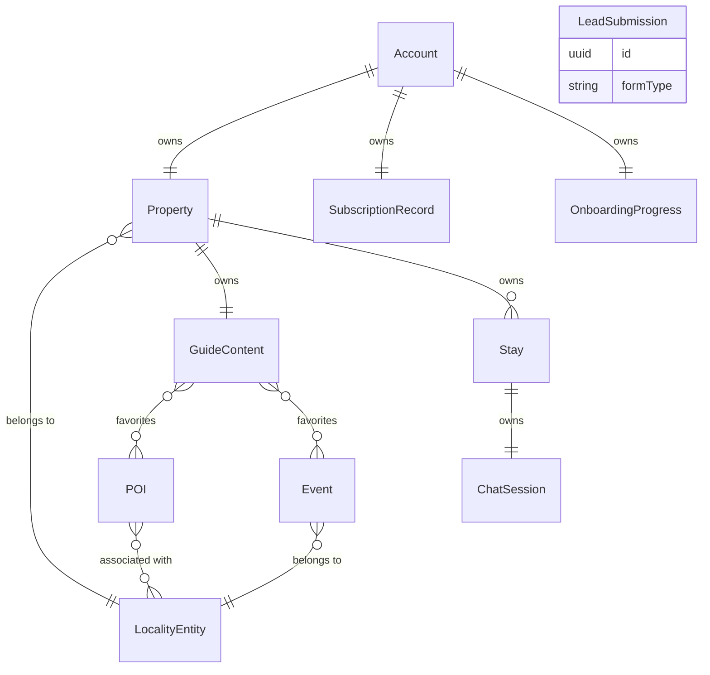

# Functional Specification — u1-backend-api

Source of truth for `u1-backend-api`'s workflows (ordered step sequences) and lifecycle-entity state transitions — the ordered behavior `entities.md` (shape) and `rules.md` (decision logic) don't capture on their own. Two derived views (entity-relationship diagram, rules summary) close the file for readability.

## Workflows

### W1 — Property Owner Signup (US1.1)

1. Property Owner submits `username` + `password` to the domain they arrived on.
2. System resolves the request's domain against `LocalityEntity.domains` (BR9.1).
3. If no match: reject with `LOCALITY_NOT_RESOLVED` (BR1.2) → **PO-0** neutral error page. End.
4. If `username` already exists (BR1.1): reject with a duplicate-username error. End.
5. Create `Account` (passwordHash computed per the algorithm chosen at `infrastructure-design`, NFR3.6).
6. Create `Property` with `localityBrandId` set to the resolved locality (BR1.2, immutable per BR1.3).
7. Create `OnboardingProgress` at `currentStep = property_basics` (BR3.1).
8. Authenticate the new account and route to the onboarding wizard.

### W2 — Password Reset (US1.2)

1. Property Owner requests a reset for their registered email.
2. System issues a time-limited reset token (mechanism/window: `infrastructure-design`).
3. Property Owner follows the emailed link within the window (BR1.4) → set a new password → authenticated.
4. If the window has elapsed: show "link expired" + offer to request a new one. End.

### W3 — Onboarding Wizard (US1.3, US1.4)

1. On first login, route to `OnboardingProgress.currentStep` (BR3.1/BR3.3).
2. **Step `property_basics`**: confirm/edit property name → advance to `content_source`.
3. **Step `content_source`**: Property Owner chooses "Upload PDF" or "Start from scratch."
   - **PDF path**: upload → extraction runs (loading state) → on success, seed `GuideContent.sections` in `draft` (BR3.5) → advance to `content_review`. On failure (BR3.4): show error, offer manual entry → advance to `content_review` with empty sections.
   - **Manual path**: advance directly to `content_review` with empty sections.
4. **Step `content_review`**: Property Owner edits/confirms `GuideContent.sections` → advance to `confirm`.
5. **Step `confirm`**: summary shown → Property Owner confirms → set `OnboardingProgress.completedAt` (BR3.2) → route to the guide editor.
6. At any step, exiting and returning re-enters at the stored `currentStep` with all prior entries intact (BR3.3) — this is idempotent re-entry, not a step transition.

### W4 — Guide Editing & Publishing (US1.5)

1. Property Owner (past onboarding) edits `GuideContent.sections` → saved immediately, `publishStatus` unchanged.
2. Property Owner explicitly publishes → `publishStatus = published` (Q1; see Lifecycle below).
3. A Guest-facing read while `publishStatus != published` returns the not-yet-published placeholder (BR4.1), never the raw `sections`.

### W5 — Curate Favorite Locality Content (US1.6)

1. Property Owner browses `POI`/`Event` rows scoped to their `Property.localityBrandId`.
2. Property Owner favorites an item → validate it belongs to the property's own locality (BR4.2) → add to `favoritedPOIIds`/`favoritedEventIds`.
3. Property Owner unfavorites → remove from the array; no confirmation required (non-destructive).
4. If the locality has no curated content yet: show the empty-locality message instead of a blank list.

### W6 — Start / Manage Subscription (US1.7, US1.8)

1. Property Owner starts a subscription → attempt payment (mechanism: `infrastructure-design`/OQ1).
   - Success: `SubscriptionRecord.status = active`, `plan = "standard"` (Q3).
   - Failure: state unchanged (BR2.3); surface the payment error.
2. Property Owner upgrades/downgrades/cancels → require `status == active` (BR2.2) → apply the transition (see Lifecycle below); until real plan tiers exist (OQ1), upgrade/downgrade are no-ops on `plan` (Q3) but still validated and logged as an action.

### W7 — Guest Access via Stay-Scoped Link (US2.1)

1. Guest opens a link containing a `Stay.token`.
2. Resolve the request's domain against `LocalityEntity.domains` (BR9.1); if unresolved, this is a guest-facing dead end distinct from PO-0 — treat as the generic "not found" case (no locality context exists to render anything, branded or not).
3. Look up `Stay` by `token`. If none matches: show "no longer valid" (BR8.2). End.
4. If `current time > Stay.expiresAt`: show "no longer valid" (BR8.1). End.
5. If the resolved domain's locality does not match the linked `Property.localityBrandId`: reject (BR8.3). End.
6. Render the guide with the property name/photo trust cue (AC2.1.1) and the resolved locality-brand theme.

### W8 — View Property Guide Content (US2.2)

1. Following W7's successful resolution, read `GuideContent` for the `Stay.propertyId` (BR4.1 applies — only `published` content is ever returned here).
2. Read `favoritedPOIIds`/`favoritedEventIds`, excluding any `Event` with `expiryStatus = expired` (BR6.3).
3. Render available content; an empty or partial set renders gracefully, never as broken/blank (AC2.2.2).

### W9 — Itinerary Chat (US2.3)

1. Guest sends a message within a resolved, valid `Stay` (W7 must have already succeeded).
2. If no `ChatSession` exists for this `Stay`, create one lazily (Q4).
3. Append the guest's message; assemble grounding context from `POI`/`Event` scoped to the stay's locality (BR7.1).
4. If the grounding context is sparse: reply with the limited-content notice + general guidance (BR7.2). Otherwise: generate and append the assistant's reply (LLM provider/approach: OQ3, deferred).
5. On a backend timeout/failure: surface a retry-able waiting state; the message history up to that point is preserved.

### W10 — Lead Form Submission (US3.1, US3.2)

1. Visitor submits one of the three lead forms.
2. Validate fields against that `formType`'s schema (BR10.1).
3. Valid: create `LeadSubmission` (no duplicate check, BR10.2) → success.
4. Invalid, or a backend failure: return an error; the visitor's entered data is preserved client-side (not a concern of this component's own state — see `contract-summary.md`'s Contract 3 note that both failure modes behave identically from the caller's perspective).

## Lifecycle State Machines

### SubscriptionRecord.status

| Current State | Event | Guard | Next State | Notes |
|---|---|---|---|---|
| none | Start subscription | payment succeeds | active | `plan` set to `"standard"` (Q3) |
| none | Start subscription | payment fails | none | BR2.3 — no partial state |
| active | Upgrade / Downgrade | status == active | active | no-op on `plan` until real tiers exist (Q3) |
| active | Cancel | status == active | cancelled | guide content is NOT deleted (A2 assumption, carried from `requirements.md`) |
| none / cancelled | Upgrade / Downgrade / Cancel | — | *(rejected, BR2.2)* | no state change; AC1.8.3 |

### GuideContent.publishStatus

| Current State | Event | Guard | Next State | Notes |
|---|---|---|---|---|
| draft | Publish | — | published | explicit Property Owner action (Q1) |
| published | Unpublish | — | draft | no story currently exercises this direction; included for completeness since no rule forbids it |
| draft | Edit content | — | draft | editing never changes publish state on its own |
| published | Edit content | — | published | edits to published content are visible immediately — there is no separate "re-publish" step |

### Event.expiryStatus

| Current State | Event | Guard | Next State | Notes |
|---|---|---|---|---|
| active | Lifecycle sweep / read-time check | `current date > eventDate` | expired | one-way; no path back to `active` (BR6.2) |

### OnboardingProgress.currentStep

| Current State | Event | Guard | Next State | Notes |
|---|---|---|---|---|
| property_basics | Advance | basics confirmed | content_source | |
| content_source | Advance (PDF path) | extraction succeeds or fails-with-fallback | content_review | BR3.4 |
| content_source | Advance (manual path) | — | content_review | |
| content_review | Advance | content confirmed | confirm | |
| confirm | Finish | — | *(terminal — `completedAt` set, BR3.2)* | routes to guide editor thereafter |
| *(any)* | Re-entry | account logs in again before `completedAt` | *(same state)* | BR3.3 — idempotent resume, not a transition |

## Derived View: Entity-Relationship Diagram

*Derived from `entities.md`'s YAML block — that file is the source of truth; this diagram is for readability only.*

**Text fallback**: Account owns exactly one Property, one SubscriptionRecord, and one OnboardingProgress. Property belongs to exactly one LocalityEntity and owns exactly one GuideContent plus zero-or-more Stays. GuideContent favorites zero-or-more POIs and zero-or-more Events. POI is associated with one-or-more LocalityEntities (many-to-many). Event belongs to exactly one LocalityEntity. Each Stay owns exactly one ChatSession. LeadSubmission has no relationships to any other entity.

## Derived View: Rules Summary

*Derived from `rules.md`'s YAML block — that file is the source of truth.*

| Group | Rules | Categories Present |
|---|---|---|
| BR1 — Identity | BR1.1-BR1.5 | validation, policy, constraint |
| BR2 — Subscription | BR2.1-BR2.3 | authorization, constraint |
| BR3 — Onboarding | BR3.1-BR3.6 | policy, constraint |
| BR4 — PropertyGuide | BR4.1-BR4.3 | authorization, validation, policy |
| BR5 — PointOfInterest | BR5.1-BR5.2 | validation, policy |
| BR6 — LocalEvent | BR6.1-BR6.4 | constraint, policy, authorization |
| BR7 — ItineraryChat | BR7.1-BR7.3 | constraint, policy |
| BR8 — GuestAccess | BR8.1-BR8.4 | validation, authorization, policy |
| BR9 — Locality | BR9.1-BR9.6 | policy, validation, authorization |
| BR10 — LeadCapture | BR10.1-BR10.2 | validation, policy |

## Review

**Verdict:** READY
**Reviewer:** aidlc-architecture-reviewer-agent
**Date:** 2026-09-06T05:59:47Z
**Iteration:** 1

### Findings

| ID | Severity | Location | Finding | Required action | Status |
|---|---|---|---|---|---|
| R-01 | Major | entities.md, rules.md > fenced yaml blocks | Verified programmatically: both blocks parse as valid YAML (11 entities, 38 rules); every `references` target in `entities.md` names a real, declared entity; no self-references. | None. | Resolved |
| R-02 | Major | traceability.json vs. rules.md | Verified programmatically: every `coverage` target BR id resolves to a real rule in `rules.md`; every `upstream_ids` entry has exactly one `coverage` row and vice versa (42/42); every one of the 38 declared rules is either targeted by a coverage row or explicitly justified in the `reverse` array — zero unexplained orphans. | None. | Resolved |
| R-03 | Major | traceability.json > `reverse` entries | The 9 orphan-justified rules split into two genuine categories, both legitimate: (a) rules whose authoring AC belongs to `u2-admin-api`'s assigned stories (US4.1-US4.4) because `Admin` calls into this unit's components without owning the AC itself — consistent with `domain-design/components.md`'s cross-Unit dependency design; (b) BR9.1, a system-wide property (NFR6.1) with no story-level AC at any layer; and BR10.2, a policy resolving an open item (Q2) rather than a numbered AC. None of these are gaps disguised as justifications. | None. | Resolved |
| R-04 | Major | functional-spec.md > Lifecycle State Machines vs. entities.md | Every state machine's states match its entity's declared `allowed_values` exactly: `SubscriptionRecord.status` (none/active/cancelled), `GuideContent.publishStatus` (draft/published), `Event.expiryStatus` (active/expired), `OnboardingProgress.currentStep` (property_basics/content_source/content_review/confirm). No state appears in one artifact but not the other. | None. | Resolved |
| R-05 | Minor | functional-spec.md > Entity-Relationship Diagram | The mermaid `erDiagram` cardinality notation matches `entities.md`'s declared relationships for all 11 entities (spot-checked all edges: 1:1, N:1, 1:N, and N:M relationships all use the correct mermaid symbols), and a text fallback is present per this workspace's Mermaid-validation convention. | None. | Resolved |
| R-06 | Minor | rules.md > BR9.5/BR9.6 vs. requirements.md/refined-mockups.md | Locality-brand rendering and its minimal-identity fallback (carried from `refined-mockups.md`'s BrandTheme component and Q6 decision) are correctly represented as rules here, closing what would otherwise be a gap between the UX-level design and this unit's own business-rule set. | None. | Resolved |

### Summary

This is a well-formed, internally consistent functional design covering all 10 components and 13 stories assigned to `u1-backend-api`. Both source-of-truth YAML blocks parse cleanly with no structural defects (R-01). Traceability is complete: every acceptance criterion maps to a real rule, and every rule is either covered or explicitly and correctly justified as belonging to a cross-Unit or open-item case rather than silently dropped (R-02, R-03). The three lifecycle state machines are byte-consistent with their entities' declared enums (R-04), and the derived ER diagram accurately reflects the source-of-truth relationships (R-05). The locality-branding rendering behavior carried forward from `refined-mockups.md` is correctly captured as first-class business rules rather than left as a UI-only concern (R-06). No blocking issues found; ready for NFR Requirements.
