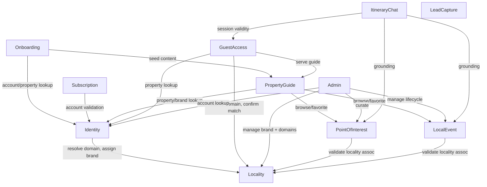

# Domain Design — Component Catalogue — Backend Services for GuestGuideIQ (re-confirmed)

Components identified from `requirements-analysis/requirements.md` and `user-stories/stories.md`, per the Q1-Q6 decisions in `domain-design-questions.md` (including the Q4 reversal adding a separate `Admin` component, and Q5/Q6's locality-branding additions). This is a **greenfield** backend — the existing marketing site (`architecture.md`, `component-inventory.md`) has no server-side components to integrate with; its six components (Site Shell, Page Routes, Lead Capture Forms, Experience Content, Site Configuration, Build & Deployment Pipeline) remain untouched except that the marketing site's existing lead-capture forms will point at this backend's `LeadCapture` component instead of Formspree (FR1).

## Part A — Component Catalogue

```yaml
components:
  - name: Identity
    summary: Property Owner accounts and the properties they own
    behaviour: >
      Owns account creation and authentication (username/password), password-reset token
      issuance and validation, and the Property entity created alongside an account. Resolves
      a new account+property's locality-brand from the signup domain by calling Locality
      (FR3.5, AC1.1.4) — if the domain doesn't resolve to any locality-brand, account creation
      is refused (AC1.1.5). A property's locality-brand assignment is immutable after creation
      (FR9.7) — Identity has no operation to reassign it.
    responsibilities:
      - Account creation, authentication, password reset
      - Property record ownership (one property per account, in this spec's scope)
      - Resolving and assigning a property's locality-brand at signup time (never after)
    depends_on:
      - component: Locality
        interaction: Resolve the signup domain to a locality-brand and assign it to the new property (FR3.5/AC1.1.4); reject signup if unresolved (AC1.1.5)
        style: sync
    dependents:
      - component: Onboarding
        interaction: Look up the account/property being onboarded
      - component: Subscription
        interaction: Validate the account exists before creating/changing a subscription
      - component: PropertyGuide
        interaction: Look up the property a guide belongs to, and its locality-brand for dashboard rendering (AC1.5.3/AC1.5.4)
      - component: GuestAccess
        interaction: Look up the property a stay/link belongs to
      - component: Admin
        interaction: Account lookup for support/investigation (US4.3)
    external_dependencies:
      - name: Secrets manager
        kind: other
        purpose: Store password-hashing keys/config per NFR3.5/NFR3.6; hashing algorithm choice deferred to infrastructure-design
    entities:
      - name: Account
        identifier: id
        attributes: [id, username, passwordHash, createdAt]
      - name: Property
        identifier: id
        attributes: [id, accountId, name, localityBrandId]
        references:
          - entity: LocalityEntity
            owned_by: Locality
            relationship: "each Property belongs to exactly one Locality/brand (FR9.6), assigned once at signup and not reassigned (FR9.7)"

  - name: Subscription
    summary: Property Owner subscription lifecycle (create/upgrade/downgrade/cancel)
    behaviour: >
      Tracks subscription status and plan for an account. Supports all four actions in scope
      per Q2 (create, upgrade, downgrade, cancel). A failed create/change leaves the account's
      prior state unchanged (AC1.7.2, AC1.8.3) — no partial state. Cancellation does not delete
      guide content (AC1.8.2's assumption, A2) — that remains PropertyGuide's data, untouched.
      Renders (or supplies data for rendering) in the account's locality-brand, reached via its
      existing Identity dependency — no separate Locality dependency needed, same reasoning as
      Onboarding.
    responsibilities:
      - Subscription status and plan tracking
      - Enforcing valid state transitions (no upgrade/downgrade/cancel with nothing active)
    depends_on:
      - component: Identity
        interaction: Validate the account exists before creating or changing a subscription
        style: sync
    dependents: []
    external_dependencies:
      - name: Billing provider (TBD, OQ1)
        kind: third-party-api
        purpose: Actual payment processing and plan billing — provider and plan structure deferred to domain-design/contract-design per OQ1; this component owns the capability, not the commercial mechanics (A2)
    entities:
      - name: SubscriptionRecord
        identifier: id
        attributes: [id, accountId, plan, status]
        references:
          - entity: Account
            owned_by: Identity
            relationship: "each SubscriptionRecord belongs to one Account"

  - name: Onboarding
    summary: Property Owner onboarding wizard progress and guide-seeding
    behaviour: >
      Tracks which onboarding step an account is on, supporting exact-step resume (AC1.3.3) and
      routing a completed account straight past the wizard on repeat login (AC1.3.4). Delegates
      actual guide-content creation (manual entry or PDF-import extraction) to PropertyGuide —
      Onboarding owns the wizard's own progress state, not guide content itself. Renders (or
      supplies data for rendering) in the account's already-resolved locality-brand, reached via
      its existing Identity dependency — the locality is already known by this point (assigned
      at signup, AC1.1.4), so no separate Locality dependency is needed here (AC1.5.3's "any
      page" includes onboarding, per `refined-mockups.md`'s PO-3).
    responsibilities:
      - Wizard step/progress tracking per account
      - Coordinating PDF-import extraction vs. manual-entry paths into PropertyGuide
    depends_on:
      - component: Identity
        interaction: Look up the account/property being onboarded
        style: sync
      - component: PropertyGuide
        interaction: Seed initial guide content from PDF extraction (FR3.2) or manual entry (FR3.3); on extraction failure, fall back to manual entry (FR3.4/AC1.4.2)
        style: sync
    dependents: []
    external_dependencies:
      - name: PDF text/OCR extraction service (TBD)
        kind: third-party-api
        purpose: Extract structured content from an uploaded PDF guide (FR3.2) — provider deferred to domain-design/infrastructure-design; stories.md's mob review flags this as multiple implementation units, not a single call
    entities:
      - name: OnboardingProgress
        identifier: id
        attributes: [id, accountId, currentStep, completedAt]
        references:
          - entity: Account
            owned_by: Identity
            relationship: "each OnboardingProgress tracks exactly one Account's wizard state"

  - name: PropertyGuide
    summary: A property's digital guide content, editable by its owner and viewable by guests
    behaviour: >
      Owns the guide's editable content sections and published state (AC1.5.1, AC1.5.2's
      not-yet-published placeholder). Tracks which POIs/Events the owner has favorited to
      feature (FR4.2, US1.6) by referencing PointOfInterest/LocalEvent entities — it does not
      own POI/Event data itself. Renders (or supplies data for rendering) in the property's
      locality-brand, via the property/locality-brand relationship reachable through Identity
      (AC1.5.3), including onboarding (PO-3) per `refined-mockups.md`'s reading of "any page."
    responsibilities:
      - Guide content authoring and publish state
      - Featured-content selection (favoriting POIs/Events)
    depends_on:
      - component: Identity
        interaction: Look up the property a guide belongs to, and resolve its locality-brand for dashboard/wizard rendering
        style: sync
      - component: PointOfInterest
        interaction: Browse curated POIs for the property's locality and mark favorites (US1.6, FR4.2)
        style: sync
      - component: LocalEvent
        interaction: Browse curated events for the property's locality and mark favorites
        style: sync
    dependents:
      - component: Onboarding
        interaction: Seed initial content from PDF extraction or manual entry
      - component: GuestAccess
        interaction: Serve the property's published guide content to a guest
    entities:
      - name: GuideContent
        identifier: id
        attributes: [id, propertyId, sections, publishedStatus, favoritedPOIIds, favoritedEventIds]
        references:
          - entity: Property
            owned_by: Identity
            relationship: "each GuideContent belongs to exactly one Property"
          - entity: POI
            owned_by: PointOfInterest
            relationship: "a GuideContent may favorite many POIs (US1.6)"
          - entity: Event
            owned_by: LocalEvent
            relationship: "a GuideContent may favorite many Events"

  - name: PointOfInterest
    summary: Curated points-of-interest content, scoped to one or more localities
    behaviour: >
      Owns curated POI records entered by Admin/ops (US4.1). A POI may be associated with more
      than one locality (FR5.4, many-to-many) — a duplicate-data check is scoped to "within the
      same locality," so a legitimate cross-locality reuse of an existing POI is not rejected
      (AC4.1.2's reworded scoping).
    responsibilities:
      - POI record storage and curation
      - Enforcing the many-to-many POI-to-locality relationship (FR5.4)
    depends_on:
      - component: Locality
        interaction: Validate/associate the locality (or localities) a POI belongs to
        style: sync
    dependents:
      - component: PropertyGuide
        interaction: Browse/favorite POIs for a property's locality
      - component: Admin
        interaction: Curate (create/edit) POI records (US4.1)
      - component: ItineraryChat
        interaction: Ground itinerary suggestions in the property's locality's curated POIs (FR7.2)
    entities:
      - name: POI
        identifier: id
        attributes: [id, name, description, category]
        references:
          - entity: LocalityEntity
            owned_by: Locality
            relationship: "a POI may be associated with one or more Localities (FR5.4, many-to-many)"

  - name: LocalEvent
    summary: Continuously-ingested local events, scoped to one locality, with lifecycle management
    behaviour: >
      Owns event records ingested by an automated monitoring module (FR6.1) and manages their
      full lifecycle through to expiry/removal from guest-facing content (FR6.3). Deduplicates
      events discovered more than once (AC4.2.3). Ingestion (source TBD, OQ2/FR6.4) and
      lifecycle/expiry are two operationally distinct concerns per stories.md's mob review —
      this component owns both but they should decompose into separate units at
      `units-generation` so lifecycle/expiry isn't held hostage to the sourcing decision.
    responsibilities:
      - Event ingestion from an external source (source TBD)
      - Event lifecycle: ingestion through expiry/removal
      - Deduplication of re-discovered events
    depends_on:
      - component: Locality
        interaction: Associate an ingested event with its locality
        style: sync
    dependents:
      - component: PropertyGuide
        interaction: Browse/favorite non-expired events for a property's locality
      - component: Admin
        interaction: Manage the events lifecycle, audit expired/duplicate events (US4.2)
      - component: ItineraryChat
        interaction: Ground itinerary suggestions in current, non-expired locality events (FR7.2)
    external_dependencies:
      - name: Events data source (TBD, OQ2)
        kind: third-party-api
        purpose: Third-party events API, web monitoring, or manual feed — specific source deferred to domain-design per FR6.4/OQ2
    entities:
      - name: Event
        identifier: id
        attributes: [id, name, eventDate, expiryStatus]
        references:
          - entity: LocalityEntity
            owned_by: Locality
            relationship: "each Event belongs to exactly one Locality"

  - name: ItineraryChat
    summary: AI/LLM-powered conversational itinerary assistant for guests
    behaviour: >
      Owns a guest's chat session (message history) for a given stay. Grounds suggestions in
      the property's locality's curated POIs/events (FR7.2). For a locality with little/no
      curated content, the assistant's own reply text says so and offers general guidance
      (AC2.3.2, Q3) rather than the UI changing state. On backend failure, preserves history
      and allows retry (AC2.3.3). Session-state handling and output moderation are explicit
      sub-scope per stories.md's mob review, not implied by "chat."
    responsibilities:
      - Multi-turn chat session/message history per guest stay
      - Grounding itinerary suggestions in locality POI/event content
      - Output moderation/guardrails (open item, R-05 from requirements-analysis)
    depends_on:
      - component: PointOfInterest
        interaction: Retrieve curated POIs for the stay's locality as grounding content
        style: sync
      - component: LocalEvent
        interaction: Retrieve current, non-expired events for the stay's locality as grounding content
        style: sync
      - component: GuestAccess
        interaction: Validate the guest session belongs to a valid, unexpired stay before starting/continuing a chat
        style: sync
    dependents: []
    external_dependencies:
      - name: LLM provider (TBD, OQ3)
        kind: third-party-api
        purpose: Model/provider, prompt-grounding approach, cost and latency implications deferred to domain-design/nfr-requirements per FR7.3/OQ3
    entities:
      - name: ChatSession
        identifier: id
        attributes: [id, stayId, messages, createdAt]
        references:
          - entity: Stay
            owned_by: GuestAccess
            relationship: "each ChatSession belongs to exactly one Stay"

  - name: GuestAccess
    summary: Stay-scoped guest access links and their validity window
    behaviour: >
      Owns the stay-scoped access link/token, its check-in/check-out window, and expiry
      behavior (FR8.2/FR8.3). Both an expired-stay link and a malformed/never-issued token
      surface the same "no longer valid" message (AC2.1.2/AC2.1.3), never a raw 404. A guest
      link resolves only through its property's own locality-brand domain/subdomain — never a
      separate, unbranded central domain (FR8.6/AC2.1.4). How a stay itself is created
      (manual entry vs. booking-calendar sync) is deferred to domain-design per FR8.4/OQ4.
    responsibilities:
      - Stay-scoped link generation, validation, and expiry
      - Domain-consistency check between the link and its property's locality-brand
    depends_on:
      - component: Identity
        interaction: Look up the property a stay/link belongs to
        style: sync
      - component: PropertyGuide
        interaction: Serve the property's guide content once a link is validated
        style: sync
      - component: Locality
        interaction: Resolve the incoming domain to a locality-brand and confirm it matches the linked property's own locality-brand (FR8.6/AC2.1.4, NFR6.1)
        style: sync
    dependents:
      - component: ItineraryChat
        interaction: Validate the guest session belongs to a valid stay before chatting
    entities:
      - name: Stay
        identifier: id
        attributes: [id, propertyId, checkIn, checkOut, token, expiresAt]
        references:
          - entity: Property
            owned_by: Identity
            relationship: "each Stay belongs to exactly one Property"

  - name: LeadCapture
    summary: Marketing-site lead-form submissions (Formspree replacement)
    behaviour: >
      Persists submissions from the three existing marketing-site lead forms (waitlist,
      partner interest, investor/press), replacing Formspree as the system of record (FR1.1,
      FR1.2). On failure, the visitor's entered data is never lost (FR1.4/AC3.2.1/AC3.2.2) —
      this is a frontend/interaction-spec concern (retain field values), not a data-loss risk
      at this component's own boundary, since nothing is persisted until a valid submission
      succeeds. Duplicate-submission handling (e.g. the same email submitting twice) remains
      an open item deferred to domain-design (stories.md's US3.1 open item).
    responsibilities:
      - Accepting and persisting the three lead-form submission types
      - Preserving the existing field sets per `api-documentation.md`
    depends_on: []
    dependents: []
    entities:
      - name: LeadSubmission
        identifier: id
        attributes: [id, formType, fields, submittedAt]

  - name: Admin
    summary: Internal ops-facing operations across POI curation, event management, account lookup, and locality-brand management
    behaviour: >
      A thin orchestration boundary with no data of its own — it exposes privileged,
      internal-only operations by calling into the components that actually own each piece of
      data (PointOfInterest, LocalEvent, Identity, Locality). Added as a separate component per
      an explicit human reversal of the original Domain Design recommendation (Q4 originally
      chose privileged operations on the owning components directly; the human overrode this
      during the locality-branding redo to centralize all ops-facing operations, including the
      new locality-brand management capability, behind one boundary). See ADR-004 in
      `decisions.md` for the accepted trade-off.
    responsibilities:
      - POI curation (US4.1)
      - Event lifecycle management and audit (US4.2)
      - Property Owner account lookup/support (US4.3)
      - Locality-brand identity and domain management (US4.4)
    depends_on:
      - component: PointOfInterest
        interaction: Create/edit curated POI records
        style: sync
      - component: LocalEvent
        interaction: Manage event lifecycle, view expired/duplicate audit trail
        style: sync
      - component: Identity
        interaction: Look up a Property Owner account for support/investigation
        style: sync
      - component: Locality
        interaction: Create/edit a locality's brand identity and domain associations (US4.4)
        style: sync
    dependents: []
    entities: []

  - name: Locality
    summary: A locality's identity, visual brand, and the domain(s) it is served from
    behaviour: >
      Owns each locality's brand identity (name, tagline, visual styling — FR9.1) and its
      associated domain(s), which may be a custom domain or a subdomain of a shared GuestGuideIQ
      domain (FR9.4). Resolves an incoming request's domain to the correct locality-brand
      (NFR6.1) as a capability of this component, not a separate one (Q6) — this is a lookup
      against data Locality already owns. Domain registration/configuration is managed only
      through Admin, never by a Property Owner or third party (FR9.5) — enforced by there being
      no mutation operation reachable from any Property Owner- or Guest-facing component.
      Rejects associating a domain already bound to a different locality-brand (AC4.4.4).
    responsibilities:
      - Locality-brand identity storage (name, tagline, visual styling)
      - Domain-to-locality-brand resolution (NFR6.1)
      - Domain uniqueness enforcement across localities (AC4.4.4)
    depends_on: []
    dependents:
      - component: Identity
        interaction: Resolve the signup domain to a locality-brand and assign it to a new property
      - component: GuestAccess
        interaction: Resolve the guest-facing domain to a locality-brand and confirm domain consistency
      - component: Admin
        interaction: Create/edit locality-brand identity and domain associations (US4.4)
      - component: PointOfInterest
        interaction: Validate/associate the locality (or localities) a POI belongs to
      - component: LocalEvent
        interaction: Associate an ingested event with its locality
    entities:
      - name: LocalityEntity
        identifier: id
        attributes: [id, name, tagline, visualStyling, domains]
```

## Part B — Human-Readable View

### Component Diagram



*Each edge points from a dependent component to the component it calls (`depends_on`), labeled with the interaction — `Locality` and `Identity` sit at the bottom of the graph since the most components ultimately call into them.*

### Component Summary

| Component | Purpose | Depends On | Dependents | Entities Owned |
|---|---|---|---|---|
| Identity | Property Owner accounts and properties | Locality | Onboarding, Subscription, PropertyGuide, GuestAccess, Admin | Account, Property |
| Subscription | Subscription lifecycle (create/upgrade/downgrade/cancel) | Identity | — | SubscriptionRecord |
| Onboarding | Onboarding wizard progress and guide-seeding | Identity, PropertyGuide | — | OnboardingProgress |
| PropertyGuide | Property's digital guide content | Identity, PointOfInterest, LocalEvent | Onboarding, GuestAccess | GuideContent |
| PointOfInterest | Curated POI content (many-to-many with Locality) | Locality | PropertyGuide, Admin, ItineraryChat | POI |
| LocalEvent | Ingested local events with lifecycle management | Locality | PropertyGuide, Admin, ItineraryChat | Event |
| ItineraryChat | AI-powered guest itinerary chat | PointOfInterest, LocalEvent, GuestAccess | — | ChatSession |
| GuestAccess | Stay-scoped guest access links | Identity, PropertyGuide, Locality | ItineraryChat | Stay |
| LeadCapture | Marketing-site lead-form submissions | — | — | LeadSubmission |
| Admin | Internal ops operations (POI, events, accounts, locality-brands) | PointOfInterest, LocalEvent, Identity, Locality | — | *(none — orchestration only)* |
| Locality | Locality brand identity, domains, and domain resolution | — | Identity, GuestAccess, Admin, PointOfInterest, LocalEvent | LocalityEntity |

### Entity Ownership

| Entity | Owning Component | Identifier | Attributes | References |
|---|---|---|---|---|
| Account | Identity | id | id, username, passwordHash, createdAt | — |
| Property | Identity | id | id, accountId, name, localityBrandId | LocalityEntity (Locality) — exactly one, immutable after signup |
| SubscriptionRecord | Subscription | id | id, accountId, plan, status | Account (Identity) |
| OnboardingProgress | Onboarding | id | id, accountId, currentStep, completedAt | Account (Identity) |
| GuideContent | PropertyGuide | id | id, propertyId, sections, publishedStatus, favoritedPOIIds, favoritedEventIds | Property (Identity); POI (PointOfInterest), many; Event (LocalEvent), many |
| POI | PointOfInterest | id | id, name, description, category | LocalityEntity (Locality) — many-to-many (FR5.4) |
| Event | LocalEvent | id | id, name, eventDate, expiryStatus | LocalityEntity (Locality) — exactly one |
| ChatSession | ItineraryChat | id | id, stayId, messages, createdAt | Stay (GuestAccess) |
| Stay | GuestAccess | id | id, propertyId, checkIn, checkOut, token, expiresAt | Property (Identity) |
| LeadSubmission | LeadCapture | id | id, formType, fields, submittedAt | — |
| LocalityEntity | Locality | id | id, name, tagline, visualStyling, domains | — |

### External Dependencies

| Component | Dependency | Kind | Purpose |
|---|---|---|---|
| Identity | Secrets manager | other | Store password-hashing keys/config (NFR3.5/NFR3.6) |
| Subscription | Billing provider (TBD, OQ1) | third-party-api | Payment processing and plan billing |
| Onboarding | PDF text/OCR extraction service (TBD) | third-party-api | Extract structured content from an uploaded PDF guide (FR3.2) |
| LocalEvent | Events data source (TBD, OQ2) | third-party-api | Event discovery — third-party API, web monitoring, or manual feed |
| ItineraryChat | LLM provider (TBD, OQ3) | third-party-api | Itinerary generation model/provider |

### Rationale

| Component | Why a separate building block |
|---|---|
| Identity | Distinct lifecycle (account/property exist independent of any guide, subscription, or onboarding state) and distinct data ownership (credentials, property record). |
| Subscription | Changes for commercial/billing reasons entirely independent of product usage; isolates future billing-provider integration (OQ1) from everything else. |
| Onboarding | Distinct, temporary lifecycle (exists only until the wizard completes) — keeping wizard-specific state out of `GuideContent` keeps that entity meaningful after onboarding ends (Q2). |
| PropertyGuide | Distinct concern from account/subscription/onboarding: the guide's content and publish state persist and evolve for the life of the property, independent of any of those. |
| PointOfInterest | Manually curated, low-change-rate content with a distinct data-ownership shape (many-to-many with Locality, FR5.4) — changes for different reasons than automated event ingestion (Q1). |
| LocalEvent | Automated-ingestion pipeline with its own risk profile (sourcing, rate-limits, dedup) and lifecycle/expiry logic distinct from POI's simple curation (Q1). |
| ItineraryChat | Conversation/session-state and LLM-grounding complexity is a distinct concern from guest-link validation, and can evolve independently (e.g. swapping LLM providers) (Q3). |
| GuestAccess | Distinct lifecycle (a stay's validity window) and distinct concern (link/token/expiry) from the guide content it ultimately serves. |
| LeadCapture | Fully independent concern (anonymous visitor lead capture) with no relationship to the Property Owner/Guest domain at all — the direct Formspree replacement. |
| Admin | **Deliberate exception to the "no component without its own data" principle** (Q4 reversal) — the human explicitly chose to centralize all ops-facing operations behind one boundary rather than scatter privileged operations across the components that own the data. See ADR-004. |
| Locality | Distinct lifecycle (a locality/brand can be provisioned before any property signs up through it) and distinct data ownership (brand identity, domains) that multiple other components need to reference or resolve against (FR9, NFR6.1) (Q5/Q6). |

**Alternatives Rejected** (see `decisions.md` for the full ADRs):
- One `LocalityContent` component owning both POI and Event (Q1, Option A) — rejected because it would force one component to own both simple curation and automated-ingestion complexity, which change for different reasons.
- Folding Onboarding progress into `PropertyGuide` (Q2, Option B) — rejected because it would leave the guide entity carrying onboarding-only fields meaningless after onboarding completes.
- Folding `ItineraryChat` into `GuestAccess` (Q3, Option B) — rejected because chat/session complexity and link-validation logic can and likely will evolve independently.
- Two components (`Locality` + `LocalityBrand`) for locality identity vs. brand (Q5, Option B) — rejected because no locality exists in this product without a brand (FR9.1), so the split adds a boundary with no independent lifecycle to justify it.
- A separate `DomainResolution` component (Q6, Option B) — rejected as a component with no data of its own; domain resolution is a lookup against data `Locality` already owns.
- No separate `Admin` component, privileged operations on owning components directly (Q4's *original* answer) — reversed by explicit human decision during the locality-branding redo; see ADR-004.

## Review

**Verdict:** READY
**Reviewer:** aidlc-architecture-reviewer-agent
**Date:** 2026-09-06T04:29:01Z
**Iteration:** 1
**Request Challenge:** review:819c7ca00b3d108a02b94083efb5c67e

### Findings

| ID | Severity | Location | Finding | Required action | Status |
|---|---|---|---|---|---|
| R-01 | Major | components.md > Part A (YAML catalogue) | Verified well-formedness programmatically: all 11 component names unique; every `component:`/`owned_by` reference resolves to a declared component; no component depends on itself; `depends_on`/`dependents` are fully symmetric in both directions; every entity has exactly one owner and an identifier; every `references.entity` is declared under the `owned_by` component it claims; the dependency graph is acyclic (topological order: Locality → {Identity, PointOfInterest, LocalEvent} → {PropertyGuide, Subscription} → {Onboarding, GuestAccess} → {ItineraryChat, Admin}, plus standalone LeadCapture). | None. | Resolved |
| R-02 | Major | components.md > Part B, Component Diagram | The mermaid diagram's edges correctly point from each dependent component to the component it calls (matching the YAML `depends_on` direction, and the stage's "one labelled edge per depends_on" instruction). | None. | Resolved |
| R-03 | Minor | components.md > Onboarding, Subscription (behaviour) | Both components correctly state they reach locality-brand data via their existing `Identity` dependency rather than declaring a redundant direct dependency on `Locality` — consistent with `PropertyGuide`'s and the diagram's treatment, and correctly extends AC1.5.3's "any page" to the onboarding wizard (PO-3) per `refined-mockups.md`. | None. | Resolved |
| R-04 | Major | traceability.json vs. components.md and stories.md | Every `USx.y` from `stories.md` (16 stories, US1.1-US4.4) is enumerated and mapped to a real, declared component or component set — no `GAP` status, and no target names a component absent from `components.md`. Locality-branding stories (US1.1, US1.5, US2.1, US2.2, US4.4) correctly include `Locality` in their target; ops stories (US4.1-US4.4) correctly include `Admin`. | None. | Resolved |
| R-05 | Minor | components.md > Admin (rationale, ADR-004 cross-reference) | `Admin`'s no-data-of-its-own status is a genuine, deliberate departure from the principle every other component in this catalogue follows — it is not glossed over: the component's own `behaviour` field, the Rationale table, and `decisions.md`'s ADR-004 all name it explicitly as a human-overridden trade-off with real consequences (increased coupling), not a silent inconsistency. | None. | Accepted risk |

### Summary

This is a well-formed, internally consistent component catalogue (re-verified after a redo jump that reset only the review-attempt boundary, not the content — the earlier iteration's findings, all already resolved, carry forward unchanged). All structural well-formedness rules verified programmatically with no violations (R-01). The human-readable diagram matches the machine-readable catalogue's dependency direction (R-02). The two locality-branding architecture questions (Q5: one `Locality` component vs. two; Q6: domain resolution as a `Locality` capability vs. a separate component) are both implemented exactly as decided, with `PropertyGuide`, `Onboarding`, and `Subscription` correctly reaching locality-brand data through their existing `Identity` dependency rather than each redundantly depending on `Locality` directly (R-03) — only `Identity`, `GuestAccess`, `Admin`, `PointOfInterest`, and `LocalEvent` have a genuine independent need to call `Locality`, and the catalogue reflects exactly that. Traceability to every user story is complete with no gaps (R-04). The one explicitly accepted design trade-off — `Admin` as a data-less orchestration component, reversing the stage's own general principle — is documented transparently rather than hidden, with a full ADR explaining the human's reversal and its consequences, using a clean single-token Status value (R-05). No blocking issues found; this is ready for Units Generation.
