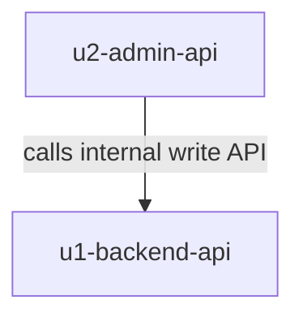

# Unit Dependency DAG — Backend Services for GuestGuideIQ

This describes topology only — what can depend on what. It does not recommend an implementation order or identify a critical path; that is Delivery Planning's (2.9) economic-sequencing decision.

## Dependency Graph

`U2` (`u2-admin-api`) depends on `U1` (`u1-backend-api`). `U1` has no dependency on `U2`.



## Integration Points

- **`admin-api` → `backend-api` internal API** (`U2` depends on `U1`): `admin-api` calls an internal-only API surface on `backend-api` for every operation `Admin` performs — POI curation (`PointOfInterest`), event lifecycle management (`LocalEvent`), account lookup (`Identity`), and locality-brand identity/domain management (`Locality`). Per Q4 in `units-generation-questions.md`, this stage names the integration point; its exact shape (REST/RPC, request/response schemas, authentication between the two services) is deferred to `contract-design`.
- **`backend-api` public HTTP API** (no Unit depends on this — external consumers only): consumed by (1) a not-yet-chosen Property Owner/Guest-facing frontend, and (2) the *existing* marketing-site repository's three lead-capture forms (`LeadCapture` endpoints), once repointed from Formspree per FR1.3. Neither consumer is a Unit in this catalogue.

## Parallel Development Opportunities

With only two Units and a single directed edge between them, there is exactly one topological ordering at the Unit level (`U1` before `U2`) — no independent Unit-pair exists to parallelize. Within that constraint: `U2`'s own internal logic (the `Admin` orchestration boundary) can be developed in parallel with `U1` against a mocked/stubbed version of `U1`'s internal write API, converging once `U1`'s real internal API is available — this is an implementation-scheduling opportunity for 2.9 to weigh, not a claim that `U2` has no dependency on `U1`.

## Machine-Readable Edge Block

```yaml
units:
  - name: u1-backend-api
    kind: service
    depends_on: []
  - name: u2-admin-api
    kind: service
    depends_on: [u1-backend-api]
```
