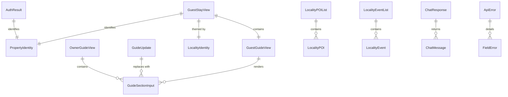

# Functional Specification — `u1-api-contract`

*Re-confirmed 2026-09-08 after the functional-design redo jump. Content
unchanged.*

The behavioural specification for this unit: the workflows it participates in and
the lifecycle it moves through.

`entities.md` is the source of truth for shapes and `rules.md` for decision
logic. This file owns the **ordered behaviour** neither of those captures, plus
derived views of both for readability.

## What this unit does, and does not do

It produces the frontend's typed view of the backend API and keeps it current.
It owns no runtime behaviour: it makes no requests, holds no state, and executes
nothing at run time. Its entire output is types and the step that produces them.

It carries **no user stories**, because it delivers nothing a user sees. Its
correctness is observed through the units that depend on it — which is why its
rules are written as constraints on what must be impossible to express, rather
than as behaviour to verify.

---

## Workflow 1 — Transcribe (current)

The workflow in force today. No machine-readable contract exists, so the types
are written by hand from the prose document.

| Step | Actor | Action |
|---|---|---|
| 1 | Author | Read the route tables in `api-documentation.md` — the auth, onboarding, guide, locality-content, subscription and guest sections. |
| 2 | Author | For each endpoint, verify it has a **route registration in the running service**. If it does not, it goes in the not-typed table and gets no shapes (BR1.1). |
| 3 | Author | Transcribe each deployed endpoint's request and response shapes into `entities.md`, path-for-path and field-for-field. Paths are copied, never paraphrased. |
| 4 | Author | Apply the hazard rules: `sections` non-optional (BR2.1), `action` a closed enum (BR2.2), bodies non-optional (BR2.3), `visualStyling` opaque (BR3.1), guest favourite ids as identifiers (BR3.2), no invented image field (BR3.4). |
| 5 | Author | Write the types to the **vendored path**, committed to this repository. |
| 6 | Author | Record the source document's digest, size and the backend commit current at transcription, in `entities.md`'s provenance block (BR1.1a). |
| 7 | Reviewer | Verify every typed path against the document. A path that does not appear there verbatim is a transcription defect. |

**Error path.** If the document and the deployed service disagree, the type
follows the **document** and the difference is raised as a backend defect
(BR1.2). It is not absorbed by quietly matching reality.

**Why step 7 is not optional.** This exact check has already caught four
transcription defects in this project — a bare favourites route, an unscoped chat
route, a parameterised onboarding endpoint that does not exist, and a
`GuestStayView` that flattened the nested guide object and dropped
`notYetPublished` entirely. Every one of them would have compiled.

**Why step 6 exists.** Without a recorded source revision, step 7 has nothing to
compare a re-transcription against — each refresh becomes a fresh reading rather
than a diff, and a changed source is indistinguishable from a changed
transcription.

---

## Workflow 2 — Generate (after ADR-006)

The target workflow, once the backend publishes a machine-readable contract.

| Step | Actor | Action |
|---|---|---|
| 1 | Refresh script | Fetch the published contract at its pinned version. |
| 2 | Refresh script | Generate types from it. |
| 3 | Refresh script | Write the output to the **same vendored path** the transcribed types occupy. |
| 4 | Author | Re-apply the hazard rules as post-generation assertions — a generated type will not know that a missing `sections` key is destructive. |
| 5 | Reviewer | Review the diff as an ordinary change. |

**The path does not move.** That is the whole point of the vendored choice: the
file changes provenance without changing location, and every importing unit is
unaffected by the transition.

**Error path.** If generation fails or the contract is unreachable, the previous
committed output stays in place and the failure is visible in the refresh run —
this unit never silently falls back to stale types without a signal.

**The known weakness, restated.** Nothing detects a *stale* vendored artifact.
If nobody runs the refresh, the types remain plausible and wrong indefinitely.
That is the accepted cost of vendoring (Contract Design Q5) and there is no
mitigation inside this unit.

---

## State machine — type provenance

The lifecycle a typed shape moves through.

| Current state | Event | Guard | Next state | Actions |
|---|---|---|---|---|
| `absent` | Endpoint is deployed | Route registration exists in the running service | `transcribed` | Add shapes to `entities.md`; remove from the not-typed table; unblock the units that waited |
| `absent` | Endpoint is documented only | No route registration | `absent` | No change. Documentation alone never produces a type (BR1.1) |
| `transcribed` | Contract published | A machine-readable contract covers this endpoint | `generated` | Replace at the same path; re-apply hazard assertions |
| `transcribed` | Document changes | — | `transcribed` | Re-transcribe; re-verify every path |
| `transcribed` | API diverges from the document | — | `transcribed` | **No type change.** Raise a backend defect (BR1.2) |
| `generated` | Contract republished | Refresh script runs | `generated` | Regenerate at the same path; review the diff |
| `generated` | Endpoint removed from the contract | — | `absent` | Remove shapes; consuming code stops compiling — the intended signal |

**Every state is reachable and terminal states are deliberate.** `generated` is
the intended resting state. `absent` is reachable from `generated` and that is
not a defect: an endpoint being withdrawn should break the build of code that
calls it, at the earliest possible moment.

**There is no transition from `generated` back to `transcribed`.** Once
generation is the source, hand-transcription would be a regression, and BR1.3
forbids the hand-edit that would perform it.

---

## Derived view — entity relationships

Derived from `entities.md`, which is the source of truth for shapes.

*Text fallback: `AuthResult` identifies one property. Both `OwnerGuideView` and
`GuideUpdate` carry lists of `GuideSectionInput` — the same shape read and
written. `GuestStayView` contains exactly one `PropertyIdentity`, one
`LocalityIdentity` and one `GuestGuideView`; the guest's sections hang off that
nested guide object, not off the stay payload directly. The two locality list
shapes each wrap their item type. `ChatResponse` returns a list of `ChatMessage`.
`ApiError` optionally carries a list of `FieldError`.*

**Three things this diagram makes visible.** `GuideSectionInput` appears on both
the read and the write side — the same shape, which is what makes a full-replace
save expressible at all. `OwnerGuideView` and `GuestGuideView` are **separate
nodes**, not one shape reused: the owner's carries `publishStatus`, the guest's
carries `notYetPublished` and nests inside the stay payload, which is ADR-002's
bounded-context split showing up in the wire shapes. And `GuestGuideView`
connects to `GuideSectionInput` but to **nothing that resolves a favourite
identifier** — the guest payload's dead end is structural, not an omission.

## Derived view — rules summary

Derived from `rules.md`, which is the source of truth for decision logic.

| Group | Rules | Concern |
|---|---|---|
| BR1.x | 6 | Fidelity and provenance — what gets typed, from what source, who may change it |
| BR2.x | 3 | **Destructive-request prevention** — the three shapes where a malformed request succeeds destructively |
| BR3.x | 4 | Honest representation — opaque where the backend is opaque, absent where the backend has nothing |

The BR2 group is the reason this unit is a real dependency rather than
bookkeeping. For a guide save that deletes everything on a missing key, a
subscription change that cancels on an unrecognised value, and a favourites call
that returns `500` on a missing body, there is no error to handle — by the time
a result arrives, the damage is done. The only workable defence is making the
dangerous request impossible to construct, and that is a property of the type.

## Traceability

This unit has **no acceptance criteria**, because it has no stories. Its rules
are therefore recorded as intentionally AC-free in `traceability.json`'s reverse
array, with the reason for each — rather than left to be derived as orphans.

The rules are not unverifiable, though. Each is observable in a consuming unit:
`BR2.1` is exercised by `u5-owner-guide`'s shrink-guard test, `BR2.2` by
`u6-owner-locality-billing`'s typed-action test, and `BR3.3` by
`u8-guest-app`'s untrusted-render test. This unit makes the guarantee; those
units demonstrate it.

## Review

**Verdict:** READY
**Reviewer:** aidlc-architecture-reviewer-agent
**Iteration:** 2
**Date:** 2026-09-08
**Request Challenge:** review:a537be7ef86782a6a9bbb7013638fbfb

Re-verification after the guest-guide theming correction was applied to
`u3-foundation`, `u8-guest-app` and `u9-guest-guide-view` under a
human Request Changes decision. This unit was not among those revised.

### Findings

| ID | Severity | Location | Finding | Required action | Status |
|---|---|---|---|---|---|
| R-01 | Minor | (whole unit) | Unchanged by the correction; the verdict recorded below still stands. | None. | Resolved |

### What was checked

That nothing in this unit's artifacts changed as part of the theming correction,
and that its recorded findings keep their dispositions - each `Resolved`
finding's fix still present, each `Accepted risk` finding still genuinely
unapplied and accurately described.

---

### The review this supersedes, retained in full

#### Review

**Recorded verdict (superseded):** READY
**Prior reviewer:** aidlc-architecture-reviewer-agent
**Prior iteration:** 1
**Date:** 2026-09-08
**Prior request challenge:** review:7e5a7509dc996ace283b9019f2012c22

This unit was fully reviewed earlier in the stage. A redo jump then reset the
stage for bookkeeping reasons unrelated to the designs, clearing the receipts.
This pass re-verified that the recorded verdict still stands.

##### Findings

| ID | Severity | Location | Finding | Required action | Status |
|---|---|---|---|---|---|
| R-01 | Minor | (whole unit) | Nothing invalidates the verdict recorded below. The only changes since it were a disclosed provenance line and, in six units, the finding-status vocabulary remap. | None. | Resolved |

##### What was re-verified

Every finding recorded as **Resolved** below has its fix genuinely present in
the artifacts, and every finding recorded as **Accepted risk** genuinely remains
unapplied and accurately described. Three highest-consequence claims were
spot-checked directly: ’s BR1.7 and BR3.6 with Workflow 1 steps 6
and 7;  citing ’s BR2.2 rather than BR3.3 for the
closed subscription-action enum; and ’s BR3.5–BR3.7 with both
touch-target tokens.

---

##### The review this supersedes, retained in full

#### Review

**Recorded verdict (superseded):** READY
**Prior reviewer:** aidlc-architecture-reviewer-agent
**Date:** 2026-09-08T05:10:36Z
**Prior iteration:** 1

##### Findings

| ID | Severity | Location | Finding | Required action | Status |
|---|---|---|---|---|---|
| R-01 | — | `entities.md` > `GuestStayView`/`GuestGuideView` shapes | Prior finding (nested `guide` object, `notYetPublished`, `guide.propertyId`, bare favourite-id arrays) re-checked against `api-documentation.md` §A.7 field-for-field; the transcription matches exactly. | None. | Resolved |
| R-02 | — | `entities.md` > `OwnerGuideView.propertyId` | Prior finding re-checked against `api-documentation.md` §A.4; `propertyId` is present and the shape matches all six routes in the group. | None. | Resolved |
| R-03 | Minor | `entities.md` > Provenance table | Digest, size and source path were independently recomputed (`sha256sum` and `wc -c` over `aidlc/spaces/default/codekb/guestguideiq-app/api-documentation.md`) and match the claimed values exactly: `sha256:9a99b130676eb5fd8d70635d3510b7973119545fcdae8c981277e36480c49928`, 26,899 bytes. No action needed; recorded here as verified evidence rather than a defect. | None. | New |

##### Validation Tool Results

No stage-specific validation tooling was listed for this pass beyond the digest recomputation performed manually (see R-03); no other automated check was run.

##### Summary

Both prior findings are genuinely fixed and verified byte-for-byte against the source document. The new `BR1.1a` addition is internally coherent: the provenance block's claimed digest/size are correct, the rule is properly cross-referenced in the rules summary table, `functional-spec.md`'s Transcribe workflow step 6 (and the renumbered step 7) read consistently, and `traceability.json`'s reverse array carries a matching `N/A` row citing both the provenance block and step 6. No contradiction or breakage was introduced by the additions; the unit is implementable as specified.
