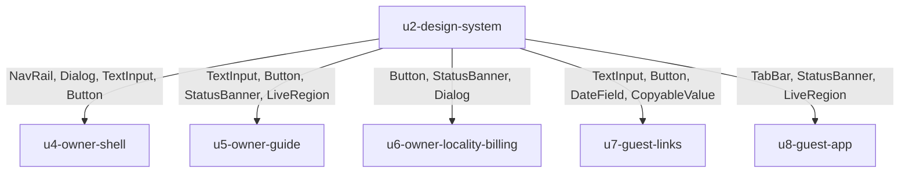

# Functional Specification — `u2-design-system`

*Re-confirmed 2026-09-08 after the functional-design redo jump. Content
unchanged.*

The behavioural specification for this unit: what each primitive does, how it
responds to a keyboard, how it behaves across the breakpoints, and what it
announces.

`entities.md` is the source of truth for the primitive inventory and
`rules.md` for the constraints. This file owns the **ordered and conditional
behaviour** neither of those captures.

Framework-neutral throughout — the framework is OQ4 and unchosen. Nothing below
is expressed as props, hooks or lifecycle in a language.

## What this unit does, and does not do

It supplies the parts every surface is built from. It renders no screen of its
own, makes no request, holds no domain state, and resolves no brand.

It carries **no user stories**, because no story is delivered by a primitive
alone. Its correctness is observed through the units that compose it — which is
why the acceptance criteria in the traceability table below are owned elsewhere
and merely *enforced* here.

---

## Behaviour — the nine primitives

### `TextInput`

| Aspect | Behaviour |
|---|---|
| States | `idle`, `focused`, `invalid`, `disabled`, `read-only` |
| Events | `changed`, `blurred`, `submitted` |
| Validation timing | On `blurred` and on `submitted`. **Never per keystroke** — an error that appears while someone is still typing is noise, and it is read out again on every character by a screen reader. |
| Label | Rendered above the field, always. A placeholder is never the only label — it disappears on first keystroke and is invisible to some assistive technology. |
| Error association | The error text is programmatically associated with the field, not merely adjacent to it. |
| Accessible by default | Omitting the label input does not produce an unlabelled field: it is a construction error the consuming unit sees, not a silent degradation. |

### `Button`

| Aspect | Behaviour |
|---|---|
| Variants | `primary`, `secondary`, `destructive` |
| States | `idle`, `hover`, `focused`, `pressed`, `busy`, `disabled` |
| Events | `activated` |
| Keyboard | Activated by both Enter and Space, regardless of the element chosen to render it. |
| `busy` | The label stays, an activity indicator is added, and repeat activation is suppressed. The label never disappears — a control that loses its text mid-action loses its accessible name with it. |
| `disabled` | Carries a reason that is programmatically reachable (BR2.5), not placed only in adjacent visual text. |
| Icon-only | Requires an accessible name. There is no icon-only button without one. |
| Touch target | `primary` reads `touch-target-primary` (48×48); `secondary` and `destructive` read `touch-target` (44×44). This is the only place in the unit where a primitive chooses between the two. |

### `DateField`

| Aspect | Behaviour |
|---|---|
| States | `empty`, `partial`, `valid`, `invalid`, `disabled` |
| Events | `changed`, `blurred` |
| Primary input | **Typing.** The field is fully operable from the keyboard with no picker opened (BR3.2). |
| Calendar grid | An additional affordance. When present it is arrow-key navigable and Escape returns focus to the field. |
| Format | The expected format is stated in the field's own description, not discovered by failing. |
| Touch target | The calendar grid's day cells read `touch-target` (44×44), which `accessibility-checklist.md` names explicitly — a day cell is the smallest hit area in the product. |
| Range validation | **Not owned here.** Whether a checkout precedes a check-in is a domain rule; this primitive validates only that what was typed is a date. |

The range rule is the clearest small illustration of BR1.1. `AC1.9.2` — the
inline error for an invalid range — is not this unit's to satisfy. It belongs to
whichever unit builds the guest-link form.

### `StatusBanner`

| Aspect | Behaviour |
|---|---|
| Tones | `success`, `error`, `warning`, `info` |
| States | `visible`, `dismissed` |
| Events | `dismissed` |
| Composition | Icon **and** text, always. Tone never carries meaning by colour alone (BR2.3). |
| Announcement | Politely, via the live region (BR2.4). |
| Persistence | Does not self-dismiss on a timer. A message that vanishes before it is read has not been delivered. |

### `CopyableValue`

| Aspect | Behaviour |
|---|---|
| States | `idle`, `copied`, `copy-unavailable` |
| Events | `copy-requested`, `copy-succeeded`, `copy-failed` |
| Structure | The value is **always** rendered as selectable text. The copy control is an addition (BR3.1). |
| On success | A polite announcement, plus a visible confirmation that does not replace the value. |
| On failure or unavailability | The control reflects that it did not work. The value is already visible, so there is nothing to recover — which is the entire point of the structure. |

This is the primitive behind the generated guest link. `AC1.9.6` exists because
clipboard access fails silently in more contexts than people expect, and an owner
who cannot obtain the link cannot host their guest.

### `TabBar`

| Aspect | Behaviour |
|---|---|
| States | `tab-selected`, `panel-empty` |
| Events | `tab-changed` |
| Keyboard | Left/Right arrows move between tabs; Home and End reach the ends. Tab moves into the panel, not across the tabs. |
| Selection | One tab is always selected. There is no state in which no panel is shown. |
| Empty panel | Renders its empty-state content (BR3.3). A panel is never silent. |
| Mobile | The tab strip scrolls horizontally rather than wrapping or truncating; every tab stays reachable at the narrowest supported width. |

### `NavRail`

| Aspect | Behaviour |
|---|---|
| States | `overlay-closed`, `overlay-open`, `icons-only`, `expanded` |
| Events | `item-selected`, `overlay-opened`, `overlay-closed` |
| Below 768px | A hamburger-triggered overlay, closed by default. While open it behaves as an overlay: focus is trapped and Escape closes it. |
| 768–1023px | A persistent icons-only rail. Every item carries an accessible name, since the label is not visible. |
| 1024px and above | Persistent and expanded. |
| Current item | Marked programmatically as current, not by colour alone. |

### `Dialog`

| Aspect | Behaviour |
|---|---|
| States | `closed`, `open` |
| Events | `opened`, `dismissed`, `confirmed` |
| On open | Focus moves into the dialog and is trapped (BR3.4). |
| On close | Focus returns to the element that opened it. |
| Escape | Closes, **by default**. This is the one default in this unit designed to be overridden — and per BR2.2 the override is named at the call site. |
| Background | Inert while open: nothing behind it is reachable by keyboard or by a screen reader's virtual cursor. |

### `LiveRegion`

| Aspect | Behaviour |
|---|---|
| States | `idle`, `announcing` |
| Events | `announced` |
| Politeness | Polite. There is no assertive mode (BR2.4) — the primitive does not expose one to be reached for. |
| Emptiness | The region exists in the document before it has anything to say. A region created at announcement time is frequently not announced at all. |
| Consumers | Copy confirmation, save status, chat replies, banner appearance. |

---

## Responsive behaviour

The breakpoints are NFR4's, applied here once rather than per screen.

| Width | `NavRail` | `TabBar` | Touch targets |
|---|---|---|---|
| below 768px | Hamburger overlay, closed by default | Horizontally scrollable strip | `touch-target` 44×44; `touch-target-primary` 48×48 |
| 768–1023px | Persistent icons-only rail | Strip, scrolls if it overflows | `touch-target` 44×44; `touch-target-primary` 48×48 |
| 1024px and above | Persistent and expanded | Strip | Pointer-sized is acceptable |

**There are two touch-target tokens, not one.**
`accessibility-checklist.md` requires ≥ 44×44 generally — including
`DateField`'s day cells — and 48×48 for primary actions (Continue, Save, Send,
Generate link). A single token cannot express that, so the `touch-target`
category carries two values and `Button`'s `primary` variant is the only thing
that reads the larger one.

The values are tokens rather than per-primitive constants so a primitive cannot
invent a third size. Which of the two a primitive reads *is* a per-primitive
decision, and there is exactly one: `Button`'s variant.

**What this unit cannot validate.** NFR3 requires each locality's accent colour
to meet 4.5:1 against the base tokens independently. Brand colours are set after
deploy, so no check inside this unit can confirm it. This unit's contribution is
BR1.3 — status colours and typography are not overridable, so a bad accent
degrades the action colour and nothing else. Validating the accent itself belongs
to `u3-foundation`, which owns the resolver, and to `nfr-design`.

---

## The accessibility contract, per primitive

What each primitive guarantees, and where a caller may name an override
(Q2 = B, bounded by BR2.2).

| Primitive | Fixed | Overridable (named) |
|---|---|---|
| `TextInput` | Label association, error association, validation timing | Nothing |
| `Button` | Enter/Space activation, accessible name, disabled-reason reachability | Nothing |
| `DateField` | Keyboard-only operability | Whether a calendar grid is offered at all |
| `StatusBanner` | Icon-plus-text composition, polite announcement | Whether it is dismissible |
| `CopyableValue` | Selectable-text presence | Nothing |
| `TabBar` | Arrow-key navigation, empty-state presence | Which tab is selected initially |
| `NavRail` | Breakpoint behaviour, current-item marking | The breakpoint values themselves |
| `Dialog` | Focus trap, focus return, background inertness | **Escape-closes** |
| `LiveRegion` | Politeness | Nothing |

Six of the nine have nothing overridable. That is what keeps Q2 = B's
flexibility from becoming a general escape hatch: the deviations that exist are
the ones somebody asked for, and each is visible in a diff.

---

## State machine — `Dialog`

The only primitive here with a lifecycle worth drawing, because both its
transitions move focus.

| Current state | Event | Guard | Next state | Actions |
|---|---|---|---|---|
| `closed` | Open requested | — | `open` | Record the opener; move focus in; trap focus; make the background inert |
| `open` | Escape pressed | Escape-closes not overridden | `closed` | Release the trap; restore the background; return focus to the opener |
| `open` | Escape pressed | Escape-closes **overridden** | `open` | Nothing. The consuming unit decides what, if anything, leaves this state |
| `open` | Dismiss activated | — | `closed` | As for Escape |
| `open` | Confirm activated | — | `closed` | As above, plus the `confirmed` event for the caller |

**The overridden branch is the whole reason the override exists.**
`SessionExpiredDialog` (owned by `u4-owner-shell`) takes it: a session that has
ended has nothing behind it to return to, so there is no correct target for
focus and no correct thing to reveal. This unit supplies the trap; it does not
decide when a trap should be permanent.

---

## Derived view — where the primitives are used

Derived from `entities.md`'s inventory and `interaction-spec.md`'s screens.

*Text fallback: this unit is consumed by all five feature units. `u4-owner-shell`
takes the navigation and dialog primitives; `u5-owner-guide` the form and feedback
primitives; `u6-owner-locality-billing` buttons, banners and dialogs;
`u7-guest-links` the guest-link form's date field and copyable value;
`u8-guest-app` the tab bar and the announcement primitives. This unit depends on
nothing.*

**What the arrows do not carry.** Each of those five units also builds
domain-shaped components of its own (`entities.md` § what this unit does not
own). Those components are composed *from* these primitives but are not supplied
by this unit, and their accessibility is the building unit's obligation.

---

## Traceability

This unit has **no acceptance criteria of its own**, because it has no stories.
The criteria in `traceability.json` are owned by feature units; each is listed
because its *enforcement point* is a primitive here.

The distinction matters for testing. This unit does not assert `AC1.9.6`; it
makes the value selectable, and `u7-guest-links`'s scenario test asserts it.
Per the affirmed testing posture, a component-level test here is written only
where a primitive carries branching logic of its own — `DateField`'s parsing,
`NavRail`'s breakpoints, `Dialog`'s two Escape branches — not by default, and
never to reach a coverage number this unit is excluded from anyway (ADR-007).

Seven of the fifteen rules have no acceptance criterion at all — the boundary and
layering rules, and the two accessibility rules that underlie every criterion
rather than any one of them. Each is recorded as `N/A` in the reverse array with
its reason, rather than left to surface as an orphan.

## Review

**Verdict:** READY
**Reviewer:** aidlc-architecture-reviewer-agent
**Iteration:** 1
**Date:** 2026-09-08
**Request Challenge:** review:5046a20e5cd43dc6be62796aaac41201

This unit was fully reviewed earlier in the stage. A redo jump then reset the
stage for bookkeeping reasons unrelated to the designs, clearing the receipts.
This pass re-verified that the recorded verdict still stands.

### Findings

| ID | Severity | Location | Finding | Required action | Status |
|---|---|---|---|---|---|
| — | — | — | Nothing invalidates the verdict recorded below. The only changes since it were a disclosed provenance line and, in six units, the finding-status vocabulary remap. | None. | Resolved |

### What was re-verified

Every finding recorded as **Resolved** below has its fix genuinely present in
the artifacts, and every finding recorded as **Accepted risk** genuinely remains
unapplied and accurately described. Three highest-consequence claims were
spot-checked directly: ’s BR1.7 and BR3.6 with Workflow 1 steps 6
and 7;  citing ’s BR2.2 rather than BR3.3 for the
closed subscription-action enum; and ’s BR3.5–BR3.7 with both
touch-target tokens.

---

### The review this supersedes, retained in full

#### Review 

**Recorded verdict (superseded):** READY
**Prior reviewer:** aidlc-architecture-reviewer-agent
**Date:** 2026-09-08
**Prior iteration:** 2
**Prior request challenge:** review:64e93ae7d63cf993e121cbfe9abc71ef

##### Findings

| ID | Severity | Location | Finding | Required action | Status |
|---|---|---|---|---|---|
| R-01 | Major | `functional-spec.md` > Responsive behaviour; `functional-spec.md` > `Button` | `accessibility-checklist.md` requires two touch-target minimums — ≥ 44×44 generally, including `DateField`'s day cells, and 48×48 for primary actions (Continue, Save, Send, Generate link). The spec modelled a single `touch-target` value at every breakpoint and asserted it "cannot drift between primitives", which forecloses the 48×48 tier. `Button`'s behaviour table carried no touch-target row at all. | Split the token into `touch-target` (44×44) and `touch-target-primary` (48×48); add a touch-target row to `Button` and to `DateField`; restate the no-drift claim so it bounds the *values* rather than forbidding the one legitimate per-primitive choice. | Resolved |
| R-02 | Major | `rules.md` > BR2.5 `violation` | The violation text described "two controls permanently disabled" and cited `AC1.14.4`. `AC1.14.4` actually disables **three** controls (upgrade, downgrade, cancel), and only in the no-active-subscription state. The "two, permanently" description matches a different, uncited scenario — `unit-of-work.md` § U6's single-tier case. One AC citation was covering two distinct scenarios. | Describe both scenarios accurately and cite each to its own source. | Resolved |
| R-03 | Minor | `entities.md` > The accessibility gap this boundary creates | The phrase "a property of the primitives, not a per-screen effort" was attributed to `accessibility-checklist.md`. It does not appear there — it is `unit-of-work.md` § U2's wording, echoed in `contract-summary.md` § C4 and `components.md`. | Correct the attribution, and state what `accessibility-checklist.md` actually contributes: the obligations themselves, with no owner named per item. | Resolved |

##### Validation tool results

`aidlc-sensor-traceability` was run against this unit's `traceability.json`. Its
first pass rejected three `OK` rows whose targets named no business rule — a real
gap rather than a formatting complaint: the copy-confirmation, tab-selection and
narrow-width tab behaviours were specified but unruled. `BR3.5`, `BR3.6` and
`BR3.7` were added and the targets repointed. The sensor now reports the single
finding it also reports for `u1-api-contract`: *no stories in
`unit-of-work-story-map.md` map to unit `u2-design-system`*. Both units carry no
user stories by design; this is a known framework limitation, disclosed rather
than worked around.

##### Summary

The reviewer independently confirmed the parts of this design most at risk of
being asserted rather than checked: that the nine primitives account for all
fourteen `interaction-spec.md` components with none double-counted; that each of
the eight excluded components' named owners matches `unit-of-work.md`, along with
the specific rule cited as disqualifying; that every cited AC, NFR and ADR exists
and says what is claimed; that the coverage and reverse arrays total exactly the
rule set with no omission or double-count; and that no item in
`accessibility-checklist.md` is left without an owner under the Q1 = A boundary.

The three findings are spec-accuracy defects rather than boundary failures, and
all three are corrected above. R-01 is the one that would have cost something: a
developer building `Button` from the uncorrected spec would have shipped every
primary action 4px under the required size, and the CI accessibility check is
advisory (NFR2), so nothing automated would have said so.

##### Status vocabulary correction, 2026-09-08

The findings above were originally recorded with the status word `Fixed`, which
is not in the engine's valid set (`New`, `Unresolved`, `Resolved`,
`Accepted risk`, `Rejected: …`). They now read `Resolved`. **No finding, severity
or disposition changed** — only the word. The stage's approval was blocked on this
and reopened under a scoped Request Changes decision covering the vocabulary
alone.

##### Iteration 2 — status vocabulary verification

A narrow verification pass over the remap alone, not a fresh design review. It
confirmed every finding row now carries a status from the engine's valid set,
that no ID, severity, location, finding text or required action changed, and that
no design content outside this Review section was touched.

It also checked the one way the remap could have overstated progress: that every
finding now reading **Resolved** has its corrective action genuinely present in
the artifacts, and every finding now reading **Accepted risk** genuinely remains
unapplied. Both held. It returned no findings.
