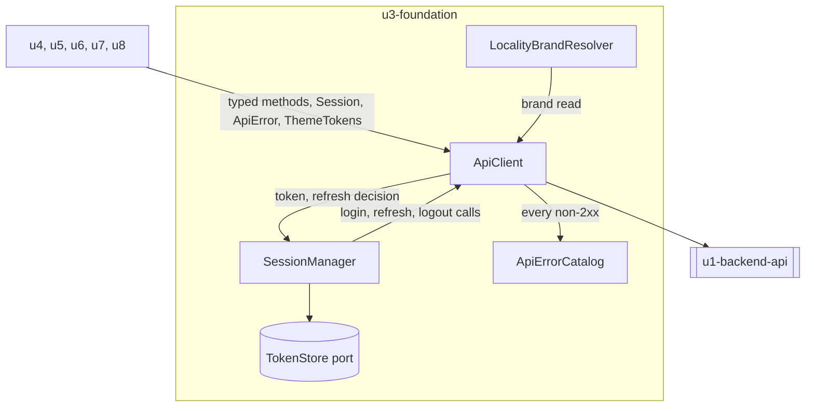

# Functional Specification — `u3-foundation`

*Revised 2026-09-08 under a human Request Changes decision: the guest-guide
theming misclassification is corrected. Every change is marked in place.*

The ordered behaviour: the session lifecycle, the single-flight refresh, the
replay path Q2 = B introduced, and the error and theme resolution paths.

`entities.md` is the source of truth for shapes and `rules.md` for the
constraints. This file owns the sequences neither captures.

Framework-neutral throughout — the framework is OQ4 and unchosen.

## What this unit does, and does not do

It is everything that talks to the backend or interprets what it returns. It
renders nothing and carries no user stories, but almost every story's acceptance
criteria depend on it — which is why its traceability table lists criteria owned
by five other units.

It is also the **reversibility boundary**. Where tokens live (OQ3) and whether
the app eventually sits behind a same-origin proxy are both undecided; confining
transport and token handling here is what keeps those decisions cheap. That is
the unit's purpose, not a side effect of it.

Unlike `u2-design-system`, this unit is inside the 80% coverage floor in full
(ADR-007). Its logic is exactly the kind the floor exists for.

---

## State machine — `Session`

| Current state | Event | Guard | Next state | Actions |
|---|---|---|---|---|
| `anonymous` | Credentials submitted | — | `authenticating` | Send login |
| `anonymous` | App loads with tokens in the store | Tokens present | `active` | Restore the session before any route guard runs (BR1.4) |
| `authenticating` | Login succeeds | — | `active` | Store tokens; resolve `Account`; new `sessionId` |
| `authenticating` | Login returns `401 UNAUTHORIZED` | — | `anonymous` | Surface one non-disclosing error (AC1.3.2). No token is stored |
| `active` | A resource request returns `401` | Not a post-refresh retry, and no flight in progress | `refreshing` | Start the single `RefreshFlight` (BR1.2) |
| `active` | A resource request returns `401` | Not a post-refresh retry, and a flight IS in progress | `refreshing` | Park this request as a waiter. **Do not** start a second flight |
| `refreshing` | Refresh succeeds | — | `active` | Rotate the stored tokens; resume every waiter once, re-running the outgoing guards (BR3.6) |
| `active` | A `401` on a resumed waiter's retry | The request is a post-refresh retry | `ended` | `endedReason = refresh-rejected`. **Do not** start a second flight (BR1.7) |
| `refreshing` | Refresh returns `401` | — | `ended` | `endedReason = refresh-rejected`. Clear session state. **Never** refresh again (BR1.3) |
| `refreshing` | Refresh fails at transport | — | `ended` | `endedReason = refresh-failed`. Same teardown |
| `active` | Owner logs out | — | `ended` | `endedReason = signed-out`. Clear session state |
| `ended` | Owner signs in again | — | `authenticating` | Carry the pending `ReplayIntent` set forward |

**Every terminal path clears the token store and nothing else.** The editor's
buffer, the wizard's draft, the screen the owner was on — none of it is touched
(BR1.5). `AC1.10.3` requires precisely that: the expiry is surfaced *over* the
work, and no success indication is shown for the save that failed.

**The two `endedReason` values that are not `signed-out` produce the same screen
but different routing afterwards.** A sign-out returns to login with nothing
pending; an expiry keeps the open screen behind the session-expired state and
carries the replay set (AC1.10.1).

---

## Workflow 1 — The single-flight refresh

The most intricate logic in the frontend, and the one with the most specific
cause.

| Step | Actor | Action |
|---|---|---|
| 1 | `ApiClient` | A resource request returns `401`. |
| 2 | `ApiClient` | Ask `SessionManager` to refresh, rather than refreshing itself. |
| 3 | `SessionManager` | If a `RefreshFlight` is already in flight, park this request as a waiter and stop. Otherwise start exactly one. |
| 4 | `SessionManager` | Send `POST /v1/auth/refresh`. |
| 5a | `SessionManager` | On success: rotate the stored tokens, mark the flight succeeded, and resume every waiter once against the new token. |
| 5b | `SessionManager` | On `401`: end the session (BR1.3). Fail every waiter with one `UNAUTHORIZED` error carrying the session-ended signal. |
| 6 | `ApiClient` | Each resumed waiter retries **once**, re-running BR3.1–BR3.3 on the outgoing request (BR3.6). |
| 7 | `ApiClient` | If that retry returns `401` again, end the session (BR1.7). Never start a second flight, even though none is in progress by then. |

**Why step 3 is the whole rule.** The backend's refresh-token store is
`src/ratelimit`-adjacent in-memory state, per process, across 2–6 running tasks.
Two refreshes sent in parallel land on different tasks, each rotates the token,
and each invalidates the other's. The owner is signed out at random — most often
on a dashboard load, because that is when several reads fire at once.

**Why a write may be retried here, when BR3.4 says writes never retry.** BR3.4
governs **indeterminate** failures — a transport error, a timeout, a `5xx` —
where the request may or may not have taken effect. A `401` is determinate: `auth`
is registered as a Fastify `preHandler` on every owner route (`src/guide/routes.ts`,
`src/subscription/routes.ts` in `guestguideiq-app`), so it is raised before the
handler body runs and the request provably did not execute. Retrying it is
re-sending something that never happened, not repeating something that might
have. BR3.6 records this, along with the condition that would invalidate it.

This is also **not** the Q2 = B replay case, and the difference is the gap. A
post-refresh retry follows within milliseconds with no owner interaction, so the
captured payload is still current. Workflow 2's replay follows a sign-in over an
arbitrary interval, which is why it demands a fresh payload instead (BR2.2).

**Why step 7 exists.** Without it the `active` state's ordinary `401` rule
applies — by then the first flight has resolved, so "no flight in progress" holds
and a second one starts, whose retry fails, starting a third. That is BR1.2's
storm arriving by a different door, from every open tab at once.

**The gap this workflow does not close.** Steps 3–5 serialise refreshes *within
one document*. Two browser tabs each run their own `SessionManager`, share the
persistent store, and hold the same refresh token; whichever refreshes second
presents a rotated-away token and is rejected. `US1.10`'s note records this as
unspecifiable while OQ3 was open — Q1 = A closes that question in the direction
that makes the race real. BR1.6 states the resulting constraint on OQ3's answer.

---

## Workflow 2 — Replay after re-authentication (Q2 = B)

What happens between a failed refresh and the owner getting their work back.

| Step | Actor | Action |
|---|---|---|
| 1 | `SessionManager` | The session ends. Each in-flight request is classified into a `ReplayIntent` by the unit that issued it. |
| 2 | `ApiClient` | Fail every in-flight request with one typed session-ended error. No request retries against the dead session. |
| 3 | `u4-owner-shell` | Render the session-expired state over the open screen, preserving what is behind it (AC1.10.3). |
| 4 | Owner | Sign in again. |
| 5 | `SessionManager` | Session becomes `active` with a new `sessionId`. |
| 6 | `ApiClient` | For each `reissue-read` intent: re-issue transparently (BR2.1). |
| 7 | Originating unit | For each `replay-write-fresh` intent: supply the **current** payload. `ApiClient` sends that, not the captured bytes (BR2.2). |
| 8 | `ApiClient` | For each `no-replay` intent: do nothing. The owning unit re-reads its state and shows the owner where things stand. |

**Classification, by request:**

| Request | Intent | Why |
|---|---|---|
| Any `GET` | `reissue-read` | No side effect |
| Guide save (`PUT`/`PATCH` guide) | `replay-write-fresh` | Full replace — stale bytes would overwrite newer content |
| Favourite / unfavourite | `replay-write-fresh` | Cheap, and the current state is what the owner means |
| Onboarding step advance | `no-replay` | The step machine is strictly forward; a replayed advance against a state that already moved returns `409` |
| `POST /v1/stays` (guest link) | `replay-write-fresh` | Creating a duplicate link is harmless; creating one from stale dates is not |
| `PATCH /v1/subscriptions` | **`no-replay`** | AC1.14.5 — billing (BR2.3) |

**Step 7 is where the answer and the safety requirement meet.** The human's
answer was to replay the request; the design replays the *intent* with a payload
fetched fresh. Those differ only when something changed in the gap — which is
exactly the situation a replay is for, so it is not an edge case being tidied
away.

**What this resolves upstream.** `user-stories`' reviewer left finding **R-02**
open, noting that `AC1.10.3` deferred a real product decision — "whether the app
then blocks and preserves the buffer, or re-authenticates in place and replays
the save" — and that the two are very different builds with different tests.
Q2 = B chose the second, and this workflow is the concrete build. That finding
can be closed against this artifact.

---

## Workflow 3 — Resolving an error

| Step | Actor | Action |
|---|---|---|
| 1 | `ApiClient` | Receive a non-2xx response and hand it, whole, to `ApiErrorCatalog`. |
| 2 | `ApiErrorCatalog` | If the body parses as `{ code, message, details? }` and `code` is one of the eleven, return that `ApiError`. |
| 3 | `ApiErrorCatalog` | If it parses but `code` is unknown, return `UNRECOGNISED` carrying the server's message. |
| 4 | `ApiErrorCatalog` | If it does not parse as an envelope at all — a raw `500` with no body, a `502`/`504`, a network failure, a timeout — return `TRANSPORT_FAILURE` with a locally supplied message. |
| 5 | `ApiErrorCatalog` | Attach `details` per field, unflattened (BR4.3). |
| 6 | `ApiClient` | Return the `ApiError` to the caller. The status code is recorded for diagnostics and is not part of the branch. |

**Steps 3 and 4 are what make the union total** (BR4.2), and they are not
hypothetical: the backend documents that a missing body on two routes produces
`500 INTERNAL_ERROR` rather than a well-shaped `400`, so a frontend cannot rely
on every malformed request returning a parseable envelope.

**Why nothing above reads a status.** `404` is both `NOT_FOUND` and
`LOCALITY_NOT_RESOLVED`; `410` is both an invalid stay link and an expired reset
token. Those pairs route to different screens. Branching on the status sends the
guest's central navigational state to the wrong one (BR4.1).

---

## Workflow 4 — Resolving a locality brand

| Step | Actor | Action |
|---|---|---|
| 1a | `LocalityBrandResolver` | **Guest path:** the brand arrives inline on the stay payload as `locality: { id, name, tagline, visualStyling }`. Parse what was handed over — **no request**. |
| 1b | `LocalityBrandResolver` | **Owner path:** read the locality brand for the current domain. Blocked on `AC4.1.7`, which is what the owner screens wait for. |
| 2 | `LocalityBrandResolver` | No brand resolves → return the unbranded base token set. Stop. |
| 3 | `LocalityBrandResolver` | Brand carries only a name and tagline → return base tokens plus the name (`brand-partial`). Stop. |
| 4 | `LocalityBrandResolver` | Parse `visualStyling` defensively. Anything uninterpretable falls back to its default; nothing throws (BR5.1). |
| 5 | `LocalityBrandResolver` | Check the parsed accent against the contrast floor. Below it → use the base accent and set `contrastDegraded` (BR5.3). |
| 6 | `LocalityBrandResolver` | Return a complete `ThemeTokens` (`brand-full`). |

**Step 1 has two sources, and only one of them is blocked.** *Corrected
2026-09-08:* this workflow previously named only the domain-keyed read, which made
the guest guide look blocked on `AC4.1.7` when its brand has always arrived inline
with the stay payload. `AC4.1.7` blocks the **owner** screens — signup, login,
onboarding — which have no stay context to carry one. `G-1`, the guest
invalid-link screen, is blocked for a different reason: a `410` carries no body at
all, which is what BR5.4's note records.

**Every path returns a complete set** (BR5.2). `u2-design-system` receives a
`TokenSet` with no holes, which is what lets its primitives read tokens without
carrying fallback logic of their own.

**Step 5 is the only contrast check that can exist.** NFR3 requires each
locality's accent to meet the floor independently, and brands are configured
after deploy — so there is no build-time artifact to check. A degraded brand is
recorded but not reported anywhere, because there is no ops surface in scope to
report it to; that gap is named in BR5.3's note and belongs to `nfr-design`.

---

## Derived view — the contained cycle

*Text fallback: the five consumer units reach this unit only through `ApiClient`'s
typed surface and the resolved `Session`, `ApiError` and `ThemeTokens` objects.
Inside, `ApiClient` and `SessionManager` depend on each other — `ApiClient` needs
the token and the refresh decision, `SessionManager` needs `ApiClient` to perform
the login, refresh and logout calls themselves. `SessionManager` alone reaches the
token store. `ApiClient` hands every non-2xx response to `ApiErrorCatalog`, and is
the only path to the backend.*

**The cycle is deliberate (ADR-003) and contained.** Both ends sit in this unit,
so it never crosses a unit boundary and no consumer can observe it. The
alternative considered and rejected was a third component whose only job was to
relay a few calls. Whether implementation resolves it by injected handler or
mutual import is code generation's call; ADR-003 records that the choice is not
architectural.

---

## Traceability

This unit has **no acceptance criteria of its own**, because it has no stories.
Every criterion in `traceability.json` is owned by another unit and listed
because its enforcement point is here.

Three rows are **not** plainly `OK`, and each is honest rather than convenient:

- **`AC1.3.3`** ("my session is restored without a re-login") is `Deferred` on
  `AC4.1.4`. This unit's half is designed — tokens persist, and the session is
  restored before any route guard runs — but `GET /v1/accounts/me` does not
  exist, so there is no way to resolve the current account from a stored token.
  Worth stating plainly, because Q1 = A was chosen partly on the strength of this
  criterion: it mandates reload survival, and it is blocked.
- **`AC1.11.1`** ("my session is revoked server-side") is `Deferred` on
  `AC4.1.5`. This unit clears local session state, which is the second half of
  the criterion. The first half cannot be built: there is no logout or
  revocation endpoint, so logout leaves a valid seven-day refresh token in
  existence.
- **`AC2.2.3`** ("no raw status code or technical detail is shown") is `OK` — the
  typed union is what makes it possible for `u8-guest-app` to render `410` as a
  sentence rather than a code. But the *branded* invalid-link screen (BR5.4) has
  no acceptance criterion at all: `US2.2` recorded it as open question **OQ2**,
  and ADR-005 decided it at domain design rather than a story deciding it. BR5.4
  is therefore recorded in the reverse array as `N/A` with that provenance, and
  it remains blocked on `AC4.1.7` in any case — a `410` carries no payload to
  resolve a brand from, and the brand read itself currently requires a session.

## Review

**Verdict:** READY
**Reviewer:** aidlc-architecture-reviewer-agent
**Iteration:** 2
**Date:** 2026-09-08
**Request Challenge:** review:561d78421076943b7f143c5b2d6807e4

A scoped pass over one correction, made under a human Request Changes decision:
the guest guide's theming had been recorded as blocked on `AC4.1.7`, and it
never was.

### Findings

| ID | Severity | Location | Finding | Required action | Status |
|---|---|---|---|---|---|
| R-01 | Minor | (whole unit) | No findings. The correction is factually right and complete. | None. | Resolved |

### What was verified

The reviewer checked the claim rather than accepting it. `GET /v1/stays/:token`
returns `locality: { id, name, tagline, visualStyling }` inline with the
`200` payload; `u1-api-contract` types it as `LocalityIdentity` and
describes it as *"the only place locality data leaves the system today"*; and
`AC4.1.7`'s own definition blocks `AC1.1.1`, `AC1.2.1`,
`AC1.2.2`, `AC1.5.6` and `AC1.9.4` - every one an owner-surface
criterion, none on the Guest surface. **The original blocked claim was wrong.**

`AC2.1.2` is correctly `OK`. The remaining deferrals - `AC2.3.2`'s
positive half on `AC4.1.9`, and `AC2.4.5` on `AC4.1.6` - are genuine
and unaffected. `G-1` stays blocked for its own reason, a `410` carrying
no body, which BR5.4 and the revised Workflow 4 state consistently. No stale
pre-fix claim survives outside the review appendices that quote it deliberately
as the defect.

---

### The review this supersedes, retained in full

#### Review

**Recorded verdict (superseded):** READY
**Prior reviewer:** aidlc-architecture-reviewer-agent
**Prior iteration:** 1
**Date:** 2026-09-08
**Prior request challenge:** review:5c820e8472cbfe547a5694e3846a7cd7

This unit was fully reviewed earlier in the stage. A redo jump then reset the
stage for bookkeeping reasons unrelated to the designs, clearing the receipts.
This pass re-verified that the recorded verdict still stands.

##### Findings

| ID | Severity | Location | Finding | Required action | Status |
|---|---|---|---|---|---|
| R-01 | Minor | (whole unit) | Nothing invalidates the verdict recorded below. The only changes since it were a disclosed provenance line and, in six units, the finding-status vocabulary remap. | None. | Resolved |

##### What was re-verified

Every finding recorded as **Resolved** below has its fix genuinely present in
the artifacts, and every finding recorded as **Accepted risk** genuinely remains
unapplied and accurately described. Three highest-consequence claims were
spot-checked directly: ’s BR1.7 and BR3.6 with Workflow 1 steps 6
and 7;  citing ’s BR2.2 rather than BR3.3 for the
closed subscription-action enum; and ’s BR3.5–BR3.7 with both
touch-target tokens.

---

##### The review this supersedes, retained in full

#### Review

**Recorded verdict (superseded):** READY
**Prior reviewer:** aidlc-architecture-reviewer-agent
**Prior iteration:** 3
**Date:** 2026-09-08
**Prior request challenge:** review:a6a25296ccf85ee505dc715a26733f56

Iteration 1 returned **NOT-READY** on four findings, two of them in the
single-flight refresh. All four were fixed and re-reviewed.

##### Findings

| ID | Severity | Location | Finding | Required action | Status |
|---|---|---|---|---|---|
| R-01 | Critical | `functional-spec.md` > Workflow 1; `rules.md` > BR3.4, BR3.6 | Workflow 1 retried every parked waiter uniformly, contradicting BR3.4 and exposing `PATCH /v1/subscriptions` and the destructive guide save to an automatic retry on a routine token expiry. Fixed by rescoping BR3.4 to *indeterminate* failures and adding BR3.6 for the determinate `401` case. Re-review verified the load-bearing claim directly against `guestguideiq-app/src/guide/routes.ts`, `src/subscription/routes.ts` and `src/auth/middleware.ts`: `auth` is a `preHandler` on every owner route and `authenticate()` throws before any handler body runs, so a `401` provably means the request did not execute. No owner route authenticates inside its handler. | None. | Resolved |
| R-02 | Major | `functional-spec.md` > State machine; `rules.md` > BR1.7 | No transition covered "a resumed waiter's retry returns `401`", so it fell through to the ordinary `active` + `401` rule and would have started a second `RefreshFlight`. Fixed with BR1.7, a state-machine row, Workflow 1 step 7, and guard qualifiers on the two existing rows. Re-review confirmed the three `active` + `401` guards are mutually exclusive and jointly exhaustive, and that `endedReason`'s existing `refresh-rejected` value was reused rather than a new one invented. | None. | Resolved |
| R-03 | Major | `traceability.json` | `AC1.1.5` — the concrete criterion BR4.3 exists to satisfy — was absent from the table entirely. Added to `upstream_ids` and `coverage` against BR4.3, verified accurate. | None. | Resolved |
| R-04 | Minor | `rules.md` > BR5.4 | The design falls short of Contract C3's unconditional `theme` guarantee while `AC4.1.7` is outstanding, and never said so. Statement added and verified verbatim against `contract-summary.md` § C3. | None. | Resolved |
| R-05 | Minor | `traceability.json` > `AC1.3.3` coverage row and `BR1.4` reverse row | `BR1.4` appears both as a coverage target and as its own reverse row, where every other rule with an upstream criterion appears only in `coverage`. | **Accepted, not a defect to fix.** The duplication is required by the traceability sensor: it derives orphans from `rules.md` and does not treat a `Deferred` coverage target as covering its rule, so removing the reverse row reintroduces `BR1.4` as an orphan (observed directly — the sensor reported exactly that before the row was added). The reverse row's own text records the reason. | Accepted risk |
| R-06 | Minor | `rules.md` > BR1.7 `source` | The `source` field cites `functional-spec.md Workflow 1 step 6`; the event BR1.7 governs is **step 7**. Step 6 is the retry itself, governed by BR3.6. A genuine one-word slip introduced alongside the R-02 fix. | **Correction, recorded here rather than applied.** BR1.7's source should read `functional-spec.md Workflow 1 step 7`. Editing `rules.md` now would change bytes outside this appendix and invalidate the iteration-2 receipt, and the one bounded recovery pass is spent. It misleads no reader who has this note, and is queued for the next time the unit's artifacts are legitimately unlocked. | Accepted risk |

##### Validation tool results

| Check | Result |
|---|---|
| `auth` `preHandler` on every owner route | Confirmed by direct source inspection — this is what R-01's fix rests on |
| Rule count vs. the header's claim | 24 counted, 24 claimed |
| Traceability balance | Every rule reachable; no orphan. One deliberate duplication (R-05) |
| `aidlc-sensor-traceability` | One finding: *no stories in `unit-of-work-story-map.md` map to unit `u3-foundation`*. Known framework limitation — the story map records this unit as carrying no stories by design |

##### Summary

Iteration 1 verified every load-bearing backend claim in this design against
`api-documentation.md` and the deployed source: the eleven-code error catalogue,
the `sections ?? []` ordering that makes a mis-keyed save destructive, the missing
`?? {}` on the favourites handler, the cancel-on-`else` subscription branch, the
per-process refresh store, the absent revocation endpoint, and the ambiguous
`404`/`410` statuses. It also confirmed the three `Deferred` rows are genuinely
blocked rather than convenient.

What it caught was the single-flight refresh — this document's own "most intricate
logic in the frontend", and the one place where nearly right is worth nothing. Both
findings there were real. R-01's resolution is worth noting for what it is not: the
retry was **not** removed. The reviewer's proposed remedy would have been wrong,
because a `401` is determinate; what was actually wrong was BR3.4's scope, written
as if it covered every failure when `AC1.14.5` governs only indeterminate ones. The
re-review verified that distinction against the backend source rather than
accepting the argument.

Two Minor findings remain: R-05 is accepted as required by the sensor, and R-06 is
a one-word citation correction recorded above and queued rather than applied.

##### Status vocabulary correction, 2026-09-08

The findings above were originally recorded with the status words `Fixed`,
`Accepted` and `Open`, none of which are in the engine's valid set (`New`,
`Unresolved`, `Resolved`, `Accepted risk`, `Rejected: …`). They now read
`Resolved` and `Accepted risk`. **No finding, severity or disposition changed** —
only the words. The stage's approval was blocked on this and reopened under a
scoped Request Changes decision covering the vocabulary alone.

##### Iteration 3 — status vocabulary verification

A narrow verification pass over the remap alone, not a fresh design review. It
confirmed every finding row now carries a status from the engine's valid set,
that no ID, severity, location, finding text or required action changed, and that
no design content outside this Review section was touched.

It also checked the one way the remap could have overstated progress: that every
finding now reading **Resolved** has its corrective action genuinely present in
the artifacts, and every finding now reading **Accepted risk** genuinely remains
unapplied. Both held. It returned no findings.
