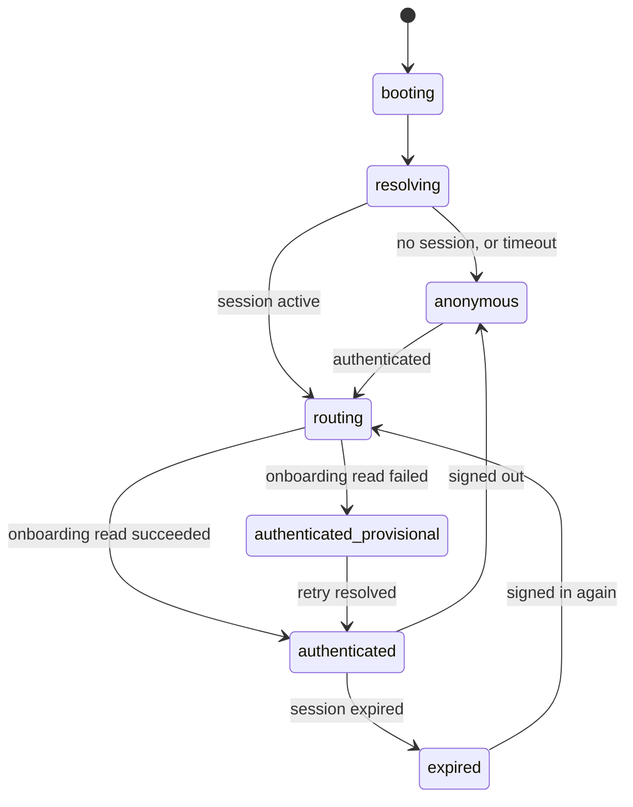

# Functional Specification — `u4-owner-shell`

*Re-confirmed 2026-09-08 after the functional-design redo jump, and re-saved
following that confirmation. Content unchanged.*

The owner application's route table, its guards, and the ordered behaviour of
every screen by which a session is created or ended.

This unit is `kind: ui`, so it produces no `entities.md` or `rules.md`. **This
file is self-contained**: it is the source of truth for this unit's workflows and
screen transitions, with no entity or rule document behind it. The data shapes it
moves are `u1-api-contract`'s, and the session logic it consumes is
`u3-foundation`'s.

Framework-neutral throughout — the framework is OQ4 and unchosen. Routes are
described by path and guard, not by a router's API.

## What this unit does, and does not do

It owns the frame and the doors: routing, route guarding, the persistent
navigation shell, the header user menu, and the surfaces by which a session
begins or ends. It renders seven screens.

It owns **no business rules**. Every access screen is a thin form over
`u2-design-system` primitives, submitting through `u3-foundation`'s typed
methods; the session lifecycle, the single-flight refresh and the error
translation all happen below it. Its own logic is entirely about **where the
owner is** and **what may render there**.

Every Owner feature unit renders inside the frame this unit provides, which is why
keeping features out of it keeps them independent of each other.

---

## The route table

| Path | Screen | Guard | Notes |
|---|---|---|---|
| `/signup` | PO-1 Sign Up | Anonymous only | Replaced **entirely** by PO-0 when no locality resolves (AC1.2.1) |
| `/login` | PO-9 Log In | Anonymous only | The skeleton's entrance. New in this design set |
| `/reset` | PO-2 Reset Password | Anonymous only | Request a link |
| `/reset/expired` | Expired-link screen | Anonymous only | Carries a "request a new link" action (AC1.4.3) |
| `/reset/confirm` | — | — | **Not built.** Deferred (Q2 = B); see below |
| `/onboarding` | PO-3 Wizard (`u5`) | Authenticated | Rendered inside the shell |
| `/guide` | PO-5 Guide Editor (`u5`) | Authenticated | The default authenticated destination |
| `/content` | PO-6 Locality Content (`u6`) | Authenticated | |
| `/subscription` | PO-4 Subscription (`u6`) | Authenticated | |
| `/links` | PO-7 Guest Links (`u7`) | Authenticated | |
| `/account` | PO-8 Account | Authenticated | Owned by this unit |

**"Anonymous only" is a real guard, not decoration.** An authenticated owner
reaching `/login` is routed to their authenticated destination rather than shown
a form; `AC1.11.2` requires the reverse to hold after logout — an authenticated
route must not be reachable by back-navigation once the session has ended.

**PO-0 is a state of `/signup`, not its own path.** `AC1.2.1` requires the signup
screen to be *replaced*, not covered by a banner, and `AC1.2.2` requires that
replacement to carry no theme at all — the one screen in the product with no brand
applied in any state, because none resolved and so nothing may be claimed.

**`/reset/confirm` is deliberately absent (Q2 = B).** The backend generates a
reset token and discards it; there is no mailer, no SES construct and no queue, so
no valid link can be obtained outside a direct database read. `AC1.4.2` is
recorded as `Deferred` against that backend gap rather than satisfied by a screen
no test can reach.

---

## State machine — where the owner is

The unit's own lifecycle. `Session` status is `u3-foundation`'s and is read, never
owned.

| Current state | Event | Guard | Next state | Actions |
|---|---|---|---|---|
| `booting` | App loads | — | `resolving` | Render the resolution state. Start the session resolution and the timeout |
| `resolving` | Session resolves `active` | — | `routing` | Read onboarding state to choose a destination |
| `resolving` | Session resolves `anonymous` | — | `anonymous` | Route to the requested anonymous route, or `/login` |
| `resolving` | Timeout elapses | — | `anonymous` | Route to `/login`. **The app never stays in `resolving`** |
| `anonymous` | Authentication succeeds | — | `routing` | Read onboarding state |
| `routing` | Onboarding read returns `completed` | — | `authenticated` | Route to `/guide` |
| `routing` | Onboarding read returns incomplete | — | `authenticated` | Route to `/onboarding` at the reported step |
| `routing` | Onboarding read **fails** | — | `authenticated-provisional` | Route to `/guide`; retry the read in the background (Q3 = B) |
| `authenticated-provisional` | Retry returns incomplete | — | `authenticated` | Route to `/onboarding`, exactly as a first-time success would have |
| `authenticated-provisional` | Retry returns `completed` | — | `authenticated` | Stay on `/guide`; lift the provisional restriction |
| `authenticated` | Session ends, `signed-out` | — | `anonymous` | Route to `/login`. Authenticated routes become unreachable (AC1.11.2) |
| `authenticated` | Session ends, expiry | — | `expired` | Render the session-expired state **over** the current route, preserving it |
| `expired` | Owner signs in again | — | `routing` | `u3-foundation` carries the `ReplayIntent` set forward |

**`resolving` and `expired` are the two states that carry the most design weight,
and they are opposites.** `resolving` blocks everything because nothing is known
yet; `expired` blocks nothing because the screen behind it is the owner's work and
must survive (AC1.10.3).

**`authenticated-provisional` exists only because of Q3 = B**, and is the
compensating control for it. See Workflow 3.

---

## Workflow 1 — Cold load (Q1 = A)

| Step | Actor | Action |
|---|---|---|
| 1 | Shell | Render the resolution state. Not a blank page — the shell's own loading treatment, within roughly 300ms (NFR5). |
| 2 | Shell | Ask `u3-foundation` to resolve the session. Start a bounded timeout alongside it. |
| 3a | Shell | Session resolves `active` → go to Workflow 3 (destination routing). |
| 3b | Shell | Session resolves `anonymous` → route to the requested anonymous route, or `/login`. |
| 3c | Shell | Timeout elapses first → route to `/login`. The resolution's later result is discarded rather than allowed to redirect underneath the owner. |
| 4 | Shell | Nothing guarded renders at any point before step 3. |

**Step 4 is the whole answer to Q1.** No flash of a login form, no shell that
appears and vanishes — the app shows one honest state and then goes where it
belongs.

**Step 3c is not defensive padding.** `AC4.1.4` does not exist:
`GET /v1/accounts/me` is unavailable, so today the resolution *cannot* succeed for
a returning owner and step 3c is the path every cold load takes. That is why the
resolution state must read as working rather than stuck — for now it is the normal
route through this workflow, not the exception.

**What changes when `AC4.1.4` lands.** Nothing in this workflow's shape. Step 3a
starts being reachable, and `AC1.3.3` becomes satisfiable without any change to
the routing model. That reversibility is the reason for choosing A over an
optimistic render whose behaviour would differ before and after.

---

## Workflow 2 — Authenticating

| Step | Actor | Action |
|---|---|---|
| 1 | Owner | Submit PO-9 (log in) or PO-1 (sign up). |
| 2 | Shell | Validate on **blur** and on submit, never per keystroke (AC1.1.4). |
| 3 | Shell | Submit through `u3-foundation`'s typed method. |
| 4a | Shell | Success → go to Workflow 3. |
| 4b | Shell | `UNAUTHORIZED` on login → render **one** non-disclosing banner above the form: the same message for a wrong password and an unknown username (AC1.3.2). |
| 4c | Shell | `CONFLICT` on signup → attach an inline "already taken" error to the **username field** (AC1.1.3). |
| 4d | Shell | `VALIDATION_ERROR` → attach each `FieldError` to its own named field (AC1.1.5), never collapsed into a banner. |
| 4e | Shell | `LOCALITY_NOT_RESOLVED` on signup → replace the screen with PO-0 (AC1.2.1). |
| 4f | Shell | Any other typed error → a banner carrying the catalogue's message. No status code or technical detail reaches the screen (AC1.2.3). |

**Steps 4b and 4d are the deliberate contradiction, and it is the right one.**
Everywhere else in this product a field-level problem gets a field-level error.
Login is the exception: distinguishing "no such username" from "wrong password"
would disclose which usernames exist, so both produce one identical banner. The
exception is stated here because a developer implementing 4d consistently would
otherwise implement 4b the same way.

**Step 4e is currently unreachable in practice.** `AC1.2.1` needs `AC4.1.7` to
determine "this address maps to nothing" *before* a form is shown. Today the only
signal is a `404` from a real signup attempt — unusable as a probe, because
validation runs before the locality check (an empty probe returns `400`) and a
real one spends the 5/min/IP budget. The screen and the transition are built; the
detection that reaches them is not.

**Signup is untestable end-to-end regardless** (AC1.1.6). The backend resolves the
tenant from the request `Host`, and a frontend on its own origin makes every
signup return `404 LOCALITY_NOT_RESOLVED` whatever this screen does. CORS permits
the request; it does not change the `Host`. That is `AC4.1.8`'s to fix.

---

## Workflow 3 — Choosing a destination (Q3 = B)

| Step | Actor | Action |
|---|---|---|
| 1 | Shell | Read onboarding state. |
| 2a | Shell | `completed` → route to `/guide`. Done. |
| 2b | Shell | Incomplete → route to `/onboarding` at the reported step. Done. |
| 2c | Shell | **Read fails** → route to `/guide` in the **provisional** state, and retry the read in the background. |
| 3 | Shell | While provisional: the dashboard renders, but nothing irreversible is offered. |
| 4a | Shell | Retry resolves incomplete → route to `/onboarding`, exactly as 2b would have. |
| 4b | Shell | Retry resolves `completed` → lift the provisional restriction in place. No navigation. |

**Why step 3 is the load-bearing part.** `AC1.5.1` says a new account lands in the
wizard. Under Q3 = B a failed read puts them on `/guide` instead, and **the guide
read will not correct this**: `GET` on the guide creates an empty draft row rather
than failing, so an un-onboarded owner sees a plausible empty editor rather than an
error. Without the provisional restriction, the window between landing and the
retry resolving is a window in which they could start authoring a guide they have
not yet been onboarded for.

**Why the failure is worth designing for at all.** The backend's rate limiter is
an in-memory token bucket **per process** across 2–6 autoscaled tasks, so the
effective limit is multiplied and unpredictable. A `429` immediately after
authenticating is a real occurrence on the walking-skeleton path, not a
hypothetical.

**What "nothing irreversible" means concretely**, since `u5-owner-guide` owns the
editor: saving, publishing and unpublishing are suppressed while provisional.
Reading and navigating are not. The shell communicates the provisional state; the
feature unit honours it.

---

## Workflow 4 — Session ends

Two endings, and they are not symmetrical.

| Step | Actor | Action |
|---|---|---|
| 1 | Shell | `u3-foundation` reports the session ended, with its reason. |
| 2a | Shell | `signed-out` → route to `/login`. Authenticated routes become unreachable, including by back-navigation (AC1.11.2). |
| 2b | Shell | `refresh-failed` / `refresh-rejected` → render the session-expired state **over** the current route (AC1.10.1). |
| 3 | Shell | In 2b, the screen behind is preserved exactly: the editor's buffer, the wizard's entries, scroll position (AC1.10.3). Nothing is unmounted. |
| 4 | Shell | The expired state says the session expired and offers a sign-in — never a silent redirect and never a generic error (AC1.10.1). |
| 5 | Shell | On successful re-authentication, `u3-foundation` resumes its `ReplayIntent` set (its Workflow 2), and this unit returns to `routing`. |

**Why a sign-out destroys and an expiry preserves.** A sign-out is deliberate: the
owner asked to leave, and `AC1.11.2` requires that leaving be real. An expiry is
not: the owner was working, and the work on screen is theirs.

**The logout control lives in the shell header's user menu** (AC1.11.3), reachable
from every dashboard screen. `US1.11` is Must and `US1.15` is Should, so routing
the only logout through the Account screen would have left a Must story with no
reachable trigger.

**What logout cannot do.** `AC1.11.1` also requires server-side revocation. There
is no logout or revocation endpoint (`AC4.1.5`), so logout is a client-side
discard that leaves a valid seven-day refresh token in existence. This unit
clears what it can reach; the rest is recorded as `Deferred`.

---

## Screen states

| Screen | States |
|---|---|
| PO-9 Log In | idle, submitting, error (one banner), redirecting |
| PO-1 Sign Up | idle, field-invalid, submitting, error (per-field or banner), replaced-by-PO-0 |
| PO-0 Signups Unavailable | one state, no theme, no form |
| PO-2 Reset Password | idle, submitting, submitted (the identical message either way) |
| Expired-link screen | one state, with a request-a-new-link action |
| Shell | resolving, authenticated, authenticated-provisional, expired-overlay |
| PO-8 Account | loaded (three read-only values, a subscription link, a logout control) |

**PO-8 is deliberately thin, and nothing on it is drawn as though it could be
edited** — no disabled inputs, no greyed "change password" leading nowhere. The
API allows nothing else: no email is ever collected, and there is no
password-change and no property-name-edit endpoint. Drawing those affordances
would be drawing a lie.

**PO-2's success message is conditional in its wording on purpose** — "if that
account exists, we've sent a reset link" — so that it is not a lie in either case
while remaining identical whether or not the account exists (AC1.4.1).

---

## Derived view — routing

*Text fallback: the app boots into a resolving state that blocks all routing.
Resolution either finds an active session — sending it to destination routing — or
finds none, or times out, sending it to the anonymous routes. Authenticating from
anonymous also enters destination routing. Routing lands on authenticated when the
onboarding read succeeds, or on a provisional authenticated state when it fails,
which resolves to authenticated once a background retry returns. A sign-out
returns to anonymous; an expiry moves to an expired state that overlays the
current route and returns to routing on re-authentication.*

---

## Traceability

This unit carries seven stories, so unlike `u1`–`u3` its coverage is over its own
acceptance criteria rather than other units'.

**Four criteria are `Deferred`, every one of them on a backend gap:**

| Criterion | Blocked on | What is missing |
|---|---|---|
| `AC1.1.6` | `AC4.1.8` | Cross-origin tenancy — the backend reads the tenant from `Host` |
| `AC1.3.3` | `AC4.1.4` | `GET /v1/accounts/me`, so no session can be restored |
| `AC1.4.2` | The mailer | The reset token is generated and discarded |
| `AC1.11.1` | `AC4.1.5` | No logout or revocation endpoint |

**Two more are built but not reachable**, which is a different thing and recorded
as such: `AC1.2.1` and `AC1.2.2` describe PO-0, which is fully specified and
buildable, but the detection that routes to it needs `AC4.1.7`. The screen is not
deferred; its trigger is.

That is four of this unit's twenty-five criteria blocked outright and two more
unreachable — the highest proportion of any unit in the frontend. It is the
predictable consequence of owning the doors of an application whose backend was
built without a frontend in front of it.

**A note on the traceability sensor for this unit.** `produces_kinds` gives a
`ui` unit no `rules.md` — its constraints live in `functional-spec.md` and
`frontend-components.md` instead — but the traceability sensor requires a
`rules.md` and a `BRx.y` id in every `OK` target regardless of unit kind. It
therefore reports 22 findings here that describe the sensor's expectation rather
than a defect in this design. The artifact set follows the stage's own
`produces` contract; the finding is disclosed rather than worked around, and it
will recur identically for `u5` through `u8`, which are all `ui`.

## Review

**Verdict:** READY
**Reviewer:** aidlc-architecture-reviewer-agent
**Iteration:** 2
**Date:** 2026-09-08
**Request Challenge:** review:6a5f7218c0c9d816befc31c42d734f7d

Re-verification after the guest-guide theming correction was applied to
`u3-foundation`, `u8-guest-app` and `u9-guest-guide-view` under a
human Request Changes decision. This unit was not among those revised.

### Findings

| ID | Severity | Location | Finding | Required action | Status |
|---|---|---|---|---|---|
| R-01 | Minor | (whole unit) | Unchanged by the correction; the verdict recorded below still stands. | None. | Resolved |

### What was checked

That nothing in this unit's artifacts changed as part of the theming correction,
and that its recorded findings keep their dispositions - each `Resolved`
finding's fix still present, each `Accepted risk` finding still genuinely
unapplied and accurately described.

---

### The review this supersedes, retained in full

#### Review

**Recorded verdict (superseded):** READY
**Prior reviewer:** aidlc-architecture-reviewer-agent
**Prior iteration:** 1
**Date:** 2026-09-08
**Prior request challenge:** review:7eb7d2c5a77fbf01769a57f32ee58166

This unit was fully reviewed earlier in the stage. A redo jump then reset the
stage for bookkeeping reasons unrelated to the designs, clearing the receipts.
This pass re-verified that the recorded verdict still stands.

##### Findings

| ID | Severity | Location | Finding | Required action | Status |
|---|---|---|---|---|---|
| R-01 | Minor | (whole unit) | Nothing invalidates the verdict recorded below. The only changes since it were a disclosed provenance line and, in six units, the finding-status vocabulary remap. | None. | Resolved |

##### What was re-verified

Every finding recorded as **Resolved** below has its fix genuinely present in
the artifacts, and every finding recorded as **Accepted risk** genuinely remains
unapplied and accurately described. Three highest-consequence claims were
spot-checked directly: ’s BR1.7 and BR3.6 with Workflow 1 steps 6
and 7;  citing ’s BR2.2 rather than BR3.3 for the
closed subscription-action enum; and ’s BR3.5–BR3.7 with both
touch-target tokens.

---

##### The review this supersedes, retained in full

#### Review

**Recorded verdict (superseded):** READY
**Prior reviewer:** aidlc-architecture-reviewer-agent
**Prior iteration:** 2
**Prior request challenge:** review:0ef28989c2f65319f633e23466262d6e
**Date:** 2026-09-08

##### Findings

| ID | Severity | Location | Finding | Required action | Status |
|---|---|---|---|---|---|
| R-01 | Major | `functional-spec.md` > State machine, the `authenticated-provisional` rows | The state table gives `authenticated-provisional` only two exits — the retry resolving incomplete or `completed`. It defines nothing for **the retry itself failing**, and nothing for a session ending while the retry is still in flight. It is the only state in the table not enumerated exhaustively, and the window it is open for is exactly the one most likely to overlap a session-ending event, since the design's own reasoning for Q3 = B is that a `429` right after authenticating is a real occurrence. | Add rows for the retry failing (attempts remaining, and exhausted) and for a session ending from `authenticated-provisional`, stating whether the pending retry is abandoned. | Accepted risk |
| R-02 | Major | `traceability.json` > `AC1.10.3`; `frontend-components.md` > `SessionExpiredDialog` | `AC1.10.3` has two halves: the editor state is preserved **and** no success indication is shown for the failed save. The coverage row claims both and appends the second as a sentence — but no equivalent content appears anywhere in this unit's artifacts, and `u5-owner-guide` does not list `AC1.10.3` at all. The save-outcome half is claimed by this unit and owned by neither. | Either specify the suppression here, or split the row so only the buffer-preservation half is claimed and assign the other half explicitly to `u5-owner-guide`. | Accepted risk |
| R-03 | Minor | `functional-spec.md` > Workflow 1 step 2 | The cold-load timeout that falls through to `/login` is never given a value. `NFR5`'s ~300ms governs when the loading treatment appears, not how long the timeout waits — a different number, left unstated, so step 2 currently means anything from 1s to 30s. | State a value or defer it explicitly to `nfr-design` with a named owner. | Accepted risk |
| R-04 | Minor | `functional-spec.md` > Screen states, `Shell` row | The `routing` state has no listed screen treatment. On the post-authentication path it is implicitly covered by the forms' own `redirecting` state, but on the cold-load path no form is in view, leaving it unstated whether the resolution treatment persists or the screen goes blank. | Add `routing` to the Shell's screen states, or say the `resolving` treatment is retained until a destination is chosen. | Accepted risk |

##### What the review confirmed

The Q1 = A cold-load design genuinely prevents a guarded-screen flash — the
resolve-versus-timeout race is disjoint and explicitly resolved. The `AC1.3.2`
login-banner exception is **structurally** unreachable by drift rather than merely
documented: `LoginForm` has no field-level error state at all, so nothing absent
can be quietly added.

The Q3 = B claim that the guide read will not rescue a mis-routed owner was
confirmed against `api-documentation.md` — `GET /v1/guides/:propertyId` does create
an empty draft as a side effect rather than failing. And the provisional
suppression was confirmed to be a **real cross-unit contract**: `u5-owner-guide`'s
own functional design independently documents it and honours it in its save,
publish and unpublish transitions.

All four `Deferred` criteria and the two built-but-unreachable ones check out
against the API and the `AC4.1.x` blockers. Every cited `u3` rule (BR1.1, BR1.2,
BR1.3, BR1.5, BR4.1, BR4.3) and `u2` rule (BR2.2, BR3.4) exists and says what is
claimed.

##### Why the findings are Open rather than Fixed

**R-01's correction is already drafted.** It was written during this stage and then
reverted, because the artifacts had to be restored to the exact bytes the reviewer
was dispatched on before its verdict could be recorded — the receipt binds them.
The drafted rows make the provisional state **stable under failure**: a retry that
exhausts its attempts leaves the restriction in place and says so, because
"we gave up asking" must never be read as "onboarding is complete", and a session
ending from `authenticated-provisional` behaves as it does from `authenticated`
with the pending retry abandoned.

Applying it now would change bytes after a terminal verdict, which the review
freeze blocks. All four findings are therefore carried to the stage's approval
gate, where a Request Changes decision unlocks them. **R-01 and R-02 should be
applied before code generation**; R-03 and R-04 are documentation completeness.

##### Status vocabulary correction, 2026-09-08

All four findings were originally recorded with the status word `Open`, which is
not in the engine's valid set (`New`, `Unresolved`, `Resolved`, `Accepted risk`,
`Rejected: …`). They now read `Accepted risk` — which is also the accurate
disposition, since the human approved the stage with them outstanding. **No
finding, severity or substance changed.** The scoped Request Changes decision that
reopened the stage covers the vocabulary alone, so R-01's drafted correction
remains unapplied and carried forward.

##### Iteration 2 — status vocabulary verification

A narrow verification pass over the remap alone, not a fresh design review. It
confirmed every finding row now carries a status from the engine's valid set,
that no ID, severity, location, finding text or required action changed, and that
no design content outside this Review section was touched.

It also checked the one way the remap could have overstated progress: that every
finding now reading **Resolved** has its corrective action genuinely present in
the artifacts, and every finding now reading **Accepted risk** genuinely remains
unapplied. Both held. It returned no findings.
