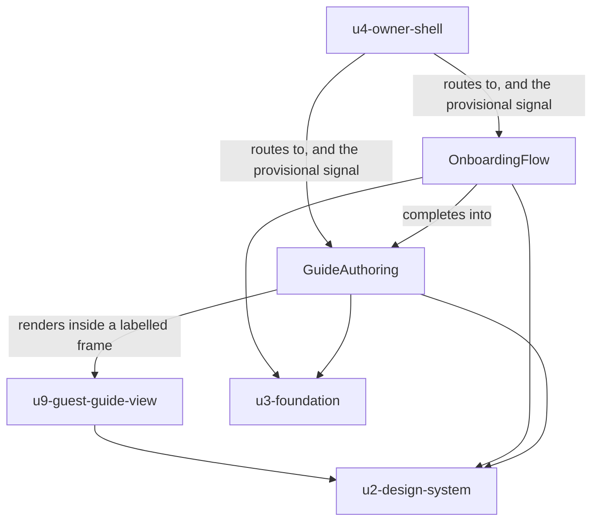

# Functional Specification — `u5-owner-guide`

*Re-confirmed 2026-09-08 after the functional-design redo jump, and re-saved
following that confirmation. Content unchanged.*

The onboarding wizard and the guide editor: the step machine, the save discipline
that guards the product's most dangerous write, the publication state, and the
guest preview.

This unit is `kind: ui`, so it produces no `entities.md` or `rules.md`. **This
file is self-contained**: it is the source of truth for this unit's workflows and
state transitions.

Framework-neutral throughout — the framework is OQ4 and unchosen.

## What this unit does, and does not do

Everything between "the owner has an account" and "a guest could read something".
It owns the guide's content model on the client and **every write to it**.

The two surfaces are one unit because they hand directly from one to the other —
onboarding completes into the editor — and because they share the constraint that
shapes both: **an API that cannot read back what was submitted.**

**It does not own the guest rendering.** Following Q2 = C, the guest view is
extracted into `u9-guest-guide-view`, which this unit renders inside a labelled
preview frame and `u8-guest-app` renders as the guest surface itself. See "The
ninth unit" below.

---

## The provisional-state contract with `u4-owner-shell`

Not a preference of this unit's — an obligation it inherits.

When the shell's onboarding read fails, it routes the owner to `/guide` in a
**provisional** state and retries in the background (`u4`'s Workflow 3, Q3 = B).
The reason it must: `GET` on the guide **creates an empty draft row rather than
failing**, so an un-onboarded owner sees a plausible empty editor rather than an
error, and nothing in the editor would otherwise reveal the mistake.

While provisional:

| Action | Behaviour |
|---|---|
| Reading the guide | Permitted |
| Navigating | Permitted |
| **Save** | **Suppressed**, with the reason reachable (`u2`'s BR2.5) |
| **Publish** | **Suppressed** |
| **Unpublish** | **Suppressed** |

**The shell can decline to route; it cannot decline to save on this unit's
behalf.** If this unit ignores the signal, the compensating control does not
exist — and the window it protects is exactly the window in which an owner who
has not been onboarded could author a guide.

---

## Workflow 1 — Onboarding (the step machine)

The backend's machine is strictly forward: `property_basics` → `content_source` →
`content_review` → `confirm` → completed. `assertStep` throws `409 CONFLICT` on
any non-current step, and **no route moves it back**.

| Step | Actor | Action |
|---|---|---|
| 1 | Wizard | Read `GET /v1/onboarding`. Open at the step it reports as current — **never at a step derived from local state**. |
| 2 | Wizard | Render the indicator as "Step X of Y" **plus the named steps**, not dots alone (AC1.5.1). |
| 3 | Wizard | Restore any unsubmitted entry for this step from the draft (Q1 = B). Where none was retained, render the field **empty and visibly so** — never silently prefilled (AC1.5.2). |
| 4 | Owner | Complete the step and submit. |
| 5 | Wizard | On `200`: show the saved indication (AC1.5.4), **clear this step's draft**, and advance to the step the response reports. |
| 6 | Wizard | On `409 CONFLICT`: the local view of the current step is stale. **Re-read `GET /v1/onboarding` and re-open at what it reports.** Never retry the submission. |
| 7 | Wizard | Backward movement is `[Review]` — prior steps open **read-only**. No control resubmits a completed step. |
| 8 | Wizard | On completion, route to the guide editor. A completed account never sees the wizard again (AC1.5.5). |

**Step 1 and step 6 are the same rule stated twice**, and it is the backend's own
instruction: drive navigation from `GET /v1/onboarding` rather than from local
state. Anything else desynchronises and produces a `409` the owner cannot act on.

**Step 7 is a consequence, not a design choice.** There is no route that would
accept a resubmission, so a Back button that returned to an editable step would
offer an action the API refuses. Review-only is the honest affordance.

**No PDF upload control is rendered** (AC1.6.2). The path is deferred, so the
control is **absent rather than present-and-disabled** — and that is the right
call for a second reason the criterion does not state: the server does not parse
PDFs at all. `/content-source/pdf` accepts a `succeeded` flag plus
*already-extracted* sections, with no upload endpoint, no multipart plugin, no
object storage and no size limit anywhere. Client-side extraction, size limits and
error handling would all be unowned frontend work. Rendering a disabled control
would advertise a feature whose entire implementation is missing.

### The named product gap (Q3 = B)

An owner who mistypes their property name **cannot correct it** — not during
onboarding, because the machine is forward-only, and not afterwards, because no
route edits it. That name is the guest's trust cue: `AC2.1.1` paints it first on
the guest surface as proof the link is theirs.

Per Q3 = B **no confirmation step is added**. Two things follow:

1. The read-only `[Review]` step makes the mistake **visible** before the final
   step commits. It cannot make it **fixable**.
2. The property-name field's label states that the name is what guests see. A
   label, not a guard.

The permanence is recorded as a **named product gap for the backend follow-up** —
a property-name edit endpoint — alongside the existing `AC4.1.x` items, so it is
tracked rather than remembered.

---

## Workflow 2 — Saving the guide

The product's most dangerous write, and the reason this unit exists as a boundary.

| Step | Actor | Action |
|---|---|---|
| 1 | Owner | Edit sections. **No autosave** — save is explicit. |
| 2 | Owner | Save. |
| 3 | Editor | **Refuse if provisional** (see the contract above). |
| 4 | Editor | Compare the outgoing section count with the last loaded state. |
| 5 | Editor | **Shrink → confirm first**, naming the count and the sections: *"This will remove 2 sections: 'House rules', 'Getting around'. They can't be recovered."* |
| 6 | Editor | Send the **complete** section set under the exact expected key (AC1.7.2). |
| 7a | Editor | `200` → the guide is now what was sent. Update the last-loaded baseline. |
| 7b | Editor | Failure → show the error, **keep every edit on screen**, discard nothing (AC1.7.4). |

**Step 5 is the third of three layers, and the only one the owner sees.**
`u1-api-contract`'s BR3.2 makes a save without a complete section set
unconstructable at the type level; `u3-foundation`'s BR3.2 refuses it at run time
before the request leaves. Both of those catch a *malformed* request. Neither
catches a **well-formed request that deletes work on purpose because the owner did
not realise it would** — which is what the guard is for.

**Why any of this is necessary.** The route defaults a missing or misspelled
`sections` to `[]` **in front of** the service's array guard, so a bodyless or
mis-keyed save returns **`200` with every section deleted**. A destructive success
is a different failure mode from a rejected request: there is no error to handle
and no result to inspect, because by the time a response arrives the guide is
gone.

**What the guard cannot do.** It compares against the **last loaded state**, so it
is defeated by a stale load — another tab, or a guide changed elsewhere since this
one was read. It is a guard against the owner's own mistake, not against
concurrency. `AC1.7.5`'s no-refetch-on-focus rule makes staleness *more* likely,
not less, and that trade was made deliberately because the alternative is a `GET`
that creates a draft row every time the window regains focus.

**A first save has no baseline.** Where no last-loaded state exists, the guard does
not fire — there is nothing to shrink from.

---

## Workflow 3 — Publishing, and the preview

| Step | Actor | Action |
|---|---|---|
| 1 | Editor | Show the publication state persistently beside the property name: `● Published` or `○ Draft`. |
| 2 | Owner | Publish → the editor shows it as published (AC1.8.1). Unpublish → it returns to draft (AC1.8.2). |
| 3 | Editor | Both are **suppressed while provisional**. |
| 4 | Owner | `[Preview as guest]`. |
| 5 | Editor | Render `u9-guest-guide-view` inside a **labelled preview frame**, fed the same `GuestGuideView` shape a guest would receive. |
| 6 | Editor | When nothing is published, the preview shows **exactly the guest-facing placeholder** — the property name, a plain statement that the host is still preparing the guide, a prompt to contact the host (AC1.8.4). |

**Step 6 is the criterion's whole point.** The owner needs to know what is served
*right now* under links they have already sent. The prior design put owner-framed
copy here — "guests will see this exact message until you publish" — which is
nonsense if it ever reaches a guest. The instinct was right; the framing was not.
A framed preview of the real guest screen keeps the instinct and fixes the
framing.

---

## The ninth unit (Q2 = C)

`AC1.8.4` says the preview shows the guest screen **"exactly as a guest would see
it"**. That is a claim that has to stay true over time, not just on the day it is
written.

The shared rendering **cannot** live in `u2-design-system`: it renders guide
sections, so it knows what a guide is, and `u2`'s BR1.1 forbids exactly that — it
is the rule that pushed eight components out of that unit. So the extraction is a
new unit.

> **`u9-guest-guide-view`** — `kind: ui`, complexity S.
> **Owns:** the rendering of a `GuestGuideView` — the identity block, the tabs and
> their empty states, and the not-yet-published placeholder.
> **Depends on:** `u2-design-system` only. It makes no request, resolves no brand
> and holds no session. It is a pure rendering of a shape it is handed.
> **Consumed by:** `u8-guest-app` (as the guest surface) and `u5-owner-guide`
> (inside the preview frame).
> **Acyclic:** neither consumer is reachable from it.

**What this changes in already-approved work**, disclosed rather than absorbed:

| Artifact | Change needed |
|---|---|
| `unit-of-work.md` | Describes eight units; needs `u9` added with a correction note |
| `unit-of-work-dependency.md` | Needs `u9` and the two new edges |
| `u8-guest-app/functional-design/*` | Specifies `IdentityBlock`, `GuideTabs` and the three panels as its own. Those move to `u9`. Its unit-stage is already complete |
| `delivery-planning/bolt-plan.md` | Sequenced eight units |

**Why the alternative was worse.** Reimplementing the guest view here would make
`AC1.8.4`'s claim false the first time one copy changed and the other did not —
silently, with no test that would catch it, on the screen the owner uses to decide
whether their guide is ready to send.

---

## State machine — the editor

| Current state | Event | Guard | Next state | Actions |
|---|---|---|---|---|
| `loading` | Guide read returns | — | `clean` | Set the last-loaded baseline |
| `loading` | Guide read fails | — | `load-failed` | Error with a retry. **No draft row is created by a retry that never reaches the server** |
| `clean` | Owner edits | — | `dirty` | Show the unsaved indicator |
| `dirty` | Save | Provisional | `dirty` | **Refuse.** Reason reachable |
| `dirty` | Save | Sections shrank | `confirming` | Name the count and the sections |
| `dirty` | Save | No shrink | `saving` | Send the complete set |
| `confirming` | Confirmed | — | `saving` | Send the complete set |
| `confirming` | Cancelled | — | `dirty` | Nothing sent, nothing lost |
| `saving` | `200` | — | `clean` | Update the baseline |
| `saving` | Failure | — | `dirty` | Error shown, **every edit kept** (AC1.7.4) |
| `clean` or `dirty` | Session expires | — | unchanged | The shell overlays the expired state; **this unit unmounts nothing** (AC1.10.3) |

**The last row is the one that matters most for the owner's trust.** An expiry
mid-edit preserves the buffer, and `u3-foundation`'s Q2 = B replay then re-sends
the save with a **fresh** payload from this unit — not the captured bytes — after
re-authentication (`u3`'s BR2.2). This unit is the caller that supplies that fresh
payload.

---

## Derived view — the two surfaces

*Text fallback: the owner shell routes to both surfaces and supplies the
provisional signal to each. The wizard completes into the editor. The editor
renders `u9-guest-guide-view` inside a labelled preview frame. Both surfaces reach
the backend only through `u3-foundation` and build from `u2-design-system`
primitives; `u9` depends on the design system alone.*

---

## Traceability

This unit carries four stories: US1.5, US1.6, US1.7 and US1.8.

**One criterion is `Deferred`:** `AC1.5.6` — the wizard carrying the locality's
brand — is blocked on `AC4.1.7`, which is what every branding criterion in this
project is blocked on. Until then, the functional default.

**`AC1.5.3` is `OK` with a recorded product gap**, not deferred. What the criterion
asks for — prior steps readable, no offer to resubmit — is fully built. The gap it
*names* is that a mistyped property name cannot be corrected anywhere in the
product, which no frontend behaviour can close.

**`AC1.8.3` is declared here and in `u8-guest-app`, deliberately.** `US1.8` is this
unit's story, but the criterion describes what a *guest* sees. It is realised in
`u9-guest-guide-view` and reaches a guest through `u8`; this unit's stake is that
the preview shows the same rendering. That shared realisation is exactly what
Q2 = C bought.

**A note on the traceability sensor.** As for `u4` and `u8`, `produces_kinds` gives
a `ui` unit no `rules.md`, while the sensor requires one and a `BRx.y` id in every
`OK` target regardless of unit kind. It reports 17 findings here, every one of that
shape. Its substantive checks all pass: **no gaps, no orphans, nothing missing from
the table and no undeclared upstream id.**

## Verification performed for this unit

No reviewer subagent was dispatched — the human directed that `ui` units be
verified inline. Checked directly rather than assumed:

- **The onboarding step machine**: `api-documentation.md` § A.3 confirms the four
  steps, the `409 CONFLICT` on any non-current step, and the instruction to drive
  navigation from `GET /v1/onboarding` rather than local state.
- **The PDF path's real state**: the server does not parse PDFs;
  `/content-source/pdf` takes a `succeeded` flag plus already-extracted sections,
  with no upload endpoint, no multipart plugin, no object storage and no size
  limit. This is stronger than `AC1.6.2`'s "deferred" and is why the control is
  absent rather than disabled.
- **The destructive save**: `src/guide/routes.ts` sends
  `request.body?.sections ?? []` into `updateSections`, confirming the default
  lands in front of the service's guard.
- **The guide `GET` side effect**: documented as *"Creates an empty draft guide on
  first read — a GET with a side effect."*
- **`u2` BR1.1 and BR2.5, `u3` BR3.2 and BR2.2, `u1` BR3.2** all exist in those
  units' `rules.md` and say what is claimed here.

## Review

**Verdict:** READY
**Reviewer:** aidlc-architecture-reviewer-agent
**Iteration:** 1
**Date:** 2026-09-08
**Request Challenge:** review:cde9acbc41ebe520326b5e1890ea1e09

This unit was fully reviewed earlier in the stage. A redo jump then reset the
stage for bookkeeping reasons unrelated to the designs, clearing the receipts.
This pass re-verified that the recorded verdict still stands.

### Findings

| ID | Severity | Location | Finding | Required action | Status |
|---|---|---|---|---|---|
| — | — | — | Nothing invalidates the verdict recorded below. The only changes since it were a disclosed provenance line and, in six units, the finding-status vocabulary remap. | None. | Resolved |

### What was re-verified

Every finding recorded as **Resolved** below has its fix genuinely present in
the artifacts, and every finding recorded as **Accepted risk** genuinely remains
unapplied and accurately described. Three highest-consequence claims were
spot-checked directly: ’s BR1.7 and BR3.6 with Workflow 1 steps 6
and 7;  citing ’s BR2.2 rather than BR3.3 for the
closed subscription-action enum; and ’s BR3.5–BR3.7 with both
touch-target tokens.

---

### The review this supersedes, retained in full

#### Review

**Recorded verdict (superseded):** READY
**Prior reviewer:** aidlc-architecture-reviewer-agent
**Prior iteration:** 1
**Date:** 2026-09-08

##### Findings

| ID | Severity | Location | Finding | Required action | Status |
|---|---|---|---|---|---|
| — | — | — | No findings. Every checked claim verified against source rather than accepted as asserted. | — | — |

##### What the review added to this design

The destructive-save chain was verified one level deeper than this document had
gone. `src/guide/routes.ts` passes `request.body?.sections ?? []` into
`updateSections`, and **`src/guide/service.ts` guards it with
`Array.isArray(sections)` — which `[]` trivially satisfies.** So the guard does not
merely fail to catch a bodyless save; it *passes* it, and the save proceeds to
replace every section with nothing. That is why `AC1.7.2`'s three layers exist and
why none of them can be dropped.

The review also confirmed the three layers are genuinely non-overlapping —
`u1`'s type and `u3`'s runtime assertion catch a **malformed** request, this
unit's shrink guard catches a **well-formed one that deletes work the owner did
not intend** — and that this document's statement of the guard's limitation
(defeated by a stale load, and made more likely by `AC1.7.5`'s no-refetch rule) is
honest rather than minimised.

##### Validation tool results

| Check | Result |
|---|---|
| Destructive-save default | Confirmed in `routes.ts` and `service.ts`, including the `Array.isArray` guard that `[]` passes |
| Onboarding `409` machine | Confirmed in `api-documentation.md` § A.3 and `src/onboarding/service.ts`'s `assertStep` |
| PDF support absent | Confirmed: no upload endpoint, no multipart plugin, no object storage, no size limit |
| `AC1.5.6` blocked on `AC4.1.7` | Confirmed against `stories.md` and `requirements.md` |
| Cross-unit rule ids | All resolve and match the claimed content |
| `aidlc-sensor-traceability` | 17 findings, all of the `ui`-unit shape. No gaps, no orphans, nothing missing, no undeclared id |

##### Summary

No architectural gaps, broken references or unsupported claims. Every load-bearing
assertion traces to source code or an upstream artifact rather than to assertion:
the destructive-save default, the three-layer guard and its disclosed limitation,
the session-expiry draft-preservation trap, the forward-only `409` machine, and
the absence of PDF support.

The review independently checked the downstream rework this unit's Q2 = C caused,
rather than taking it on trust: `u9-guest-guide-view` exists with the claimed kind
and dependency, both `units-generation` artifacts carry the correction, and
`u8-guest-app`'s artifacts record the components moving out. It confirmed
`delivery-planning/bolt-plan.md` does **not** yet mention `u9` — which this
document already flags as needed rather than claiming done, and which is carried
to the approval gate as an open item.
