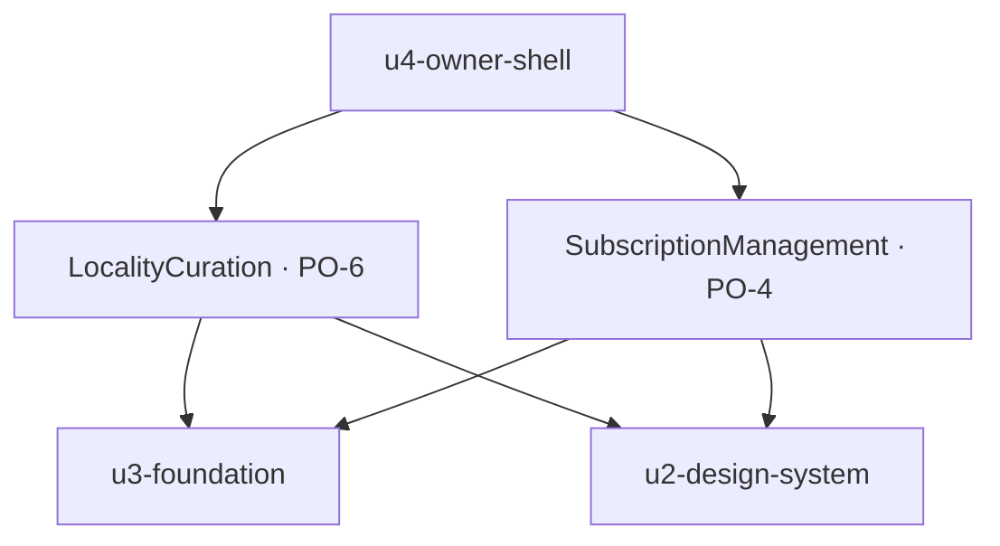

# Functional Specification — `u6-owner-locality-billing`

*Re-confirmed 2026-09-08 after the functional-design redo jump, and re-saved
following that confirmation. Content unchanged.*

Two unrelated Owner screens in one unit: locality curation with its optimistic
favourite toggle, and subscription management against an API that cannot be read.

This unit is `kind: ui`, so it produces no `entities.md` or `rules.md`. **This
file is self-contained**: it is the source of truth for this unit's workflows and
state transitions.

Framework-neutral throughout — the framework is OQ4 and unchosen.

## What this unit does, and does not do

`LocalityCuration` (PO-6) and `SubscriptionManagement` (PO-4).

**Why these two are one unit, stated honestly.** Not domain affinity — they have
almost nothing in common — but delivery shape: both are self-contained Owner
screens outside the walking skeleton, both depend only on the shell, and both are
individually too small to justify their own boundary at the chosen granularity.
`unit-of-work.md` records this as **the weakest cohesion boundary in the
decomposition** and names the line it splits along if either grows: straight
between the two components.

**Both screens work; neither yet does what the owner expects.** Nothing curated
here reaches any guest until `AC4.1.9`. And **nothing anywhere in the API gates a
feature on subscription status** — no route, service or middleware outside
`src/subscription/` reads it — so cancelling has no functional effect on the
guide, the guest link, or chat.

The two screens handle that shared predicament **differently, on purpose**. See
"Two gaps, two treatments" below.

---

## Workflow 1 — Browsing and curating locality content

| Step | Actor | Action |
|---|---|---|
| 1 | Curation | Read the POI list and the event list. Both derive the locality from the JWT's `propertyId` — there are no query parameters, no filtering, no pagination and no sorting, so the full locality list arrives every time. |
| 2 | Curation | `isEmptyLocality` → render the server's `emptyMessage`, **not a competing hardcoded string** (AC1.12.4). Never a blank grid. |
| 3 | Curation | Render the persistent notice that these choices do not yet reach guests (Q3 = A). |
| 4 | Owner | Click a favourite toggle. |
| 5 | Curation | Update the display **immediately** (AC1.12.2). |
| 6 | Curation | Send the favourite or unfavourite request, **always with a complete body** (AC1.12.6). |
| 7a | Curation | `200` → the response is a full `OwnerGuideView`. Reconcile the local view from it (Q1 = B). |
| 7b | Curation | Failure → **revert the toggle** and show an inline notice (AC1.12.2). |
| 7c | Curation | `400 VALIDATION_ERROR` (item outside the locality) → revert, and show the inline error (AC1.12.5). |

**Step 2 is a rule about whose words appear**, and the backend has real copy for
both lists: `"Content is being added for this locality."` for POIs and
`"No events yet — check back soon."` for events. Rendering a locally invented
string alongside or instead of those is what the criterion forbids.

**Step 6 is not defensive style.** The favourites handler destructures
`request.body` directly with **no `?? {}` fallback** — the only handler in the file
without one — so a bodyless request returns `500 INTERNAL_ERROR` rather than a
well-shaped `400`. `u3-foundation`'s BR3.1 refuses such a request before it
leaves.

### The known race (Q1 = B)

Step 7a reconciles from the response, and the response is a **whole guide
snapshot** rather than the toggled item. So:

> The owner favourites item A, then item B about a second later. A's response —
> a snapshot taken before B was applied — arrives after B's. **B's toggle visibly
> reverts**, though the server holds both.

This was chosen with the failure named. Three things bound it:

1. **Recoverable and self-evident.** The owner sees the toggle flip back and
   clicks again. Unlike the guide save, nothing is destroyed.
2. **Server state is correct throughout.** Only the local view is stale.
3. **Nothing downstream depends on it today.** Until `AC4.1.9`, no guest sees any
   of these favourites.

**What is built to bound it, without changing the decision:** the screen re-reads
its lists on navigating back to it, so a wrong display never outlives the visit.

**The fix, named so it is not rediscovered.** A per-item sequence number — apply a
response only if it is not stale for that item — makes the race impossible under
any ordering. Serialising per item (disabling a toggle while its own request is in
flight) is the simpler variant. Either is a small, local change confined to
`FavoriteToggle`.

---

## Workflow 2 — Subscription (Q2 = C)

**There is no `GET /v1/subscriptions`.** The API documentation states the
consequence plainly: the current plan and status cannot be read without mutating,
and a manage-subscription screen has no safe way to render current state.

There is no safe probe either. `PATCH` cancels on anything unrecognised. `POST`
creates a subscription and returns `404` when no `SubscriptionRecord` row exists
at all.

So this screen **makes no claim about plan or status** (Q2 = C). What it offers
is four controls, each with a disposition that *is* knowable:

| Control | Disposition | Why this is knowable without reading state |
|---|---|---|
| Start | Available | Always a valid attempt; `404` and `402` are handled |
| Upgrade | **Disabled** | Only one tier — `standard` — exists, so it changes no observable field |
| Downgrade | **Disabled** | Same |
| Cancel | Available | `409 CONFLICT` when there is no active subscription, handled inline |

**The disabled reason is "only one plan exists", not "start a subscription
first".** The first is true regardless of subscription state; the second is a
claim this screen cannot make. Both reasons are programmatically reachable
(`u2`'s BR2.5), which matters because a permanently disabled control whose reason
a screen-reader user cannot reach is a dead end.

| Step | Actor | Action |
|---|---|---|
| 1 | Subscription | Render the four controls. Show no plan and no status. |
| 2 | Owner | Start. |
| 3a | Subscription | `201` → show the returned plan and status **as the result of this action**, not as a claim about current state. |
| 3b | Subscription | `402 PAYMENT_FAILED` → a banner stating plainly that **no changes were made** to the account (AC1.13.2). |
| 3c | Subscription | `404 NOT_FOUND` → no `SubscriptionRecord` row exists; an inline explanation, no retry. |
| 4 | Owner | Cancel. |
| 5 | Subscription | **Confirm first**, stating that guide content stays intact and resubscribing restores access (AC1.14.3). |
| 6 | Subscription | Send `cancel` from the closed typed set (AC1.14.6). |
| 7 | Subscription | On an **indeterminate** outcome — a timeout or transport failure — **do not retry**. Ask the owner. `AC1.14.5` also says the app re-reads subscription state; **it cannot** — there is no `GET /v1/subscriptions`. Asking is the whole of what this screen can do. |

**Step 3a is a narrow distinction that matters.** Showing what a mutation returned
is reporting an outcome. Showing it later, on a fresh visit, as "your plan" would
be asserting a state the screen cannot know — which is what Q2 = C rules out.

**Step 5's reassurance is verified, not hopeful.** `cancel` only sets status and
never touches guide content; `stories.md` records that assumption A4 became a
property of the code rather than a belief.

**Step 7 is the highest-consequence rule in the product's Owner half.** The
endpoint's final `else` branch cancels the subscription on **any** unrecognised
action, and the body is read as `request.body?.action`, so **a missing body reaches
`cancel`**. A speculative retry is a silent billing event. Three layers keep it
impossible: `u1-api-contract`'s BR2.2 at the type level, `u3-foundation`'s BR3.3 as
a runtime assertion before the request leaves, and `u3`'s BR2.3 excluding this
endpoint from the replay path entirely.

---

## Two gaps, two treatments

The unit's two screens face the same predicament and answer it oppositely. That is
deliberate and worth stating, because a reader meeting it cold would take it for
an inconsistency.

| | Curation (PO-6) | Subscription (PO-4) |
|---|---|---|
| The gap | Favourites reach no guest until `AC4.1.9` | Plan and status cannot be read until `AC4.1.2` |
| On screen | **A persistent notice** | **Silence** |
| Why | The owner would otherwise conclude something false — that guests see their choices | The owner is shown no state, so there is nothing false to correct |

**The test is what the owner would otherwise believe.** PO-6 without a notice
teaches a falsehood by omission. PO-4 with no state simply does less than it will;
its gap is disclosed in `traceability.json`, where `AC1.14.1` is recorded
`Deferred` on `AC4.1.2`.

**The notice has a removal condition, recorded rather than remembered.** When
`AC4.1.9` lands the notice on PO-6 becomes false in the other direction and must
be removed. It is tied to that criterion explicitly here so the obligation
survives.

---

## State machine — the favourite toggle

| Current state | Event | Guard | Next state | Actions |
|---|---|---|---|---|
| `not-favourited` | Toggled | — | `favouriting` | Display updates immediately (AC1.12.2) |
| `favourited` | Toggled | — | `unfavouriting` | Display updates immediately |
| `favouriting` | `200` | — | `favourited` | Reconcile the whole view from the response (Q1 = B) |
| `unfavouriting` | `200` | — | `not-favourited` | Reconcile the whole view from the response |
| `favouriting` or `unfavouriting` | Failure | — | previous state | **Revert**, with an inline notice (AC1.12.2) |
| `favouriting` | `400` outside locality | — | `not-favourited` | Revert, with the inline error (AC1.12.5) |

**No confirmation on any transition** (AC1.12.1) — a single click, and unfavouriting
stops the item appearing in the guide (AC1.12.3). The reconcile rows are where the
known race lives.

---

## Derived view — the two screens

*Text fallback: the owner shell routes to both screens. Neither depends on the
other — the dashed line between them in any mental model is the split line
`unit-of-work.md` names. Both reach the backend only through `u3-foundation` and
build from `u2-design-system` primitives.*

---

## Traceability

This unit carries three stories: US1.12, US1.13 and US1.14.

**Two criteria are not plainly `OK`:**

| Criterion | Status | Why |
|---|---|---|
| `AC1.14.1` | `Deferred` | No `GET /v1/subscriptions` exists. Blocked on `AC4.1.2` |
| `AC1.14.4` | `Deferred` | The screen cannot know whether a subscription is active, so it cannot disable controls *for that reason*. The controls that are disabled are disabled for a different, knowable reason |

**`AC1.14.4` is the more interesting of the two.** Its *shape* is delivered —
upgrade, downgrade and cancel behave sensibly and their reasons are reachable —
but its *condition* is unknowable, so claiming it as met would be claiming the
screen distinguishes a case it cannot see. Deferring it on `AC4.1.2` alongside
`AC1.14.1` is the honest record.

**A note on the traceability sensor.** As for `u4`, `u5` and `u8`,
`produces_kinds` gives a `ui` unit no `rules.md`, while the sensor requires one and
a `BRx.y` id in every `OK` target regardless of unit kind. It reports 14 findings
here, every one of that shape. Its substantive checks all pass: **no gaps, no
orphans, nothing missing from the table and no undeclared upstream id.**

## Verification performed for this unit

No reviewer subagent was dispatched — the human directed that `ui` units be
verified inline. Checked directly rather than assumed:

- **No `GET /v1/subscriptions` exists.** Confirmed in `api-documentation.md` § A.6
  and against `guestguideiq-app/src/subscription/routes.ts`, which registers only
  `app.post` and `app.patch`.
- **The `PATCH` cancel-on-anything branch** and that the body is read as
  `request.body?.action`, so a missing body reaches `cancel`.
- **`POST /v1/subscriptions` returns `404`** when no `SubscriptionRecord` row
  exists — which is why Start is "always a valid attempt" but not always a
  successful one.
- **The favourites handler has no `?? {}` fallback**, alone in its file.
- **The real `emptyMessage` strings** the backend supplies for both lists, and
  that the endpoints take no query parameters, filtering, pagination or sorting.
- **Every AC id cited** exists in `stories.md` and says what is claimed.
- **`u2` BR2.5, `u3` BR3.1, BR3.3 and BR2.3** exist in those units' `rules.md`
  and say what is claimed. **`u1` BR2.2** likewise — *corrected at review*: this
  section originally cited `u1` BR3.3 and claimed it had been checked. What had
  actually been checked was that the id **existed**, not that it said what was
  claimed about it. `u1`'s BR3.3 is the untrusted-chat-reply rule; the closed
  action enum is BR2.2. See R-01 below.

## Review

**Verdict:** READY
**Reviewer:** aidlc-architecture-reviewer-agent
**Iteration:** 2
**Date:** 2026-09-08
**Request Challenge:** review:cb002adf33f5bfbc9fae2ce4a415f9b1

Re-verification after the guest-guide theming correction was applied to
`u3-foundation`, `u8-guest-app` and `u9-guest-guide-view` under a
human Request Changes decision. This unit was not among those revised.

### Findings

| ID | Severity | Location | Finding | Required action | Status |
|---|---|---|---|---|---|
| R-01 | Minor | (whole unit) | Unchanged by the correction; the verdict recorded below still stands. | None. | Resolved |

### What was checked

That nothing in this unit's artifacts changed as part of the theming correction,
and that its recorded findings keep their dispositions - each `Resolved`
finding's fix still present, each `Accepted risk` finding still genuinely
unapplied and accurately described.

---

### The review this supersedes, retained in full

#### Review

**Recorded verdict (superseded):** READY
**Prior reviewer:** aidlc-architecture-reviewer-agent
**Prior iteration:** 1
**Date:** 2026-09-08
**Prior request challenge:** review:4ec823a11c64fdccec58fc64068f0b91

This unit was fully reviewed earlier in the stage. A redo jump then reset the
stage for bookkeeping reasons unrelated to the designs, clearing the receipts.
This pass re-verified that the recorded verdict still stands.

##### Findings

| ID | Severity | Location | Finding | Required action | Status |
|---|---|---|---|---|---|
| R-01 | Minor | (whole unit) | Nothing invalidates the verdict recorded below. The only changes since it were a disclosed provenance line and, in six units, the finding-status vocabulary remap. | None. | Resolved |

##### What was re-verified

Every finding recorded as **Resolved** below has its fix genuinely present in
the artifacts, and every finding recorded as **Accepted risk** genuinely remains
unapplied and accurately described. Three highest-consequence claims were
spot-checked directly: ’s BR1.7 and BR3.6 with Workflow 1 steps 6
and 7;  citing ’s BR2.2 rather than BR3.3 for the
closed subscription-action enum; and ’s BR3.5–BR3.7 with both
touch-target tokens.

---

##### The review this supersedes, retained in full

#### Review

**Recorded verdict (superseded):** READY
**Prior reviewer:** aidlc-architecture-reviewer-agent
**Date:** 2026-09-08T08:15:50Z
**Prior iteration:** 2
**Prior request challenge:** review:496aab7ab874fd6a50a51b4d42cbda3b

##### Findings

| ID | Severity | Location | Finding | Required action | Status |
|---|---|---|---|---|---|
| R-01 | Major | `functional-spec.md` Workflow 2 and Verification performed; `frontend-components.md` > `PlanControls`; `functional-design-questions.md` preamble | Four places cite `u1-api-contract`'s **BR3.3** as the type-level guard making a free-form subscription `action` unconstructable. `u1`'s BR3.3 is *"Chat reply text is marked untrusted at the boundary"* — an unrelated rule about model output. The rule that matches the claim is **BR2.2**, *"SubscriptionAction.action is a closed enum, never a free-form string."* This is the citation chain behind the document's own "highest-consequence rule in the product's Owner half", and the Verification section asserted the id had been checked and found correct, which it had not. | Replace every such citation with BR2.2, and correct the Verification claim. | Resolved |
| R-02 | Minor | `functional-spec.md` Workflow 2 step 7; `frontend-components.md` > `PlanControls`; `traceability.json` `AC1.14.5` | `AC1.14.5` reads "does not retry automatically; it **re-reads my subscription state** and asks me." There is no `GET /v1/subscriptions` — the same fact that makes `AC1.14.1` and `AC1.14.4` `Deferred` — so there is nothing to re-read, and "re-reads what it can" claims more than the design can do. `AC1.14.5` was marked plain `OK` with no caveat, unlike its two neighbours. | Record that only the no-retry half is deliverable, and drop the re-read language. | Resolved |

##### Iteration 2 verification

**R-01.** `u1-api-contract/functional-design/rules.md` confirms BR2.2 (line
133) is *"SubscriptionAction.action is a closed enum, never a free-form
string"* and BR3.3 (line 187) is *"Chat reply text is marked untrusted at the
boundary"* — exactly as the fix states. Every remaining BR2.2/BR3.3 citation
in `u6` was checked: `functional-spec.md` lines 138, 250–255, 268, 288 and
`frontend-components.md` lines 156–157 all cite `u1`'s BR2.2 for the enum
guard and `u3-foundation`'s BR3.3 for the runtime assertion — confirmed
against `u3-foundation/functional-design/rules.md` line 217, *"The
subscription action comes from a closed set, checked before it is sent"*, a
genuinely different, correctly-attributed rule. No stray `u1` BR3.3 reference
remains. The Verification section (lines 250–255) now states plainly what
was actually checked (id existence) versus what R-01 had wrongly claimed
(content match) — the historical `functional-design-questions.md` preamble is
correctly left untouched as the confirmed record, per the note accompanying
this dispatch. Resolved.

**R-02.** `traceability.json`'s `AC1.14.5` row is now `Deferred`, stating
both clauses explicitly: the no-retry half delivered and enforced in depth
(`u3`'s BR3.4 and BR2.3), the re-read half blocked on `AC4.1.2` because no
`GET /v1/subscriptions` exists. `functional-spec.md` Workflow 2 step 7 and
`frontend-components.md`'s `PlanControls` section both now say plainly that
the app "cannot" re-read and that asking is the whole of what the screen can
do — no claim of reading what it can survives. The one remaining "re-reads"
sentence in `functional-spec.md` (line 77) is about `FavoriteToggle`
re-reading its lists on navigation, an unrelated feature in Workflow 1, not
a residual subscription re-read claim. Resolved.

##### Also checked

- `traceability.json` balances: 14 upstream ids, 14 coverage rows, no gaps
  and no orphans (`upstream_ids` and `coverage[].id` sets are identical).
  Coverage status is 11 `OK` / 3 `Deferred`, consistent with the document's
  narrative. The sensor's 13 `ui`-unit-shape findings (wanting a `rules.md`
  and `BRx.y` ids this unit's `produces_kinds` does not call for) are the
  disclosed, known-and-accepted advisory noise named in the dispatch — not
  re-reported.
- Every other cited rule id spot-checked resolves to its claimed content:
  `u2-design-system`'s BR2.5 (line 113, disabled-control reason
  programmatically reachable), `u3-foundation`'s BR3.1 (line 187, complete
  body checked before send), BR3.4 (line 231, indeterminate-failure
  retry/no-retry split) and BR2.3 (line 169, a subscription change is never
  replayed) all match what `u6`'s documents claim about them.
- Nothing introduced by the two fixes contradicts anything else in
  `functional-spec.md`, `frontend-components.md`, or `traceability.json`.

##### What the review confirmed

Every subscription hazard was verified independently against
`api-documentation.md` and the live source: no `GET /v1/subscriptions` exists, the
`PATCH` final `else` cancels on anything unrecognised, `request.body?.action`
means a missing body reaches `cancel`, and `POST` returns `404` with no
`SubscriptionRecord` row. The favourites handler's missing `?? {}` fallback was
confirmed too, as were the server-supplied `emptyMessage` strings.

The Q1 = B race is recorded honestly with an accurately described fix, and the
Q2 = C and Q3 = A resolutions are coherent. **Every other cited rule id resolves
to its claimed content.**

##### Why R-01 is Major rather than Minor

The wrong id sits in the chain a developer would follow to implement the
billing-safety guard — the one where a typo cancels a subscription. A reader
chasing `u1`'s BR3.3 finds a rule about chat text and has no reason to think the
enum guard exists at all. The compounding fault is the Verification section: it
claimed the citation was checked. What was actually checked was that the id
*existed*, not that it said what was claimed about it — which is the specific
failure this workflow had already been corrected for.
