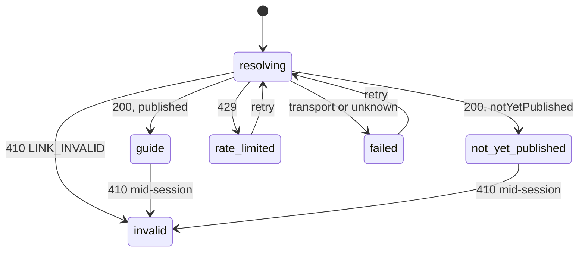

# Functional Specification — `u8-guest-app`

*Revised 2026-09-08 under a human Request Changes decision: the guest-guide
theming misclassification is corrected. Every change is marked in place.*

The guest surface: resolving a stay link into a guide, the ordered render that
`AC2.1.1` demands, the tab model, the chat lifecycle, and the degraded states.

This unit is `kind: ui`, so it produces no `entities.md` or `rules.md`. **This
file is self-contained**: it is the source of truth for this unit's workflows and
screen transitions. The wire shapes it renders are `u1-api-contract`'s
`GuestStayView` and `GuestGuideView`; the typed errors are `u3-foundation`'s.

Framework-neutral throughout — the framework is OQ4 and unchosen.

> **Revised 2026-09-08 — the guide rendering moved out.** `IdentityBlock`,
> `GuideTabs` and its panels, and `NotYetPublishedNotice` now live in
> `u9-guest-guide-view`, so `u5-owner-guide`'s preview renders the same components
> a guest gets rather than a second copy (`u5`'s Q2 = C). This unit keeps the route
> model, the stay resolution, the chat widget and the degraded states, and it
> decides **when** the guide renders while `u9` decides **how**.
>
> Workflows 1 and 2 below still describe the guest-visible behaviour end to end,
> because that is what this unit delivers to a guest. Steps 2–4 of Workflow 1 and
> the whole of Workflow 2 are now **executed inside `u9`**; they are retained here
> because this unit is where a guest's experience is specified, and losing them
> would make this document describe a shell rather than a surface. `u9`'s own
> `functional-spec.md` is the source of truth for how they render.

## What this unit does, and does not do

Everything a guest sees, and nothing else. No authentication, no account, no
dashboard frame. It shares **no model** with the Owner's guide: `OwnerGuideView`
carries `publishStatus`, `GuestGuideView` carries `notYetPublished` and nests
inside the stay payload. That is ADR-002's bounded-context split, and it is
visible in the wire shapes rather than merely asserted.

**It does not depend on `u4-owner-shell`.** Making the guest app wait on Owner
routing would encode a dependency that does not exist. It needs `u2-design-system`
and `u3-foundation` and nothing else, which makes it the largest genuinely
parallel branch in the topology.

**The guest is never asked to create an account** (AC2.1.4) — no prompt, no
upsell, no "save this guide" anywhere on this surface.

---

## The route model

There is exactly one route: `/{token}`. Everything else is a state of it.

| State | Screen | Reached when |
|---|---|---|
| `resolving` | Skeleton of the identity block and tab bar | The stay read is in flight |
| `guide` | G-2 Property Guide | `200` — the stay resolved |
| `not-yet-published` | G-2's guest-framed placeholder | `200`, and `notYetPublished` is true |
| `invalid` | G-1 Link Not Valid | `410 LINK_INVALID` |
| `rate-limited` | The specific too-many-requests state | `429 RATE_LIMITED` |
| `failed` | Error with a retry | `TRANSPORT_FAILURE` or anything else |

**`410` is this unit's central navigational state, not an error page.** Every
stay-link failure — unknown token, expired stay, missing property, host/locality
mismatch — returns the same `410` with the same message, deliberately. The
frontend **cannot** distinguish them and must not try: doing so would tell a
stranger which tokens exist.

**A not-yet-started stay is not `invalid`** (AC2.2.4). The backend resolver
compares `expiresAt` only and never reads `checkIn`, so a link is live from
creation until the end of the checkout date. A guest opening a link early sees
the guide normally, and the copy must not tell them to contact their host — the
link is valid, is not expired, and contacting the host achieves nothing.

---

## Workflow 1 — Opening a stay link (Q1 = A)

The render ordering `AC2.1.1` demands, stated as steps because the ordering *is*
the requirement.

| Step | Actor | Action |
|---|---|---|
| 1 | Guest app | Request the stay payload. Render the skeleton of the identity block and tab bar — **never a full-page spinner** and never a blank page (AC2.5.1). |
| 2 | Guest app | Payload arrives. **Paint the property name and the locality name immediately**, in base tokens, as the first content on screen (AC2.1.1). |
| 3 | Guest app | Paint the "this is your stay" confirmation alongside them. The identity block reads as complete **without an image** (AC2.1.5). |
| 4 | Guest app | Then the tab bar and the Overview panel's content. |
| 5 | Guest app | Then the chat affordance. |
| 6 | Guest app | Hand the payload's `locality` object to `u3-foundation` for parsing. When tokens resolve, apply them — **accent surfaces only** (Q1 = A's control). **No second request**: the brand arrived with the stay at step 1. |

**Steps 2 and 6 are the whole of Q1.** Identity paints before theming; the brand
arrives afterwards and changes only the accent bar and the action colour. Layout,
type, position and spacing are identical before and after, so **nothing reflows**.
A colour arriving is not a glitch; text moving is.

**The unbranded state is a finished design, not a placeholder.** `AC2.1.3`
requires a brand carrying only a name and tagline to render "the clean default
look plus that name — never a half-styled or broken page", and the same is true
when no brand resolves at all.

**Step 6 needs no additional request, and is not blocked.** The stay payload this
unit already reads at step 1 carries the brand inline:

```
GET /v1/stays/:token → { property, locality: { id, name, tagline, visualStyling }, guide }
```

That `locality` object is exactly what `u3-foundation`'s `LocalityBrandResolver`
parses into tokens — `u1-api-contract` types it as `LocalityIdentity`. So the
guide's theming is available the moment the stay resolves. The restyle Q1 = A
describes is **real in production, not hypothetical**: the accent bar and action
colour do change a moment after identity paints, which is why Q1 = A's containment
(accent surfaces only, nothing reflows) matters rather than being precautionary.

**`AC4.1.7` does not block this path.** It is a *separate*, domain-keyed brand read
needed by the **owner** screens, which have no stay context to carry a brand:
signup, login and onboarding. Its own definition names the criteria it blocks —
`AC1.1.1`, `AC1.2.1`, `AC1.2.2`, `AC1.5.6`, `AC1.9.4` — and none is on the Guest
surface. `stories.md` says so directly: *"Today locality data leaves the system
only through the guest stay payload."*

**Where the block is real is `G-1`.** A `410 LINK_INVALID` carries no body at all,
so the invalid-link screen has nothing to resolve a brand from and `ADR-005`'s
branded treatment stays blocked. `u3-foundation`'s BR5.4 note covers that path and
is unaffected.

**The unbranded rendering still has to be good in its own right** — `AC2.1.3`
requires a brand carrying only a name and tagline to render the clean default look
plus that name, and a `null` `visualStyling` is a documented possibility.

> **Corrected 2026-09-08.** This section previously asserted that no
> frontend-reachable read returns a locality brand, and that the base-token state
> was the only state a guest would ever see. Both were wrong, and they contradicted
> `u1-api-contract` — which types this very field and describes it as *"the only
> place locality data leaves the system today"*. The error was generalising
> "`AC4.1.7` blocks branding" from the owner surfaces to the guest surface without
> re-checking. Caught at review, fixed under a human Request Changes decision.

**Why no image, and no placeholder for one** (AC2.1.5). There is no photo anywhere
in the system: the stay payload returns `property: { id, name }`, onboarding
accepts a name only, and there is no upload endpoint or object storage. A grey box
or a generic stock photo would weaken exactly the specificity the identity block
exists to provide — a generic photo is worse than none.

---

## Workflow 2 — The tabs (Q3 = A)

| Step | Actor | Action |
|---|---|---|
| 1 | Guest app | Render three tabs: Overview, Places, Events (AC2.3.1). |
| 2 | Guest app | **Overview is selected by default**, so the guest lands on content rather than on a promise. |
| 3 | Guest app | Overview renders the guide's sections from `GuestGuideView`. |
| 4 | Guest app | Places and Events: resolve the favourited ids into displayable content. |
| 5 | Guest app | **The ids do not resolve.** Render `AC2.3.3`'s empty state — "more local recommendations are being added". |
| 6 | Guest app | **No raw identifier is ever displayed** (AC2.3.2). |

**Steps 4–6 are the current reality for every guest on every stay.** The stay
payload carries bare `favoritedPOIIds` and `favoritedEventIds`, and both list
endpoints require an owner JWT — so the guest cannot render a name, a category or
a date. It is not a missing detail view; it is missing everything, and `AC4.1.9`
is what closes it.

**The empty panels still carry their empty-state text in the accessibility tree**
(`u2-design-system`'s BR3.3). A silent panel is invisible to a screen-reader user,
and here two panels out of three are empty by construction — so this is the
load-bearing case for that rule, not an edge one.

**An absent events list does not break the page** (AC2.3.4): the rest of the guide
still renders.

**Tabs scroll horizontally at mobile widths** (AC2.3.5), which `u2`'s BR3.7
guarantees. The guest surface is mobile-first and the tabs are its only
navigation.

---

## Workflow 3 — The itinerary chat (Q2 = A)

| Step | Actor | Action |
|---|---|---|
| 1 | Guest app | The chat bubble is present on every tab (AC2.4.1) — genuinely persistent, not re-mounted per tab. |
| 2 | Guest | Send a message. |
| 3 | Guest app | Show the typing indicator. **Past roughly five seconds, escalate to an explicit note** (AC2.4.2) — a guest waiting on a provider that will never answer is told, not left watching dots. |
| 4a | Guest app | `200` → render the reply as **untrusted text** (AC2.4.6). |
| 4b | Guest app | `504 CHAT_PROVIDER_TIMEOUT` → preserve the history, offer a retry of the last message, never hang silently (AC2.4.3). |
| 4c | Guest app | `429` → the specific rate-limited state, not a generic error (AC2.5.3). |
| 4d | Guest app | `410` → the link expired mid-session; the whole surface moves to `invalid`. |

**Step 4a is not demonstrable end to end.** The deployed chat provider is `null`,
so `4b` is what almost every guest gets. That is why the failure path had to be
designed as the primary path rather than as an afterthought.

**The one path that does succeed** is `AC2.4.4`'s: a locality with fewer than
three curated items returns a canned sparse-content reply in the assistant's own
words — not a UI state change. It is the only success path a scenario test can
exercise today, so it is the one the test exercises.

**`AC2.4.6` is not a preference.** The guest's own message round-trips through a
model and comes back as the reply, so the reply is attacker-influenceable by
construction. It never reaches a raw-HTML sink; the blocking lint rule banning
raw-HTML injection APIs (team practice) is what enforces it, and there is no
documented exception on this path.

**History does not survive close and reopen** (AC2.4.5) — blocked on `AC4.1.6`,
since chat history is not readable. Within one open session the history is held in
the widget; closing it loses it. Recorded as `Deferred` rather than papered over
with local storage, which would create a second, divergent history the backend
knows nothing about.

---

## Workflow 4 — Degraded states

| Condition | State | Behaviour |
|---|---|---|
| Slow load | `resolving` | A skeleton of the identity block and tab bar (AC2.5.1). Never a blank page, never a full-page spinner |
| Failed load | `failed` | An error with a retry action (AC2.5.2). Reached from `TRANSPORT_FAILURE` — `u3-foundation`'s BR4.2 is what guarantees a non-envelope failure resolves to something renderable |
| Rate limited | `rate-limited` | A **specific** "too many requests — try again shortly" state (AC2.5.3), never a generic error |
| Invalid link | `invalid` | G-1, one message for every cause (AC2.2.1, AC2.2.2), no raw status or technical detail (AC2.2.3) |

**Why the rate-limited state gets its own screen rather than folding into
`failed`.** A shared hotel address means one guest's requests can rate-limit
several unrelated guests at once. A generic error sends all of them to their host
for a link that is working perfectly.

**No countdown is buildable.** `Retry-After` is unreadable cross-origin because
the backend sets no `exposedHeaders`, so the state says "shortly" rather than
inventing a number. Testing it deterministically needs a mocked network — the live
limiter is an in-memory bucket per process across 2–6 tasks, so the effective
limit is multiplied and unpredictable.

---

## The not-yet-published state

Distinct from every state above, and the one most easily got wrong.

When the stay resolves but `notYetPublished` is true, the guest sees a single
**guest-framed** placeholder: the property name, a plain statement that the host is
still preparing the guide, and a prompt to contact the host (AC1.8.3).

**Never an error, never a blank page, and never owner-facing wording.** The prior
design had copy along the lines of "guests will see this exact message until you
publish", which is nonsense if it ever reaches a guest. The instinct — tell the
owner what the guest sees — was right; the framing was not.

The identity block still paints first here. A guest whose host has not finished
still needs to know the link is theirs.

---

## Derived view — guest surface states



*Text fallback: the surface starts resolving the stay token. A `200` lands on the
guide, or on the not-yet-published placeholder when the payload says the guide is
unpublished. A `410` lands on the invalid-link screen, a `429` on the specific
rate-limited state, and anything else on a failed-load state with a retry. Both
the failed and rate-limited states return to resolving on retry. A `410` arriving
mid-session — the stay expiring while the guest is reading — moves the guide or
the placeholder to the invalid-link screen.*

**`invalid` is terminal by design.** There is nothing to retry: the link is not
coming back, and offering a retry would suggest otherwise. The screen's only
action is to contact the host.

---

## Traceability

This unit carries five stories — US2.1 through US2.5 — plus `AC1.8.3`, which
describes the guest-facing side of the owner's publish state and is not otherwise
owned by any unit that renders it.

**Three criteria are `Deferred`, all on backend gaps:**

| Criterion | Blocked on | What is missing |
|---|---|---|
| ~~`AC2.1.2`~~ | — | **No longer deferred (2026-09-08).** The stay payload carries `locality.visualStyling` inline, so the guide is themeable today. `AC4.1.7` blocks only the owner screens |
| `AC2.3.2` (the positive half) | `AC4.1.9` | The guest cannot resolve a favourite id into anything displayable |
| `AC2.4.5` | `AC4.1.6` | Chat history is not readable |

**`AC2.3.2` is split rather than deferred whole**, because it has two halves and
they are in different states. Its negative half — "no raw id is ever displayed" —
is met today and is the half that matters for correctness. Its positive half —
favourites appearing with name and category — is what `AC4.1.9` blocks.

**A note on the traceability sensor.** As for `u4-owner-shell`, `produces_kinds`
gives a `ui` unit no `rules.md`, while the sensor requires one and a `BRx.y` id in
every `OK` target regardless of unit kind. It reports 23 findings here, every one
of that shape. Its substantive checks all pass: **no gaps, no orphans, and nothing
missing from the coverage table**. The artifact set follows the stage's own
`produces` contract.

## Verification performed for this unit

No reviewer subagent was dispatched for this unit — the human directed that `ui`
units be verified inline instead. What was checked directly, rather than assumed:

- **`GET /v1/stays/:token`'s failure behaviour**: `api-documentation.md` § Guest
  routes confirms every failure mode returns the same `410 LINK_INVALID` with
  `"This link is no longer valid."`, and states the sameness is deliberate.
- **The chat endpoint's shape and failure codes**: `POST /v1/stays/:token/chat`
  returns `{ reply, sparse, messages }`, with `400`, `410`, `429` and
  `504 CHAT_PROVIDER_TIMEOUT` — confirming both the sparse path and the timeout
  this design is built around.
- **`AC2.2.4`'s premise**: the resolver compares `expiresAt` only and never reads
  `checkIn`, so a pre-check-in link is live. Recorded in `stories.md` as verified
  against the deployed code, and consistent with the route documentation.
- **Every AC id cited** exists in `stories.md` and says what is claimed here.
- **The `u2` and `u3` rule ids cited** (BR3.3, BR3.7, BR4.2) exist in those units'
  `rules.md` and say what is claimed.

## Review

**Verdict:** READY
**Reviewer:** aidlc-architecture-reviewer-agent
**Iteration:** 2
**Date:** 2026-09-08
**Request Challenge:** review:f2399bef22ab8301ec0a32d39a43a443

A scoped pass over one correction, made under a human Request Changes decision:
the guest guide's theming had been recorded as blocked on `AC4.1.7`, and it
never was.

### Findings

| ID | Severity | Location | Finding | Required action | Status |
|---|---|---|---|---|---|
| R-01 | Minor | (whole unit) | No findings. The correction is factually right and complete. | None. | Resolved |

### What was verified

The reviewer checked the claim rather than accepting it. `GET /v1/stays/:token`
returns `locality: { id, name, tagline, visualStyling }` inline with the
`200` payload; `u1-api-contract` types it as `LocalityIdentity` and
describes it as *"the only place locality data leaves the system today"*; and
`AC4.1.7`'s own definition blocks `AC1.1.1`, `AC1.2.1`,
`AC1.2.2`, `AC1.5.6` and `AC1.9.4` - every one an owner-surface
criterion, none on the Guest surface. **The original blocked claim was wrong.**

`AC2.1.2` is correctly `OK`. The remaining deferrals - `AC2.3.2`'s
positive half on `AC4.1.9`, and `AC2.4.5` on `AC4.1.6` - are genuine
and unaffected. `G-1` stays blocked for its own reason, a `410` carrying
no body, which BR5.4 and the revised Workflow 4 state consistently. No stale
pre-fix claim survives outside the review appendices that quote it deliberately
as the defect.

---

### The review this supersedes, retained in full

#### Review

**Recorded verdict (superseded):** READY
**Prior reviewer:** aidlc-architecture-reviewer-agent
**Prior iteration:** 1
**Date:** 2026-09-08
**Prior request challenge:** review:1dfc47d5999ce1a969e362674658590f

This unit was fully reviewed earlier in the stage. A redo jump then reset the
stage for bookkeeping reasons unrelated to the designs, clearing the receipts.
This pass re-verified that the recorded verdict still stands.

##### Findings

| ID | Severity | Location | Finding | Required action | Status |
|---|---|---|---|---|---|
| R-01 | Minor | (whole unit) | Nothing invalidates the verdict recorded below. The only changes since it were a disclosed provenance line and, in six units, the finding-status vocabulary remap. | None. | Resolved |

##### What was re-verified

Every finding recorded as **Resolved** below has its fix genuinely present in
the artifacts, and every finding recorded as **Accepted risk** genuinely remains
unapplied and accurately described. Three highest-consequence claims were
spot-checked directly: ’s BR1.7 and BR3.6 with Workflow 1 steps 6
and 7;  citing ’s BR2.2 rather than BR3.3 for the
closed subscription-action enum; and ’s BR3.5–BR3.7 with both
touch-target tokens.

---

##### The review this supersedes, retained in full

#### Review

**Recorded verdict (superseded):** READY
**Prior reviewer:** aidlc-architecture-reviewer-agent
**Prior iteration:** 2
**Prior request challenge:** review:2379b4be04788df6320cf628dade6e62
**Date:** 2026-09-08

##### Findings

| ID | Severity | Location | Finding | Required action | Status |
|---|---|---|---|---|---|
| R-01 | Major | `functional-spec.md` > Workflow 1 step 6 and "Today step 6 never completes"; `frontend-components.md` > `GuestSurface` and > API integration points; `traceability.json` > `AC2.1.2` | **The guest guide's brand is not blocked, and this design says it is.** `GET /v1/stays/:token`'s `200` body already carries `locality: { id, name, tagline, visualStyling }` inline — the exact payload `LocalityBrandResolver` parses — delivered by the same stay read Workflow 1 already makes at step 1. `AC4.1.7` is a *different*, domain-keyed read needed by owner screens that have no stay context (signup, login, onboarding); its own definition names the criteria it blocks and **none of them are Guest-surface**. So `AC2.1.2` — a **Must** criterion — is misclassified `Deferred`, and Q1's framing that the restyle is "hypothetical in production" is wrong for the guide screen. A developer building from this spec would not implement guide theming at all. | Derive the guide path's tokens from the `locality.visualStyling` already in the resolved `GuestStayView`, with no additional call. Move `AC2.1.2` to `OK`. Correct Q1's framing. | Resolved |

##### Why this one matters more than its severity suggests

**This design contradicts `u1-api-contract`, which I wrote.** `u1`'s `entities.md`
types `LocalityIdentity` and describes it as *"Locality identity as carried in the
guest payload — the only place locality data leaves the system today."* `u1` typed
the field; `u8` and `u9` then asserted the brand never resolves. Nothing in the API
changed between the two — I generalised "`AC4.1.7` blocks branding" from the owner
surfaces to the guest surface without re-checking, and the contradiction sat across
two of my own artifacts.

**What remains correct:** the invalid-link screen (`G-1`) genuinely cannot be
branded — a `410` carries no body at all — so `ADR-005` stays blocked and
`u3-foundation`'s BR5.4 note is unaffected. The block is real for `G-1` and false
for `G-2`.

##### What the review confirmed

The 2026-09-08 extraction is **clean**: no dangling references to the five moved
components survive in any of this unit's three files, every traceability target
pointing into `u9-guest-guide-view` resolves to a section that exists and says what
is claimed, and the "this unit decides *when*, `u9` decides *how*" split is stated
identically from both sides. The nine-unit graph is consistent across
`unit-of-work.md`, `unit-of-work-dependency.md` and both units' designs.

The state machine is complete and disjoint, `invalid` is correctly terminal, and
the deliberate asymmetry — chat's `410` promotes to whole-surface `invalid` while
its `429` and `504` stay in-widget — is stated consistently rather than left as a
gap. The `410`-sameness, the chat endpoint's shape, and `AC2.2.4`'s premise all
verify against the docs and the live source. `LinkInvalidScreen`'s no-cause-input
argument is structurally sound: the backend supplies no distinguishing cause to
take. The other two `Deferred` rows (`AC2.4.5` on `AC4.1.6`, and `AC2.3.2`'s
positive half on `AC4.1.9`) are genuinely blocked.

##### Why R-01 is Open rather than Fixed

Correcting it changes bytes outside the reviewer-authored appendix, which the
review freeze blocks once a verdict is recorded. It is carried to the stage's
approval gate, where a Request Changes decision unlocks it.

**It should be fixed before code generation.** It is the one finding in this stage
that would cause working functionality to go unbuilt rather than merely being
described imprecisely — and the same correction is needed in
`u9-guest-guide-view`, which inherited the claim.

##### Status vocabulary correction, 2026-09-08

R-01 was originally recorded with the status word `Open`, which is not in the
engine's valid set (`New`, `Unresolved`, `Resolved`, `Accepted risk`,
`Rejected: …`). It now reads `Accepted risk` — the accurate disposition, since the
human approved the stage with it outstanding. **No finding, severity or substance
changed.** The scoped Request Changes decision that reopened the stage covers the
vocabulary alone, so the theming correction itself remains unapplied.

**It should still be the first thing fixed before code generation.** It is the
only finding in this stage that would cause working functionality to go unbuilt
rather than merely be described imprecisely.

##### Iteration 2 — status vocabulary verification

A narrow verification pass over the remap alone, not a fresh design review. It
confirmed every finding row now carries a status from the engine's valid set,
that no ID, severity, location, finding text or required action changed, and that
no design content outside this Review section was touched.

It also checked the one way the remap could have overstated progress: that every
finding now reading **Resolved** has its corrective action genuinely present in
the artifacts, and every finding now reading **Accepted risk** genuinely remains
unapplied. Both held. It returned no findings.
