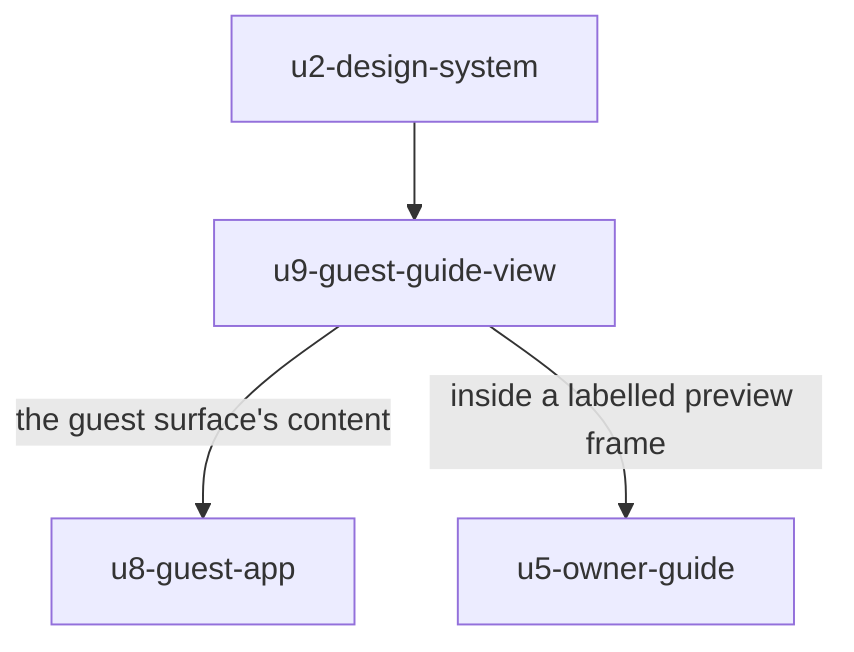

# Functional Specification — `u9-guest-guide-view`

*Re-confirmed 2026-09-08 after the functional-design redo jump, and re-saved
following that confirmation. Content unchanged.*

The shared rendering of a `GuestGuideView`: the identity block, the three tabs and
their empty states, and the not-yet-published placeholder.

This unit is `kind: ui`, so it produces no `entities.md` or `rules.md`. **This
file is self-contained.**

Framework-neutral throughout — the framework is OQ4 and unchosen.

## Why this unit exists

It was created at Construction `functional-design` on 2026-09-08, after
`units-generation` was approved, as a direct consequence of a human decision at
`u5-owner-guide`'s gate (its Q2 = C). The correction is disclosed in
`unit-of-work.md` and `unit-of-work-dependency.md` rather than applied silently.

Because the unit did not exist when this stage began, it has no questions of its
own: every decision shaping it was made at another unit's gate. Its
`functional-design-questions.md` records that inheritance, the three choices made
locally while writing it, and the rework it forced — confirmed by the human on
2026-09-08.

`AC1.8.4` requires the owner's preview to show the guest screen **"exactly as a
guest would see it"** — a claim that has to stay true over time, not only on the
day it is written. Two units need the identical rendering:

- **`u8-guest-app`** serves it to guests.
- **`u5-owner-guide`** shows it inside a labelled preview frame.

The alternatives were both worse. A `u5` → `u8` edge would have ended the Guest
branch's independence — *the single most valuable non-edge in the topology*, and
what makes the whole Guest branch separately workable. A second implementation
would have made `AC1.8.4` false the first time one copy changed and the other did
not, silently, with no test that would catch it.

**Why not `u2-design-system`.** It renders guide sections, so it knows what a
guide is — and `u2`'s BR1.1 forbids exactly that. That rule pushed eight
components out of `u2`; bending it here to avoid a new unit would have undone the
boundary it created.

## What this unit does, and does not do

**It is handed a shape and draws it.** It makes no request, resolves no brand,
holds no session and owns no route. Everything it renders arrives as an input.

| Not owned here | Owner |
|---|---|
| Resolving the stay token | `u8-guest-app` |
| The invalid-link, rate-limited and failed-load screens | `u8-guest-app` |
| The chat widget | `u8-guest-app` |
| The preview frame and its label | `u5-owner-guide` |
| Resolving the brand into tokens | `u3-foundation` |
| The primitives it builds from | `u2-design-system` |

**It carries no user stories.** Its correctness is observed through both
consumers, which is why its traceability lists criteria owned by `u8` and `u5`.

---

## Workflow — rendering a guide view

The paint ordering **is** the requirement, so it is specified as steps.

| Step | Action |
|---|---|
| 1 | Paint the **property name and locality name first**, before tab content and before any theming asset (AC2.1.1). |
| 2 | Paint the "this is your stay" confirmation alongside them. The identity block reads as complete **without an image** (AC2.1.5). |
| 3 | Then the tab bar, with **Overview selected by default**. |
| 4 | Then each panel's content, or its empty state. |
| 5 | Apply theme tokens whenever they arrive — **accent surfaces only**. Layout, type, position and spacing are identical before and after, so nothing reflows. |

**Step 1 is a property of this unit's structure**, not a convention its consumers
follow. A caller cannot reorder it, which is the point of extracting it: the
ordering is now guaranteed in one place for both surfaces rather than
re-implemented in two.

**Step 5's containment is `u8`'s Q1 = A control**, and it lives here now because
this is where the rendering lives. A colour arriving is not a glitch; text moving
is.

**When `notYetPublished` is true**, steps 3 and 4 are replaced by the
guest-framed placeholder: the property name, a plain statement that the host is
still preparing the guide, and a prompt to contact the host (AC1.8.3). Step 1
still runs — a guest whose host has not finished still needs to know the link is
theirs.

---

## The tabs

Three, always (`u8`'s Q3 = A): Overview, Places, Events (AC2.3.1).

| Panel | Content today |
|---|---|
| Overview | The guide's sections from `GuestGuideView` |
| Places | Empty state — the favourite ids do not resolve |
| Events | Empty state — the favourite ids do not resolve |

**Two of three are empty for every guest on every stay** until `AC4.1.9`. The stay
payload carries bare `favoritedPOIIds` and `favoritedEventIds`, and both list
endpoints require an owner JWT, so this unit cannot render a name, a category or a
date. It is not a missing detail view; it is missing everything.

**The empty state is `AC2.3.3`'s wording** — "more local recommendations are being
added" — never a blank panel and never an error.

**It carries in the accessibility tree**, not merely drawn (`u2`'s BR3.3). This is
the load-bearing case for that rule rather than an edge one: a screen-reader user
meeting silence would meet it two times out of three.

**No raw identifier is ever rendered** (AC2.3.2). Showing an unresolvable id would
be worse than showing nothing.

**An absent events list does not break the page** (AC2.3.4) — each panel owns its
own empty state, so the page never branches on content presence.

**The strip scrolls horizontally at narrow widths** (AC2.3.5), which `u2`'s BR3.7
provides and this unit must not override.

---

## What must not be added

Recording these matters more than usual, because this unit has two consumers and a
change made for one would silently reach the other.

| Never | Why |
|---|---|
| An **image input** on the identity block | No photo exists anywhere in the system. A generic placeholder is worse than none — it weakens the specificity the block exists to provide (AC2.1.5) |
| A **network call** of any kind | It would run inside the owner's preview as well as the guest's page, fetching guest data from an owner's screen |
| A **brand resolution** | `u3-foundation` owns the only parse of `visualStyling`. This unit consumes resolved tokens |
| An **account prompt** | The guest is never asked to create an account (AC2.1.4), and this unit renders on the guest's surface |
| A **preview-mode flag** | The moment this unit knows whether it is in a preview, the two renderings can diverge — which is the exact failure extracting it prevents |

**The last row is the one to defend.** A "preview mode" input looks harmless and
would immediately reintroduce the drift `AC1.8.4` needs eliminated. The frame and
its label belong to `u5-owner-guide`, outside this component.

---

## Derived view — one rendering, two consumers

*Text fallback: `u9-guest-guide-view` depends on `u2-design-system` alone. Both
`u8-guest-app` and `u5-owner-guide` depend on `u9`; neither is reachable from it,
so the graph stays acyclic. Verified programmatically over the nine-unit edge
block.*

---

## Traceability

This unit carries **no acceptance criteria of its own**, because it has no
stories. Every criterion below is owned by `u8-guest-app` or `u5-owner-guide` and
listed because its rendering happens here.

**Both consumers declare the same criteria for their own halves**, which is
correct rather than duplicative: `u8` owns getting the shape and reaching a guest
with it, `u5` owns framing and labelling it, and this unit owns drawing it.

**A note on the traceability sensor.** It reports two independent findings for
this unit. `produces_kinds` gives a `ui` unit no `rules.md` while the sensor
requires one and a `BRx.y` id in every `OK` target; and no stories map to this
unit in the story map, as for `u1`, `u2` and `u3`. Both are framework limitations
already disclosed for other units.

## Verification performed for this unit

No reviewer subagent was dispatched — the human directed that `ui` units be
verified inline. Checked directly:

- **The nine-unit dependency graph is acyclic** and every `depends_on` name is a
  declared unit — verified programmatically over the edge block, not by reading.
- **`u2` BR3.3, BR3.6 and BR3.7** exist in that unit's `rules.md` and say what is
  claimed here.
- **Every AC id cited** exists in `stories.md` and says what is claimed.
- **The favourite ids are genuinely unresolvable by a guest**: the stay payload
  carries bare id arrays and both list endpoints require an owner JWT.

## Review

**Verdict:** READY
**Reviewer:** aidlc-architecture-reviewer-agent
**Iteration:** 1
**Date:** 2026-09-08
**Request Challenge:** review:36d5e3ad8456cf8ba2b8ee417e6c5974

This unit was fully reviewed earlier in the stage. A redo jump then reset the
stage for bookkeeping reasons unrelated to the designs, clearing the receipts.
This pass re-verified that the recorded verdict still stands.

### Findings

| ID | Severity | Location | Finding | Required action | Status |
|---|---|---|---|---|---|
| — | — | — | Nothing invalidates the verdict recorded below. The only changes since it were a disclosed provenance line and, in six units, the finding-status vocabulary remap. | None. | Resolved |

### What was re-verified

Every finding recorded as **Resolved** below has its fix genuinely present in
the artifacts, and every finding recorded as **Accepted risk** genuinely remains
unapplied and accurately described. Three highest-consequence claims were
spot-checked directly: ’s BR1.7 and BR3.6 with Workflow 1 steps 6
and 7;  citing ’s BR2.2 rather than BR3.3 for the
closed subscription-action enum; and ’s BR3.5–BR3.7 with both
touch-target tokens.

---

### The review this supersedes, retained in full

#### Review

**Recorded verdict (superseded):** READY
**Prior reviewer:** aidlc-architecture-reviewer-agent
**Prior iteration:** 2
**Prior request challenge:** review:4bc933f09e55f0c032265e21655060f5
**Date:** 2026-09-08

##### Findings

| ID | Severity | Location | Finding | Required action | Status |
|---|---|---|---|---|---|
| R-01 | Minor | `inception/units-generation/unit-of-work-dependency.md` > What the topology cannot express | The sentence "Seven of the **eight** units are blocked on external work" was missed in the 2026-09-08 correction pass. The sibling `unit-of-work.md` was correctly updated to "seven of **nine**" with the same 7-blocked / 2-unblocked count. The correction note claims the dependency artifact "was revised" — it was, but not this passage. | Update the count to nine. | Accepted risk |
| R-02 | Major | `frontend-components.md` > `GuestGuideView` ("`ThemeTokens` is optional and its absence is a supported state... `AC4.1.7` does not exist, so no brand currently resolves"); `functional-spec.md` > Workflow step 5 | **Carried from `u8-guest-app`'s R-01.** This unit inherited the claim that no brand resolves for the guest surface. It is false: `GET /v1/stays/:token` returns `locality: { id, name, tagline, visualStyling }` inline, which is what `u3-foundation` parses into tokens. `AC4.1.7` blocks the *owner* screens, which have no stay context. Tokens will normally be present on the guest path. | Correct the framing: absent tokens remain a supported state (`AC2.1.3`), but they are the exception rather than the permanent condition. | Accepted risk |

##### What the review confirmed

The **BR1.1 argument was checked rather than accepted**: `u2-design-system`'s BR1.1
forbids a primitive knowing product facts, and its own `logic` clause names "a guide
save can delete sections" as an example — directly analogous to a component that
renders guide sections. The reasoning holds; it is not a convenient reading.

The **dependency correction was verified by hand from the YAML edge block**: nine
declared units, every `depends_on` name resolving to a declared unit, the graph
acyclic, and the `u5-owner-guide → u8-guest-app` non-edge genuinely preserved — with
the table explicitly recording that the correction is why it survived.

The **"no preview-mode input" rule was tested for loopholes** across all three of
this unit's artifacts and `u5-owner-guide`'s `GuestPreviewFrame`, whose only input
is the `GuestGuideView` shape and which makes no API call. No flag, mode, context or
variant input was found by any name.

The **boundary claims** — no request, no brand resolution, no session, no route —
were corroborated from both consuming units' own artifacts rather than from this
one's assertions. Every cited AC and BR resolves to text matching the claim, and
the triple declaration of shared criteria across `u5`, `u8` and `u9` was judged
coherent rather than double-counting, with story ownership in the story map
matching which unit's traceability is primary.

##### Why both findings are Open

Correcting either changes bytes outside the reviewer-authored appendix after a
recorded verdict, which the review freeze blocks. Both are carried to the stage's
approval gate.

**R-02 is the one that matters**, and it is the same defect as `u8-guest-app`'s
R-01: the guest guide *can* be themed today, and two artifacts say it cannot. R-01
here is a stale number in a sentence I claimed to have revised.

##### Status vocabulary correction, 2026-09-08

Both findings were originally recorded with the status word `Open`, which is not
in the engine's valid set (`New`, `Unresolved`, `Resolved`, `Accepted risk`,
`Rejected: …`). They now read `Accepted risk` — the accurate disposition, since
the human approved the stage with them outstanding. **No finding, severity or
substance changed.** The scoped Request Changes decision that reopened the stage
covers the vocabulary alone, so R-02's theming correction remains unapplied here
as in `u8-guest-app`.

##### Iteration 2 — status vocabulary verification

A narrow verification pass over the remap alone, not a fresh design review. It
confirmed every finding row now carries a status from the engine's valid set,
that no ID, severity, location, finding text or required action changed, and that
no design content outside this Review section was touched.

It also checked the one way the remap could have overstated progress: that every
finding now reading **Resolved** has its corrective action genuinely present in
the artifacts, and every finding now reading **Accepted risk** genuinely remains
unapplied. Both held. It returned no findings.
