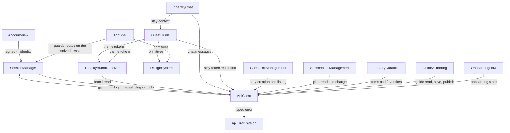

# Component Catalogue — GuestGuideIQ Frontend

The logical building blocks of the frontend: code we write, each with its own
behaviour, entities and lifecycle. Databases, the backend API, the chat provider
and the browser's own storage are **external dependencies of** components, never
components themselves.

**Not decided here:** the framework, language or hosting target (OQ4 →
`infrastructure-design`), deployment topology (→ `units-generation`), or where
tokens physically live (OQ3 → `nfr-design`). Every boundary below is designed to
survive whichever way those land — that is the point of confining transport and
token handling to two components at the bottom of the graph.

## Part A — Catalogue

```yaml
components:
  - name: ApiClient
    summary: The single module through which every backend request passes.
    behaviour: >
      Owns request construction, transport and response handling for every call to
      u1-backend-api. Nothing above this component calls the network directly and
      imports flow downward only (UI -> view state -> ApiClient -> transport).
      Attaches the bearer token supplied by SessionManager to each authenticated
      request; on a 401 it asks SessionManager to refresh and retries once against
      that single result rather than refreshing per request. Disables
      refetch-on-focus and prefetch as configuration, because the guide read
      creates an empty draft row as a side effect. Sends every request with a
      complete body — several backend handlers treat a missing body as a
      destructive default rather than an error.
    responsibilities:
      - Every HTTP call to the backend
      - Attaching the resolved bearer token to authenticated requests
      - Retrying exactly once behind a single in-flight refresh
      - Enforcing complete-body and typed-action rules at the boundary
    depends_on:
      - component: SessionManager
        interaction: obtains the current access token and requests a refresh on 401
        style: sync
      - component: ApiErrorCatalog
        interaction: hands every non-2xx response to be parsed into a typed error
        style: sync
    dependents:
      - component: OnboardingFlow
        interaction: reads and advances onboarding state
      - component: GuideAuthoring
        interaction: reads, saves and publishes the guide
      - component: LocalityCuration
        interaction: lists locality items and toggles favourites
      - component: SubscriptionManagement
        interaction: reads and changes the subscription
      - component: GuestLinkManagement
        interaction: creates and lists stay links
      - component: GuestGuide
        interaction: resolves a stay token into the guest payload
      - component: ItineraryChat
        interaction: sends chat messages and reads history
      - component: LocalityBrandResolver
        interaction: reads the locality brand for the current domain
      - component: SessionManager
        interaction: performs the login, refresh and logout calls themselves
    external_dependencies:
      - name: u1-backend-api
        kind: third-party-api
        purpose: every piece of application data
    entities: []

  - name: SessionManager
    summary: Owns the session lifecycle and hands out a resolved session object.
    behaviour: >
      Holds the access and refresh tokens and is the only component that touches
      the token store; every other component consumes a resolved session object
      and never a raw token. Collapses concurrent 401s into exactly one in-flight
      refresh, with all other waiters resolving against its result — the backend's
      refresh-token store is per-process across 2-6 tasks, so parallel refreshes
      race and revoke each other. Ends the session rather than refreshing again
      when a 401 comes from the refresh call itself, which is what stops the
      client looping. On session end it clears local session state but does not
      discard in-progress editor state.
    responsibilities:
      - Token storage and lifecycle
      - Single-flight refresh
      - The resolved session object, including the signed-in account identity
      - Deciding when a session has ended unrecoverably
    depends_on:
      - component: ApiClient
        interaction: performs login, refresh, logout and current-account calls
        style: sync
    dependents:
      - component: ApiClient
        interaction: supplies the current token and the refresh decision
      - component: AppShell
        interaction: supplies the resolved session for route guarding and identity display
      - component: AccountView
        interaction: supplies the signed-in identity
    external_dependencies:
      - name: browser token store
        kind: other
        purpose: >
          persisting the access and refresh tokens between page loads; the concrete
          mechanism is deliberately undecided (OQ3)
    entities:
      - name: Session
        identifier: accessToken
        attributes: [accessToken, refreshToken, expiresAt, status]
      - name: Account
        identifier: username
        attributes: [username, propertyName, localityName]

  - name: ApiErrorCatalog
    summary: Translates the backend's error envelope into a typed, exhaustive union.
    behaviour: >
      Parses the shared { code, message, details? } envelope into a discriminated
      union keyed on error.code, covering the eleven catalogued codes. Nothing
      above this component reads a raw HTTP status or an unparsed body. Defines a
      fallback for a response that is not envelope-shaped at all — a raw 500 with
      no body, or a 502/504 from infrastructure — and treats an unrecognised future
      code as a defined default rather than a crash. Attaches field-level details
      to their own named fields so a form can render them per-field rather than
      collapsing them into one banner.
    responsibilities:
      - The single parse of the error envelope
      - The typed error union every other component branches on
      - The non-envelope and unknown-code fallbacks
    depends_on: []
    dependents:
      - component: ApiClient
        interaction: hands it every non-2xx response
    external_dependencies: []
    entities:
      - name: ApiError
        identifier: code
        attributes: [code, message, details]

  - name: LocalityBrandResolver
    summary: Resolves and parses the locality brand into typed design tokens.
    behaviour: >
      Reads the locality brand for the current domain and parses visualStyling —
      an unschematised, attacker-influenceable blob — into typed design tokens with
      defaults, before any component reads it. No component touches the raw blob or
      spreads it into a style object. Falls back to the product's base tokens when
      a brand carries only a name and tagline, and to the unbranded default when no
      brand resolves at all. Serves the guest invalid-link path as well as the
      valid one, because that path reaches a domain that does resolve.
    responsibilities:
      - Resolving the brand for the current domain
      - Parsing visualStyling into typed tokens with defaults
      - The minimal-brand and no-brand fallbacks
      - Contrast-safe degradation when a brand's accent fails the floor
    depends_on:
      - component: ApiClient
        interaction: reads the locality brand
        style: sync
    dependents:
      - component: AppShell
        interaction: supplies theme tokens to the owner surface
      - component: GuestGuide
        interaction: supplies theme tokens to the guest surface, valid link or not
    external_dependencies: []
    entities:
      - name: LocalityBrand
        identifier: localityId
        attributes: [localityId, name, tagline, tokens, completeness]

  - name: AppShell
    summary: Owner-side routing, route guarding and the persistent dashboard frame.
    behaviour: >
      Owns the owner application's routes and the persistent shell — the navigation
      rail, the header user menu and the logout control that AC1.11.3 requires be
      reachable without visiting the Account screen. Guards authenticated routes
      against the resolved session object, never against a token. Routes a
      just-authenticated owner by onboarding state rather than asking them to
      choose. Surfaces the unrecoverable session-end state over whatever screen is
      open, preserving that screen's in-progress state behind it.
    responsibilities:
      - Owner route table and route guards
      - The persistent navigation frame and user menu
      - Post-authentication routing by onboarding state
      - Presenting session end without destroying in-progress work
    depends_on:
      - component: SessionManager
        interaction: reads the resolved session to guard routes and show identity
        style: sync
      - component: LocalityBrandResolver
        interaction: obtains theme tokens for the shell
        style: sync
    dependents: []
    external_dependencies: []
    entities: []

  - name: OnboardingFlow
    summary: The forward-only onboarding wizard and its client-held draft state.
    behaviour: >
      Drives the wizard from the backend's reported current step. The backend step
      machine is strictly forward — any non-current step is rejected — so prior
      steps are offered as read-only review and no control resubmits a completed
      step. Because the API returns only { currentStep, completed } and no owner
      route reads a submitted property name back, this component owns a
      client-held draft of unsubmitted entries; where a draft was not retained the
      field renders visibly empty rather than prefilled from a stale guess.
    responsibilities:
      - Wizard progression against the backend's current step
      - Read-only review of completed steps
      - The client-held draft of unsubmitted entries
      - Routing out to guide authoring on completion
    depends_on:
      - component: ApiClient
        interaction: reads onboarding state and advances steps
        style: sync
    dependents: []
    external_dependencies: []
    entities:
      - name: OnboardingProgress
        identifier: accountId
        attributes: [accountId, currentStep, completed]
      - name: OnboardingDraft
        identifier: accountId
        attributes: [accountId, stepId, fieldValues, capturedAt]

  - name: GuideAuthoring
    summary: The owner's editable guide, its full-replace save discipline and publication.
    behaviour: >
      Owns the owner's view of the guide and every write to it. Each save carries
      the complete section set under the exact expected key — the route defaults a
      missing or misspelled sections key to an empty array in front of the
      service's guard, so a mis-keyed save returns 200 with every section deleted
      rather than an error. Before any save whose payload carries fewer sections
      than the last loaded state, it requires an explicit confirmation naming the
      sections that will be removed. A failed save leaves edits on screen and
      discards nothing. Owns publication state and the guest-framed preview of what
      a guest currently sees.
    responsibilities:
      - The owner's guide model and section editing
      - Full-replace save with a shrink guard
      - Publication and unpublication state
      - The guest-view preview rendered for the owner
    depends_on:
      - component: ApiClient
        interaction: reads, saves and publishes the guide
        style: sync
    dependents: []
    external_dependencies: []
    entities:
      - name: Guide
        identifier: guideId
        attributes: [guideId, propertyId, sections, publicationState, loadedRevision]
      - name: GuideSection
        identifier: sectionId
        attributes: [sectionId, title, body, order]

  - name: LocalityCuration
    summary: Browsing the locality's points of interest and events, and marking favourites.
    behaviour: >
      Lists the locality's curated items and owns the owner's favourite selections.
      Favouriting is a single click with no confirmation and updates optimistically,
      reverting with an inline notice if the request fails. Every favourite and
      unfavourite request carries a complete body — this is the one backend handler
      without a body fallback, so a bodyless request returns a 500 rather than a
      400. Renders the backend's own empty-state message rather than a competing
      hardcoded string.
    responsibilities:
      - Listing locality items
      - Favourite and unfavourite selection with optimistic update and revert
      - Rendering server-supplied empty-state copy as-is
    depends_on:
      - component: ApiClient
        interaction: lists locality items and toggles favourites
        style: sync
    dependents: []
    external_dependencies: []
    entities:
      - name: LocalityItem
        identifier: itemId
        attributes: [itemId, kind, name, category, occursOn]
      - name: FavouriteSelection
        identifier: itemId
        attributes: [itemId, kind, selected]

  - name: SubscriptionManagement
    summary: Reading and changing the subscription, with the destructive-default guard.
    behaviour: >
      Reads plan and status and issues plan changes. Every action value comes from
      a fixed typed set and every request carries a body — the endpoint's final
      else branch cancels the subscription on any unrecognised action, and a
      missing body reaches that branch. On an indeterminate outcome, a timeout or a
      network failure, it never retries automatically: it re-reads subscription
      state and asks the owner. Upgrade and downgrade are surfaced as unavailable
      while only one tier exists, because neither produces an observable change.
    responsibilities:
      - Subscription read and plan-change actions
      - The typed-action and complete-body invariants
      - Refusing automatic retry on an indeterminate outcome
      - Cancellation confirmation stating what survives
    depends_on:
      - component: ApiClient
        interaction: reads and changes the subscription
        style: sync
    dependents: []
    external_dependencies: []
    entities:
      - name: Subscription
        identifier: accountId
        attributes: [accountId, plan, status]

  - name: GuestLinkManagement
    summary: Creating stay links for a validity window and listing the ones already made.
    behaviour: >
      Creates a stay link from a check-in and check-out window and lists previously
      generated links with their validity. Displays every date in the property's
      time zone and states which zone is in use, because link expiry is derived
      from the checkout date and a UTC day boundary silently shortens or extends
      the window depending on the property's offset. Validates the range before
      submitting. Presents the generated link as selectable text as well as behind
      a copy control, so a clipboard failure never leaves the owner unable to send
      it.
    responsibilities:
      - Stay-link creation from a dated window
      - Range validation before submission
      - Listing generated links with validity state
      - Time-zone-correct presentation of every date
    depends_on:
      - component: ApiClient
        interaction: creates a stay and lists existing stays
        style: sync
    dependents: []
    external_dependencies: []
    entities:
      - name: StayLink
        identifier: stayId
        attributes: [stayId, propertyId, checkIn, checkOut, timeZone, absoluteUrl, validity]

  - name: GuestGuide
    summary: The guest's read-only stay view, resolved from a link token.
    behaviour: >
      Resolves a stay token into the guest payload and renders the guide. Paints
      the property name and locality name as the first content on screen, before
      tab content, the chat affordance or any theming asset, and shows no full-page
      spinner ahead of them — the identity block is the guest's proof the link is
      theirs. Renders no image and no placeholder standing in for one. Collapses
      every invalid-link case into one message with no raw status, and renders that
      screen in the locality's brand, since the domain resolved even though the
      stay did not. Shows an empty state rather than a raw identifier when the
      payload carries favourite ids it cannot resolve into displayable content.
    responsibilities:
      - Resolving a stay token into the guest view
      - Identity-first render ordering
      - The single invalid-link state, branded
      - Tab content and empty states, never raw identifiers
      - Degraded-connectivity and rate-limited states
    depends_on:
      - component: ApiClient
        interaction: resolves the stay token
        style: sync
      - component: LocalityBrandResolver
        interaction: obtains theme tokens, including on the invalid-link path
        style: sync
    dependents:
      - component: ItineraryChat
        interaction: supplies the stay context the chat is scoped to
    external_dependencies: []
    entities:
      - name: GuestStay
        identifier: stayToken
        attributes: [stayToken, propertyName, localityName, guideContent, favouritedItemIds, validity]

  - name: ItineraryChat
    summary: The guest's conversational assistant, scoped to their stay.
    behaviour: >
      Sends the guest's messages and renders replies. Every reply is treated as
      untrusted text and never reaches a raw-HTML sink — the guest's own message
      round-trips through a model, so a reply is attacker-influenceable. Preserves
      the transcript across failures and offers a retry of the last message rather
      than hanging silently. Escalates a long wait to an explicit note. Holds the
      transcript locally so closing and reopening the widget does not lose it,
      because no chat-history read exists.
    responsibilities:
      - Sending messages and rendering replies as untrusted text
      - Local transcript retention across widget open and close
      - Failure, retry and long-wait states
    depends_on:
      - component: ApiClient
        interaction: sends chat messages
        style: sync
      - component: GuestGuide
        interaction: obtains the stay context the conversation is scoped to
        style: sync
    dependents: []
    external_dependencies: []
    entities:
      - name: ChatMessage
        identifier: messageId
        attributes: [messageId, role, text, sentAt, deliveryState]
      - name: ChatTranscript
        identifier: stayToken
        attributes: [stayToken, messages]
        references:
          - entity: GuestStay
            owned_by: GuestGuide
            relationship: each ChatTranscript belongs to exactly one GuestStay

  - name: AccountView
    summary: The owner's read-only account screen.
    behaviour: >
      Displays the signed-in identity — username, property name and locality name —
      taken from the resolved session rather than fetched separately, plus a link
      to subscription and a logout control. Owns no editable state and offers no
      editing affordances: no email is collected anywhere in the product, and there
      is no password-change or property-name-edit endpoint, so drawing those
      controls would be drawing something that cannot work.
    responsibilities:
      - Read-only display of the signed-in identity
      - Navigation to subscription and logout
    depends_on:
      - component: SessionManager
        interaction: reads the resolved account identity
        style: sync
    dependents: []
    external_dependencies: []
    entities: []

  - name: DesignSystem
    summary: The shared visual and interaction primitives every surface is built from.
    behaviour: >
      Provides the product's primitives — inputs, buttons, banners, dialogs, tabs,
      navigation, date fields, copyable values — with their states, keyboard
      behaviour, focus management and live-region announcements built in rather
      than reimplemented per screen. Consumes theme tokens; it never resolves or
      parses a brand itself. Accessibility behaviour lives here so that meeting
      WCAG 2.1 AA is a property of the primitives rather than a per-screen effort.
    responsibilities:
      - Visual and interaction primitives with their states
      - Keyboard operation, focus management and announcements
      - Consuming theme tokens without knowing where they came from
    depends_on: []
    dependents:
      - component: AppShell
        interaction: builds the owner frame from the primitives
      - component: GuestGuide
        interaction: builds the guest surface from the primitives
    external_dependencies: []
    entities: []
```

## Part B — Human view

### Component diagram



*Text fallback: `AppShell` depends on `SessionManager`, `LocalityBrandResolver`
and `DesignSystem`. `AccountView` depends on `SessionManager`. The six owner
feature components (`OnboardingFlow`, `GuideAuthoring`, `LocalityCuration`,
`SubscriptionManagement`, `GuestLinkManagement`) and the two guest components
(`GuestGuide`, `ItineraryChat`) all depend on `ApiClient`. `GuestGuide` also
depends on `LocalityBrandResolver` and `DesignSystem`; `ItineraryChat` also
depends on `GuestGuide`. `LocalityBrandResolver` depends on `ApiClient`.
`ApiClient` depends on `SessionManager` and `ApiErrorCatalog`. `SessionManager`
depends on `ApiClient` for the auth calls themselves — the one deliberate cycle,
explained in the Rationale.*

### Component summary

| Component | Purpose | Depends On | Dependents | Entities Owned |
|---|---|---|---|---|
| ApiClient | Every backend request | SessionManager, ApiErrorCatalog | 9 components | — |
| SessionManager | Session lifecycle and resolved session | ApiClient | ApiClient, AppShell, AccountView | Session, Account |
| ApiErrorCatalog | Typed error union | — | ApiClient | ApiError |
| LocalityBrandResolver | Brand resolution and token parsing | ApiClient | AppShell, GuestGuide | LocalityBrand |
| AppShell | Owner routing, guards, frame | SessionManager, LocalityBrandResolver, DesignSystem | — | — |
| OnboardingFlow | Forward-only wizard and drafts | ApiClient | — | OnboardingProgress, OnboardingDraft |
| GuideAuthoring | Guide editing, save, publication | ApiClient | — | Guide, GuideSection |
| LocalityCuration | Locality items and favourites | ApiClient | — | LocalityItem, FavouriteSelection |
| SubscriptionManagement | Plan read and change | ApiClient | — | Subscription |
| GuestLinkManagement | Stay-link creation and listing | ApiClient | — | StayLink |
| GuestGuide | Guest read-only stay view | ApiClient, LocalityBrandResolver, DesignSystem | ItineraryChat | GuestStay |
| ItineraryChat | Guest assistant | ApiClient, GuestGuide | — | ChatMessage, ChatTranscript |
| AccountView | Read-only account screen | SessionManager | — | — |
| DesignSystem | Shared primitives | — | AppShell, GuestGuide | — |

### Entity ownership

| Entity | Owning Component | Identifier | Attributes | References |
|---|---|---|---|---|
| Session | SessionManager | accessToken | accessToken, refreshToken, expiresAt, status | — |
| Account | SessionManager | username | username, propertyName, localityName | — |
| ApiError | ApiErrorCatalog | code | code, message, details | — |
| LocalityBrand | LocalityBrandResolver | localityId | localityId, name, tagline, tokens, completeness | — |
| OnboardingProgress | OnboardingFlow | accountId | accountId, currentStep, completed | — |
| OnboardingDraft | OnboardingFlow | accountId | accountId, stepId, fieldValues, capturedAt | — |
| Guide | GuideAuthoring | guideId | guideId, propertyId, sections, publicationState, loadedRevision | — |
| GuideSection | GuideAuthoring | sectionId | sectionId, title, body, order | — |
| LocalityItem | LocalityCuration | itemId | itemId, kind, name, category, occursOn | — |
| FavouriteSelection | LocalityCuration | itemId | itemId, kind, selected | — |
| Subscription | SubscriptionManagement | accountId | accountId, plan, status | — |
| StayLink | GuestLinkManagement | stayId | stayId, propertyId, checkIn, checkOut, timeZone, absoluteUrl, validity | — |
| GuestStay | GuestGuide | stayToken | stayToken, propertyName, localityName, guideContent, favouritedItemIds, validity | — |
| ChatMessage | ItineraryChat | messageId | messageId, role, text, sentAt, deliveryState | — |
| ChatTranscript | ItineraryChat | stayToken | stayToken, messages | GuestStay (GuestGuide) |

### External dependencies

| Component | Dependency | Kind | Purpose |
|---|---|---|---|
| ApiClient | u1-backend-api | third-party-api | Every piece of application data |
| SessionManager | Browser token store | other | Persisting tokens between page loads; the mechanism is deliberately undecided (OQ3) |

### Rationale

| Component | Why it is a separate building block |
|---|---|
| ApiClient | Distinct concern and the affirmed single point of network contact. Confining transport here is what makes the eventual same-origin-proxy decision a change in one place rather than a rewrite. |
| SessionManager | Distinct change rate and distinct concern. Token lifecycle and single-flight refresh change when the auth transport changes; request shaping changes when endpoints change. Separately testable without a transport. |
| ApiErrorCatalog | Distinct data ownership — the typed error union is the vocabulary the whole app branches on, and it changes when the backend's error catalogue changes, not when any feature does. Zero dependencies, so it is trivially testable. |
| LocalityBrandResolver | Distinct concern and a security boundary: it is the one place an unschematised, attacker-influenceable blob is parsed into typed tokens. Both surfaces consume it; neither knows the raw shape. |
| AppShell | Distinct lifecycle — routing and guarding change with navigation structure, not with any feature's business rules. |
| OnboardingFlow | Distinct lifecycle: onboarding runs once per account and is then never seen again. It also owns the only client-side compensating entity in the design (`OnboardingDraft`). |
| GuideAuthoring | Distinct data ownership and the design's highest-risk write path. Its full-replace save discipline is a behaviour no other component shares. |
| LocalityCuration | Distinct data ownership (favourite selections) and a distinct interaction model (optimistic, revertible). |
| SubscriptionManagement | Distinct concern with billing consequences. Its typed-action and no-auto-retry invariants exist nowhere else and must not leak into a general-purpose module. |
| GuestLinkManagement | Distinct concern and the only component reasoning about time zones and validity windows. |
| GuestGuide | Distinct bounded context — the guest's read model is a different concept from the owner's editable guide (see ADR-002). Different lifecycle: read once, never written. |
| ItineraryChat | Distinct concern with its own untrusted-content handling and its own local persistence, both of which exist for reasons no other component shares. |
| AccountView | Distinct surface with no state of its own. Kept separate rather than folded into AppShell so the shell's routing concern is not mixed with a screen's content. |
| DesignSystem | Distinct change rate and the single home for accessibility behaviour. Excluded from the coverage floor (ADR-007), which only works if it is a real boundary. |

**Alternatives rejected.** Two decompositions were genuinely open and were put to
the team rather than decided here:

- **One combined API/session component** (Q1 option A) — matches the affirmed
  practice's literal wording. Rejected in favour of two components; see ADR-001.
- **A single shared Guide model across owner and guest** (Q2 option B) — less
  duplication. Rejected in favour of two bounded contexts; see ADR-002.

### The one deliberate cycle

`ApiClient` and `SessionManager` depend on each other. `ApiClient` needs the
current token and the refresh decision; `SessionManager` needs `ApiClient` to
perform the login, refresh, logout and current-account calls themselves.

This is deliberate and bounded. Breaking it would mean either a third component
whose only job is to make three HTTP calls, or `SessionManager` opening its own
transport — which would violate the affirmed rule that exactly one module reaches
the network. Both components sit in the same layer at the bottom of the graph,
and the cycle does not extend upward: nothing above them participates in it. In
practice it resolves as a callback or an injected refresh handler rather than a
mutual import, which `functional-design` will pin down.

### What this design does not settle

- **The framework, language and hosting target** (OQ4) — `infrastructure-design`.
- **Where tokens physically live** (OQ3) — `nfr-design`. `SessionManager` is
  designed so that this changes one component's internals and nothing else.
- **Whether cross-tab session races are in scope** — depends on OQ3.
- **The concrete `include`/`exclude` globs** for the coverage floor. The category
  boundary is decided in ADR-007; the globs need the framework.
- **The blocked-versus-preserved behaviour on session expiry** — carried from
  Refined Mockups as a committed but revisitable reading.

## Review

**Verdict:** READY
**Reviewer:** aidlc-architecture-reviewer-agent
**Date:** 2026-09-08T01:54:22Z
**Iteration:** 1

### Findings

| ID | Severity | Location | Finding | Required action | Status |
|---|---|---|---|---|---|
| R-01 | Major | components.md > Part A catalogue, `AppShell` and `GuestGuide` entries, `depends_on`; cross-checked against `DesignSystem.dependents` and the Component Summary table | The Part A YAML — declared the "source of truth" by the stage definition — breaks its own symmetry rule. `DesignSystem.dependents` lists `AppShell` and `GuestGuide`, but neither `AppShell.depends_on` nor `GuestGuide.depends_on` lists `DesignSystem`. Part B (the mermaid diagram, and the Component Summary table row for both components, which explicitly reads "…, DesignSystem") already carries the correct edge — so Part B is not "derived from" Part A here, it corrects it. More broadly, `DesignSystem`'s own summary states it is "the shared visual and interaction primitives every surface is built from," yet six other UI-rendering components that plainly need those primitives (`OnboardingFlow`, `GuideAuthoring`, `LocalityCuration`, `SubscriptionManagement`, `GuestLinkManagement`, `AccountView`, `ItineraryChat`) declare no dependency on it at all, in either part. A tool or reviewer reading the machine-readable catalogue alone (the artifact the stage explicitly designates as authoritative for downstream automated consumption, e.g. dependency-graph or contract tooling) would get an incomplete and internally inconsistent picture of who consumes the design system. | Add `DesignSystem` to `depends_on` for `AppShell` and `GuestGuide` (and the matching `dependents` entries already exist), and either declare the same edge for the other UI-rendering components that consume it, or add a one-line note in the Rationale explaining why they are deliberately left off the graph (e.g. "presentational-only edges omitted below the feature-component layer") so the omission reads as a choice rather than a gap. | New |
| R-02 | Major | decisions.md > ADR-006 "Consequences" (the "delivery-planning must see this" sentence); cross-checked against `.claude/aidlc-common/stages/inception/delivery-planning.md` frontmatter `consumes` | ADR-006 explicitly states the backend follow-up's third growth is "the largest single risk to the frontend's start date" and that "`delivery-planning` must see this." But `delivery-planning.md`'s `consumes` list requires `components` (this file) and `unit-of-work`, and does not list `decisions` — so the one artifact `delivery-planning` is contracted to read from this stage (`components.md`) contains no mention of the backend follow-up's growth, the "third time" escalation, or the start-date risk; a grep of `components.md` for "follow-up" or "ADR-006" returns nothing. The risk the ADR insists must reach the next planning stage is recorded only in a file that stage has no contractual reason to open. | Either add `decisions` to `delivery-planning`'s `consumes` (a cross-stage change outside this stage's own scope, so at minimum flag it there), or — cheaper and within this stage's own artifact — add a short pointer in `components.md`'s "What this design does not settle" section (or the Rationale) naming the ADR-006 risk explicitly, so the escalation survives even if only `components.md` is read downstream. | New |
| R-03 | Minor | decisions.md > ADR-005 "Consequences" (the "cannot take effect in the first release" paragraph) vs. components.md > `GuestGuide` entry and "What this design does not settle" | ADR-005 discloses a real and important caveat: the invalid-link screen's branding decision "cannot take effect in the first release" because a `410` carries no payload to resolve a brand from, and the fix depends on AC4.1.7's not-yet-built signup-host branch. `components.md`'s `GuestGuide` entry states the branded behaviour as if it is simply how the component works, and the "What this design does not settle" list (the section a reader of `components.md` alone would check for exactly this kind of caveat) does not mention it. A developer working from `components.md` without also reading `decisions.md` could reasonably build toward branded error rendering that has no data path to satisfy it yet. | Add a line to "What this design does not settle" (or a caveat in the `GuestGuide` entry itself) cross-referencing ADR-005's first-release limitation, so the caveat is visible without requiring a read of `decisions.md`. | New |

### Validation Tool Results

| Tool | Result | Interpretation |
|---|---|---|
| aidlc-sensor-traceability.ts | `{"pass":true,"gaps":[],"orphans":[],"missing_from_table":[],"missing_from_upstream_ids":[],"invalid_entries":[],"invalid_targets":[],"findings_count":0}` | All 21 stories (`US1.1`–`US1.15`, `US2.1`–`US2.5`, `US4.1`) are declared and covered; no gaps, orphans, or invalid targets. Confirms the traceability artifact is mechanically sound. |

### Summary

The catalogue is well-formed on every rule that matters most (unique names, no self-dependency, exactly-one entity ownership, the deliberate `ApiClient`↔`SessionManager` cycle correctly disclosed and bounded), the component boundaries are well-argued and appropriately grained for this scope, and traceability is clean and mechanically verified. The two Major findings are real but narrow: a symmetry/completeness gap around `DesignSystem`'s dependency edges in the declared source-of-truth YAML (R-01), and a genuine risk of ADR-006's flagged "largest risk to the start date" not reaching `delivery-planning` because it lives in a file that stage's contract does not consume (R-02). Neither blocks a developer from implementing the design as written; both are worth the team's attention before the next stage runs.
