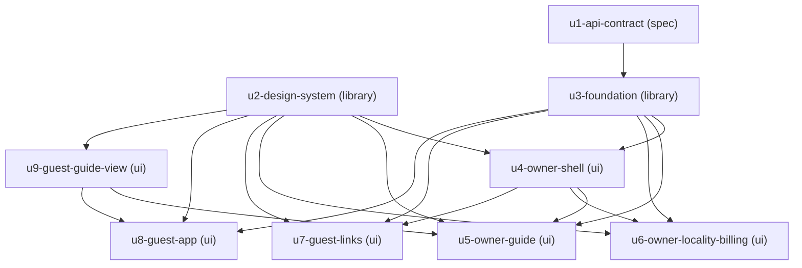

# Unit Dependency Topology — GuestGuideIQ Frontend

Topology only. This document says what **may** depend on what and which units
could be worked simultaneously. It does not choose a build order, name a critical
path, or say which unit ships first — those are economic decisions and they
belong to Delivery Planning, which consumes this DAG as input.

## Edge block

```yaml
units:
  - name: u1-api-contract
    kind: spec
    depends_on: []
  - name: u2-design-system
    kind: library
    depends_on: []
  - name: u3-foundation
    kind: library
    depends_on: [u1-api-contract]
  - name: u4-owner-shell
    kind: ui
    depends_on: [u2-design-system, u3-foundation]
  - name: u5-owner-guide
    kind: ui
    depends_on: [u2-design-system, u3-foundation, u4-owner-shell, u9-guest-guide-view]
  - name: u6-owner-locality-billing
    kind: ui
    depends_on: [u2-design-system, u3-foundation, u4-owner-shell]
  - name: u7-guest-links
    kind: ui
    depends_on: [u2-design-system, u3-foundation, u4-owner-shell]
  - name: u8-guest-app
    kind: ui
    depends_on: [u2-design-system, u3-foundation, u9-guest-guide-view]
  - name: u9-guest-guide-view
    kind: ui
    depends_on: [u2-design-system]
```

> **Correction, 2026-09-08.** `u9-guest-guide-view` was added at Construction
> `functional-design`, per a human decision at `u5-owner-guide`'s gate (its
> Q2 = C). Two edges were added — `u9 → u8` and `u9 → u5` — and one previously
> recorded non-edge, `u5-owner-guide → u8-guest-app`, is **preserved by this
> change rather than broken by it**: that is the reason the unit exists.
> `u5-owner-guide`'s `depends_on` gains `u9-guest-guide-view` below.

## Dependency graph



*Text fallback: `u1-api-contract` and `u2-design-system` have no dependencies.
`u3-foundation` depends on `u1-api-contract`. `u4-owner-shell` depends on
`u2-design-system` and `u3-foundation`. `u5-owner-guide`,
`u6-owner-locality-billing` and `u7-guest-links` each depend on
`u2-design-system`, `u3-foundation` and `u4-owner-shell`, and `u5-owner-guide`
additionally on `u9-guest-guide-view`. `u8-guest-app` depends on
`u2-design-system`, `u3-foundation` and `u9-guest-guide-view` — not on
`u4-owner-shell`. `u9-guest-guide-view` depends on `u2-design-system` alone.*

The graph is acyclic. Every name in a `depends_on` list is a declared unit, no
unit depends on itself, and each unit is named exactly once.

## Why each edge exists

| Edge | Reason |
|---|---|
| `u1-api-contract` → `u3-foundation` | The foundation's request and response types are generated from the contract. Without it, the API client has nothing to type against and falls back to hand-written types (see the degradation note in `unit-of-work.md`). |
| `u2-design-system` → `u4-owner-shell` | The shell's navigation, user menu and account screen are built from the primitives. |
| `u3-foundation` → `u4-owner-shell` | Route guards consume the resolved session object, which `SessionManager` owns. |
| `u4-owner-shell` → `u5-owner-guide` | Both surfaces render inside the persistent frame and are reached through owner routing. |
| `u4-owner-shell` → `u6-owner-locality-billing` | Same — both are screens inside the dashboard shell. |
| `u4-owner-shell` → `u7-guest-links` | Same. |
| `u3-foundation` → `u5`, `u6`, `u7` | **Direct, not transitive.** `components.md` declares `OnboardingFlow`, `GuideAuthoring`, `LocalityCuration`, `SubscriptionManagement` and `GuestLinkManagement` each depending directly on `ApiClient`; each also branches on `ApiErrorCatalog`'s typed errors. They reach the foundation themselves rather than through the shell. |
| `u2-design-system` → `u5`, `u6`, `u7` | **Direct, not transitive.** Each renders forms, tables, dialogs and banners from the primitives. The shell provides the frame around them, not the controls inside them. |
| `u2-design-system` → `u8-guest-app` | The guest surface is built from the same primitives; the design system is deliberately not Owner-specific. |
| `u3-foundation` → `u8-guest-app` | The guest resolves its stay through `ApiClient`, reads typed errors from `ApiErrorCatalog`, and themes from `LocalityBrandResolver` — including on the invalid-link path. |
| `u2-design-system` → `u9-guest-guide-view` | `u9` is presentation over the primitives and nothing else. Its only dependency. |
| `u9-guest-guide-view` → `u8-guest-app` | The guest surface renders `u9` as its content, keeping the stay resolution, chat and degraded states for itself. |
| `u9-guest-guide-view` → `u5-owner-guide` | The owner's preview renders the *same* component a guest gets, inside a labelled frame — which is what makes `AC1.8.4`'s "exactly as a guest would see it" stay true over time rather than only on the day it was written. |

## Edges that deliberately do not exist

Recording absent edges matters as much as present ones: an unstated
non-dependency tends to get assumed into existence later.

| Non-edge | Why not |
|---|---|
| `u4-owner-shell` → `u8-guest-app` | The Guest surface has its own entry point, no authentication and no dashboard frame. Making it wait on Owner routing would encode a dependency that does not exist. This is the single most valuable non-edge in the topology — it is what makes the whole Guest branch independently workable. |
| `u7-guest-links` → `u8-guest-app` | The Owner creates links and the Guest consumes them, but that is a **runtime** relationship mediated by the backend, not a build-time one. Neither unit imports the other; `StayLink` and `GuestStay` are separate entities in separate contexts. |
| `u5-owner-guide` → `u8-guest-app` | `GuideAuthoring`'s guest-view preview renders what a guest sees — but through `u9-guest-guide-view`, not by importing the Guest app. **This non-edge survived the 2026-09-08 correction, and preserving it is precisely why `u9` exists**: the alternative to extracting the shared rendering was this edge. ADR-002 keeps the two guide models separate, and this non-edge is what that decision buys. |
| `u9-guest-guide-view` → anything but `u2-design-system` | `u9` renders a shape it is handed. It makes no request, resolves no brand, holds no session and owns no route, so it needs neither `u3-foundation` nor `u1-api-contract`. Giving it a foundation edge would let a presentation unit start fetching. |
| `u1-api-contract` → anything but `u3-foundation` | Only the foundation consumes generated types directly. Feature units consume the foundation's own interfaces, so a contract change reaches them through one boundary rather than eight. |
| Any edge among `u5`, `u6`, `u7` | The three Owner feature units share only the shell. None reads another's state or imports another's code. |

## Integration points

Interfaces that cross a unit boundary. Contract Design formalises these; this
section names where they are.

| From | To | What crosses | Style |
|---|---|---|---|
| `u3-foundation` | `u1-api-contract` | Generated request/response types | build-time |
| `u4`–`u8` | `u3-foundation` | The resolved session object; typed API errors; theme tokens; every backend call | sync, in-process |
| `u4`–`u8` | `u2-design-system` | Primitive components and their props | build-time |
| `u5-owner-guide` | `u2-design-system` | The guest-preview frame renders guest-shaped content through shared primitives | build-time |
| `u8-guest-app` internal | — | `ItineraryChat` obtains its stay context from `GuestGuide`; both are in the same unit, so this is not a unit boundary | sync, in-process |

The **cycle between `ApiClient` and `SessionManager` (ADR-003) is entirely inside
`u3-foundation`** and crosses no unit boundary. That containment is part of why
those four components are one unit.

## Parallel development opportunities

Sets with no dependency between their members. Multiple valid topological
orderings exist; Delivery Planning picks one.

- **`{u1-api-contract, u2-design-system}`** — independent of everything and of
  each other. Both can begin immediately, though `u1` cannot *complete* until the
  backend publishes.
- **`{u4-owner-shell, u8-guest-app}`** — once `u2` and `u3` exist, the Owner and
  Guest branches are fully independent. This is the widest fork in the graph and
  the largest available parallelism.
- **`{u5-owner-guide, u6-owner-locality-billing, u7-guest-links}`** — once `u4`
  exists, all three are independent of each other.

Longest chain by edge count: `u1 → u3 → u4 → {u5 | u6 | u7}`, four units deep.
`u8` sits three deep on a separate branch. **This is a structural observation
about the graph's shape, not a critical-path claim or a recommended order** —
weighting these paths by value, risk and duration is Delivery Planning's job.

The direct `u2` and `u3` edges added to `u5`, `u6` and `u7` in revision do not
change any of these sets: those units already sat behind `u4-owner-shell`, which
sits behind both. The edges make real compile-time coupling explicit rather than
leaving it to be inferred transitively; nothing about what may be worked in
parallel moves.

## What the topology cannot express

Seven of the eight units are blocked on external work that is not in this graph,
because it belongs to another team and another repository (`US4.1`, recorded as
an external prerequisite rather than a unit). The DAG shows that `u3-foundation`
depends on `u1-api-contract`; it cannot show that `u1-api-contract` waits on a
backend commitment with no owner and no schedule.

`unit-of-work.md` carries the full blocked-unit table. Delivery Planning should
read the topology and that table together — the graph alone makes the work look
more startable than it is.
